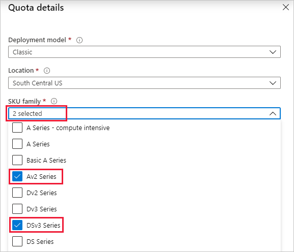

# Classic deployment model

The Classic deployment model is the older generation Azure deployment model. It enforces a global vCPU quota limit for virtual machines and virtual machine scale sets. The Classic deployment model is no longer recommended, and is now superseded by the Resource Manager model.

To learn more about these two deployment models and the advantages of using Resource Manager, see [Resource Manager and classic deployment](../../azure-resource-manager/management/deployment-models.md).

When a new subscription is created, a default quota of vCPUs is assigned to it. Anytime a new virtual machine is to be deployed using the Classic deployment model, the sum of new and existing vCPU usage across all regions must not exceed the vCPU quota approved for the Classic deployment model.

To learn more about quotas, see [Azure subscription and service limits, quotas, and constraints](../../azure-resource-manager/management/azure-subscription-service-limits.md).

You can request an increase in the vCPU quota limit for the Classic deployment model. Use either **Help + support** or **Usage + quotas** in the Azure portal.

## Request per VM series vCPU quota increase at subscription level using Help + support

Follow the instructions below to create a support request by using **Help + support** in the Azure portal.

1. From the [Azure portal](https://portal.azure.com) menu, select **Help + support**.

   

1. Select **New support request**.

   

1. In **Issue type**, choose **Service and subscription limits (quotas)**.

   

1. Select the subscription whose quota you want to increase.

   

1. For **Quota type**, select **Compute -VM (cores-vCPUs) subscription limit increases**.

   

1. Select **Next: Solutions** to open **PROBLEM DETAILS**. Select **Provide details** to provide additional information.

   

1. In **Quota details**, select **Classic** and select a **Location**.

   

1. For **SKU family**, select one or more SKU families to increase.

   

1. Enter the new limits you would like on the subscription. To remove a line, unselect the SKU from **SKU family** or select the discard "X" icon. After you enter a quota for each SKU family, select **Save and Continue** in **Quota details** to continue with the support request.

   

## Request per VM series vCPU quota increase at subscription level using Usage + quotas

Follow the instructions below to create a support request by using **Usage + quotas** in the Azure portal.

1. In the [Azure portal](https://portal.azure.com), search for and select **Subscriptions**.

   

1. Select the subscription whose quota you want to increase.

   

1. Select **Usage + quotas**.

   

1. In the upper right corner, select **Request increase**.

   

1. Select **Compute-VM (cores-vCPUs) subscription limit increases** as the **Quota type**.

   

1. Select **Next: Solutions** to open **PROBLEM DETAILS**. Select **Provide details** to provide additional information.

   

1. In **Quota details**, select **Classic** and a **Location**.

   

1. Select one or more SKU families for an increase.

   

1. Enter the new limits you would like on the subscription. To remove a line, unselect the SKU from **SKU family** or select the discard "X" icon. After you enter a quota for each SKU family, select **Save and Continue** in **Quota details** to continue with the support request.

   

