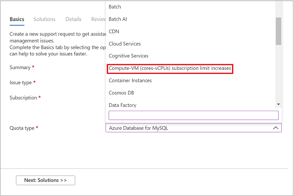
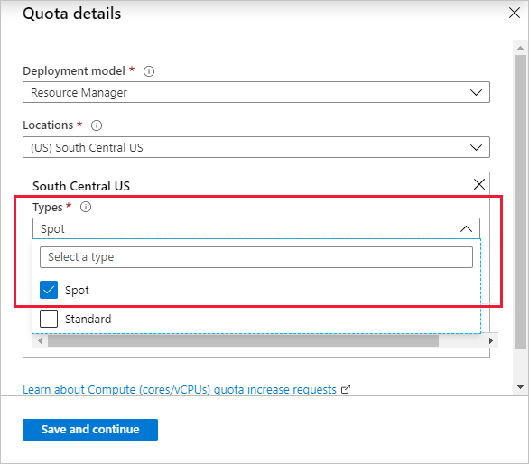
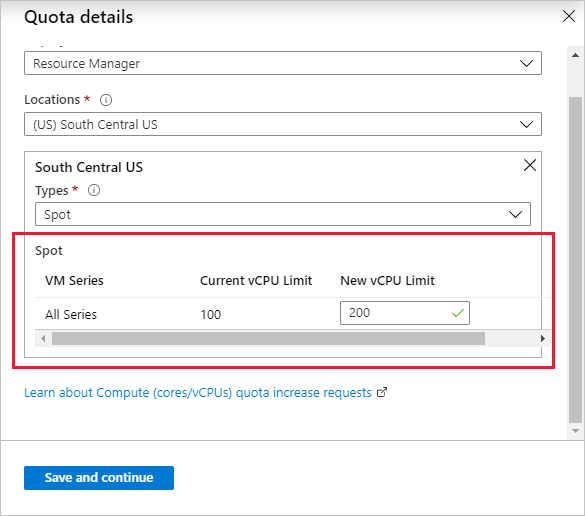
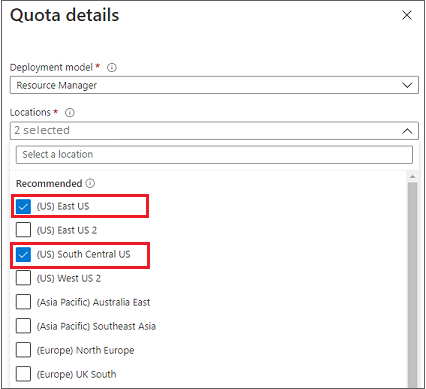

# Spot quota: Increase limits for all VM series

Spot virtual machines (VMs) provide a different model of Azure usage. They let you assume lower costs in exchange for letting Azure remove virtual machines as needed for pay-as-you-go or reserved VM instance deployments. For more information about spot VMs, see [Azure spot VMs for virtual machine scale sets](../../virtual-machine-scale-sets/use-spot.md).

Azure Resource Manager supports two types of vCPU quotas for virtual machines:

* *Pay-as-you-go VMs* and *reserved VM instances* are subject to a *standard vCPU quota*.
* *Spot VMs* are subject to a *spot vCPU quota*.

For the spot vCPU quota type, Resource Manager vCPU quotas are enforced across all available virtual machine series as a single regional limit.

Whenever you deploy a new spot VM, the total new and existing vCPU usage for all spot VM instances must not exceed the approved spot vCPU quota limit. If the spot quota is exceeded, the spot VM deployment isn't allowed.

This article discusses how to request an increase in the spot vCPU quota limit by using the Azure portal.

To learn more about standard vCPU quotas, see [Virtual machine vCPU quotas](../../virtual-machines/windows/quotas.md) and [Azure subscription and service limits, quotas, and constraints](../../azure-resource-manager/management/azure-subscription-service-limits.md).

To learn about increasing the vCPU limit by region, see [Standard quota: Increase limits by region](regional-quota-requests.md).

## Request a quota limit increase from Help + support

To request a spot quota limit increase for all virtual machine series using **Help + support**:

> [!NOTE]
> You can also request a quota limit increase for multiple regions through a single support case. For details, see step 8.

1. From the [Azure portal](https://portal.azure.com) menu, select **Help + support**.

   

1. In **Help + support**, select **New support request**.

    

1. For **Issue type**, select **Service and subscription limits (quotas)**.

   

1. For **Subscription**, select the subscription whose quota you want to increase.

   

1. For **Quota type**, select **Compute-VM (cores-vCPUs) subscription limit increases**.

   

1. Select **Next: Solutions** to open **PROBLEM DETAILS**. Select **Provide details** to enter additional information.

   

1. In **Quota details**, do the following steps:

   1. For **Deployment model**, select the appropriate model, and for **Locations**, select a location.

      

   1. For the selected location, under **Types**, in **Select a type**, choose **Spot**.

      

       Under **Types**, you can request both standard and spot quota types from a single support case through multi-selection support.

       For more information, see [Standard quota: Increase limits by VM series](per-vm-quota-requests.md).

   1. Enter the new quota limit that you want for this subscription.

      

1. To request a quota increase for more than one location, select an additional location in **Locations**, and then select an appropriate VM type. You can then enter a limit that applies to the additional location.

   

1. Select **Save and continue** to continue creating the support request.

## Request a quota limit increase from the Subscriptions pane

To request a spot quota limit increase for all VM series from the **Subscriptions** pane:

> [!NOTE]
> You can also request a quota limit increase for multiple regions through a single support case. For details, see step 7.

1. In the [Azure portal](https://portal.azure.com), search for and select **Subscriptions**.

   

1. Select the subscription whose quota you want to increase.

   

1. In the left pane, select **Usage + quotas**.

   

1. At the top right, select **Request increase**.

   

1. For **Quota type**, select **Compute-VM (cores-vCPUs) subscription limit increases**.

   

1. Select **Next: Solutions** to open **PROBLEM DETAILS**. Select **Provide details** to enter additional information. In **Quota details**, enter the following information:

   1. For **Deployment model**, select the appropriate model, and for **Locations**, select a location.

      

   1. For the selected location, under **Types**, in **Select a type**, choose **Spot**.

      

      For more information, see [Standard quota: Increase limits by VM series](per-vm-quota-requests.md).

   1. Enter the new quota limit that you want for this subscription.

      

1. To request a quota increase for more than one location, select an additional location in **Locations**, and then select an appropriate VM type. You can then enter a limit that applies to the additional location.

   

1. Select **Save and continue** to continue creating the support request.
