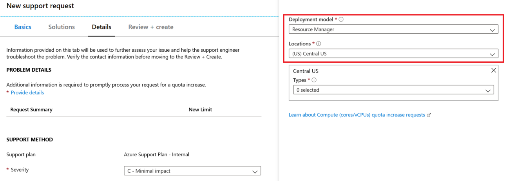
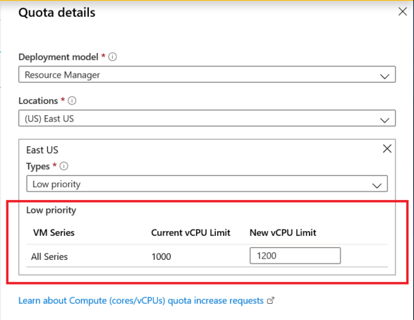
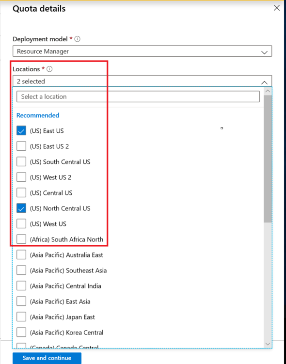

# Spot quota: limit increase for all VM Series

Spot VMs provide a different model of Azure usage, trading a lower cost for letting Azure remove a VM as needed for Pay-as-you-go or Reserved VM Instance deployments. Read more about Spot VMs [here](https://docs.microsoft.com/azure/virtual-machine-scale-sets/use-spot).

Resource Manager supports two types of vCPU quotas for virtual machines. **Pay-as-you-go VMs and Reserved VM Instances** use standard quota. **Spot VMs** use Spot quota. 

For **Spot quota** type, Resource Manager vCPU quotas are enforced across all available VM Series as a single regional limit.

Anytime a new Spot VM is to be deployed, the sum of new and existing vCPUs usage for all Spot VM instances must not exceed the approved Spot vCPU quota limit. If the Spot quota is exceeded, the Spot VM deployment will not be allowed. You can request an increase of the Spot vCPUs quota limit from Azure portal. 

Learn more about standard vCPU quotas on the Virtual machine vCPU quotas page and Azure subscription and service limits page. Learn more about increasing the regional vCPU limit for standard quota on this [page](https://docs.microsoft.com/azure/azure-portal/supportability/regional-quota-requests).

You can now request an increase in **Spot quota limits for all VM Series** via **Help + Support** blade or the **Usages + Quota** blade in the portal.

## Request Spot quota limit increase for all VM Series per Subscription using the Help + Support blade

Follow the instructions below to create a support request via Azure's 'Help + Support' blade available in the Azure portal.

You can also **request Quota for multiple regions** through a single support case. Refer to Step 10 below for details. 

1. From https://portal.azure.com, select **Help + Support**.

   
 
2.  Select **New support request**. 

     

3. In the Issue type drop-down, choose **Service and subscription limits (quotas)**.

   

4. Select the subscription that needs an increased quota.

   
   
5. Select **Compute -VM (cores-vCPUs) subscription  limit increases** in **quota type** drop-down. 

   

6. In **Problem Details**, provide additional information to help process your request by clicking **Provide details**.

   
   
7.	In the **Quota details*** panel, select **Deployment model** and select a **location**.

8. For the selected location, select **Type** value as **‘Spot’**. You can request both Standard and Spot quota types from a single support case through multi-selection support on the **Type** field. Learn more about **increasing Standard quota per VM Series** on this [page](https://docs.microsoft.com/azure/azure-portal/supportability/per-vm-quota-requests).

9.	Enter the new limit you would like on the subscription. 
 
 

10.	To request Quota for more than one location you can check on another location from the drop-down and select appropriate VM Type. You can then enter the new limits you would like.

11. After entering the desired quota, click **Save and Continue** on the Quota details panel to continue with the support request creation.

## Request Spot quota limit increase for all VM Series per Subscription using Usages + Quota blade

Follow the instructions below using to create a support request via Azure's 'Usage + quota' blade available in the Azure portal.

You can also **request Quota for multiple regions** through a single support case. Refer to Step 9 below for details. 

1.	From https://portal.azure.com, select **Subscriptions**.

 

2.	Select the subscription that needs an increased quota.

 

3.	Select **Usage + quotas**.

 

4.	In the upper right corner, select **Request increase.**

   

5.	Select **Compute-VM (cores-vCPUs) subscription limit increases** as the quote type.

  

6.	In the **Quota details** panel, select Deployment model and select a location.

  
 
7.	For the selected location, select **Type** value as **‘Spot’.** You can request both Standard and Spot quota types from a single support case through multi-selection support on the **Type** field. Learn more about **increasing standard quota per VM Series** on this [page](https://docs.microsoft.com/azure/azure-portal/supportability/per-vm-quota-requests).

  
 
8.	Enter the new limit you would like on the subscription.

  
 
9.	To request Quota for more than one location you can check on another **location** from the drop-down and select appropriate VM Type. You can then enter the new limits you would like.

  
 
10. After entering the desired quota, click **Save and Continue** on the Quota details panel to continue with the support request creation.

