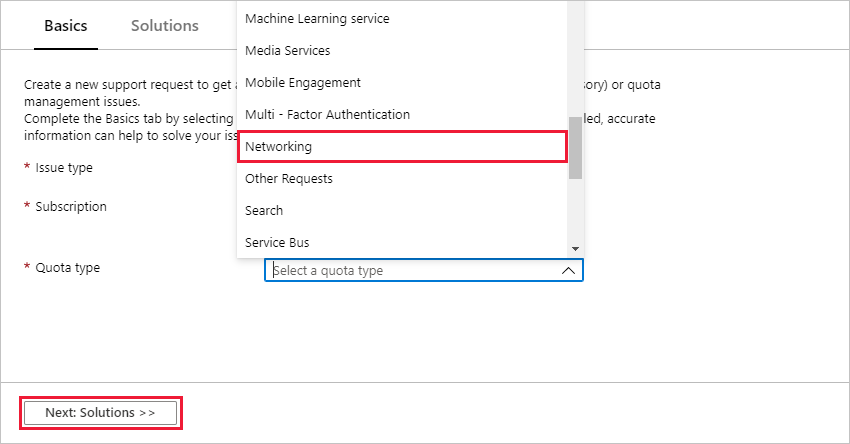
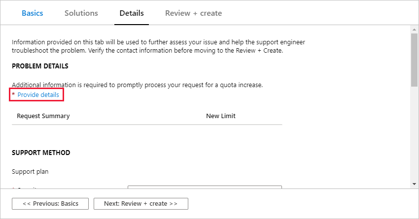
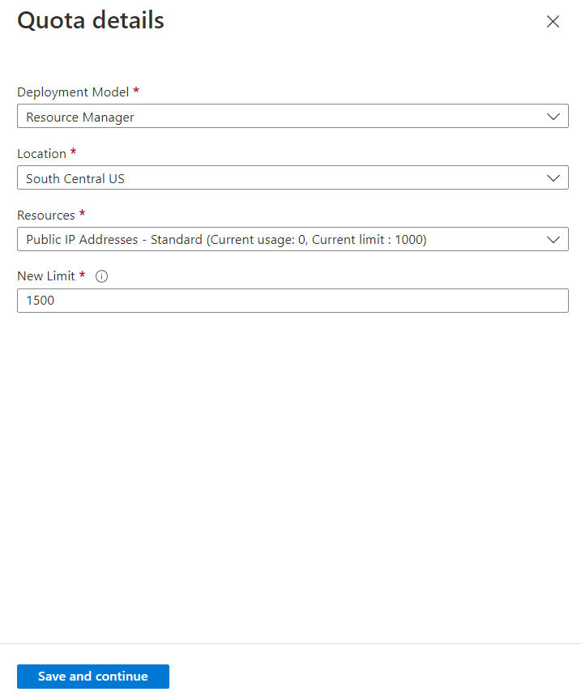
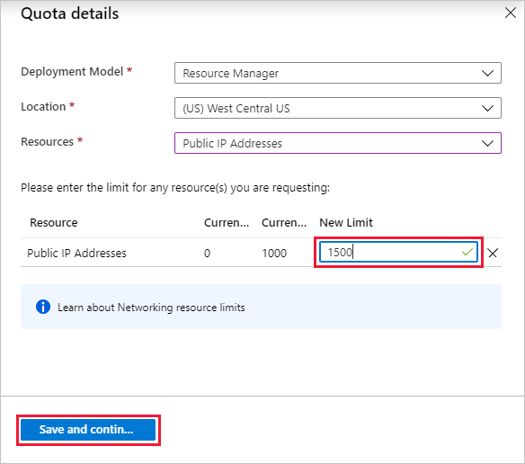

# Networking limit increase

Use the [Azure portal](https://portal.azure.com) to increase your networking quota.

To view your current Networking usage and quota in Azure portal, open your subscription, then select **Usages + quotas**. You can also use the following options to view your network usage and limits.

* [Usage CLI](/cli/azure/network#az-network-list-usages)
* [PowerShell](/powershell/module/azurerm.network/get-azurermnetworkusage)
* [The network usage API](/rest/api/virtualnetwork/virtualnetworks/listusage)

You can request an increase by using **Help + support** or in **Usages + quotas** in the portal.

> [!Note]
> To change the default size of **Public IP Prefixes**, select **Min Public IP InterNetwork Prefix Length** from the dropdown list.

## Request Networking quota increase at subscription level using Help + support

Follow the instructions below to create a support request by using **Help + support** in the Azure portal.

1. Sign in to [Azure portal](https://portal.azure.com), and then select **Help + support** from the Azure portal menu or search for and select **Help + support**.

    

1. Select **New support request**.

    

1. For **Issue type**, choose **Service and subscription limits (quotas)**.

    

1. Select the subscription that needs an increased quota.

    

1. Under **Quota type**, select **Networking**. Select **Next: Solutions**.

    

1. In **PROBLEM DETAILS**, select **Provide details** and fill in additional information to help process your request.

    

1. In the **Quota details** panel, select a deployment model, a location, and the resources to include in your request.

    

1. Enter the new limits you would like on the subscription. To remove a line, unselect the resource from the **Resources** menu or select the discard "x" icon. After entering the quota for each resource, select **Save and continue** to continue with the support request creation.

    

## Request Networking quota increase at subscription level using Usages + quotas

Follow these instructions to create a support request by using **Usage + quota** in the Azure portal.

1. From https://portal.azure.com, search for and select **Subscriptions**.

    

1. Select the subscription that needs an increased quota.

    

1. Select **Usage + quotas**

    

1. In the upper right corner, select **Request increase**.

    

1. Follow the steps starting with step 3 in [Request Networking quota increase at subscription level](#request-networking-quota-increase-at-subscription-level-using-help--support).

## About Networking limits

To learn more about Networking limits, see the [Networking section](../../azure-resource-manager/management/azure-subscription-service-limits.md#networking-limits) of the limits page or our Network Limits FAQ.
