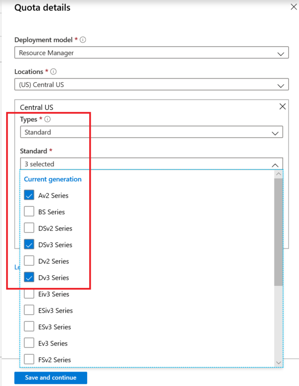
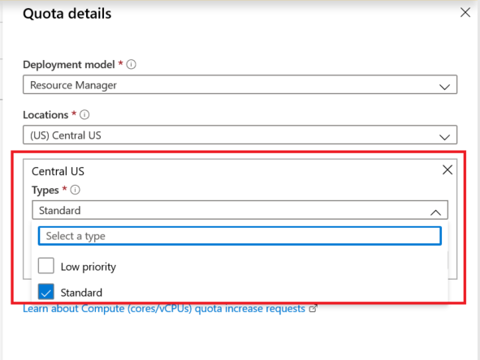

# Standard quota: Increase limits by VM series

Azure Resource Manager supports two types of vCPU quotas for virtual machines:
* *Pay-as-you-go VMs* and *reserved VM instances* are subject to a *standard vCPU quota*.
* *Spot VMs* are subject to a *spot vCPU quota*. 

The standard vCPU quota for pay-as-you-go and reserved VM instances is enforced at two tiers for each subscription in each region:
* The first tier is the *total regional vCPUs limit* (across all VM series).
* The second tier is the *per-VM series vCPUs limit* (such as the Dv3-series vCPUs). 

Whenever you deploy a new spot VM, the total new and existing vCPU usage for that VM series must not exceed the approved vCPU quota for that particular VM series. Additionally, the total number of new and existing vCPUs that are deployed across all VM series should not exceed the total approved regional vCPU quota for the subscription. If either of these quotas is exceeded, the VM deployment isn't allowed.

You can request an increase in the vCPU quota limit for the VM series by using the Azure portal. An increase in the VM series quota automatically increases the total regional vCPU limit by the same amount. 

To learn more about standard vCPU quotas, see [Virtual machine vCPU quotas](https://docs.microsoft.com/azure/virtual-machines/windows/quotas) and [Azure subscription and service limits](https://docs.microsoft.com/azure/azure-supportability/classic-deployment-model-quota-increase-requests). 

To learn about increasing the vCPU limit by region for standard quota, see [Standard quota: Increase limits by region](https://docs.microsoft.com/azure/azure-supportability/regional-quota-requests). 

To learn more about increasing spot VM vCPU limits, see [Spot quota: Increase limits for all VM series](https://docs.microsoft.com/azure/azure-supportability/low-priority-quota).

You can request an increase in standard vCPU quota limits per VM series in either of two ways, as described in the next sections.

## Request a standard quota increase from the "Help + support" pane

To request a standard vCPU quota increase per VM series from the **Help + support** pane, do the following: 

> [!NOTE]
> You can also request a quota limit increase for multiple regions through a single support case. For details, see step 8.

1. In the left pane of the [Azure portal](https://portal.azure.com), select **Help + support**.

   
 
1. In the **Help + support** pane, select **New support request**. 

    

1. In the **Issue type** drop-down list, select **Service and subscription limits (quotas)**.

   

1. In the **Subscription** drop-down list, select the subscription whose quota you want to increase.

   
   
1. In the **Quota type** drop-down list, select **Compute-VM (cores-vCPUs) subscription limit increases**. 

   

1. On the **Details** tab, under **Problem Details**, select **Provide details**, and then enter additional information to help process your request.

   

1. In the **Quota details** pane at the top right, do the following:

   

   a. In the **Deployment model** drop-down list, select the appropriate model.

   b. In the **Locations** drop-down list, select a location. For the selected location, under **Types**, in the **Select a type** box, enter **Standard**.

   

   Under **Types**, you can request both standard and spot quota types from a single support case through multi-selection support.
   
   For more information about increasing spot quota limits, see [Azure spot VMs for virtual machine scale sets](https://docs.microsoft.com/azure/virtual-machine-scale-sets/use-spot).

   c. Below the **Standard** drop-down list, select the SKU series whose quotas you want to increase.

   

   d. Enter the new quota limits that you want for this subscription. To remove a SKU from your list, clear the check box next to the SKU or select the **Delete** (X) icon. 

   

1. To request a quota increase for more than one location, select an additional location in the drop-down list, and then select an appropriate VM type. You can then enter a limit that applies to the additional location.

   
   
1. Select **Save and continue** to continue creating the support request.

## Request a standard quota increase from the "Subscriptions" pane

To request a standard vCPU quota increase per VM series from the **Subscriptions** pane, do the following:

> [!NOTE]
> You can also request a quota limit increase for multiple regions through a single support case. For details, see step 7.

1. In the left pane of the [Azure portal](https://portal.azure.com), select **Subscriptions**.

   

1. Select the subscription whose quota you want to increase.

   

1. In the left pane of your **\<Subscription name>** page, select **Usage + quotas**.

   

1. At the top right, select **Request increase**.

   

1. In the **Quota type** drop-down list, select **Compute-VM (cores-vCPUs) subscription limit increases**.

   
   
1. In the **Quota details** pane at the top right, do the following:

   

   a. In the **Deployment model** drop-down list, select the appropriate model.

   b. In the **Locations** drop-down list, select a location. 
   
   c. For the selected location, under **Types**, select **Select a type**, and then select the **Standard** check box.

   
   
   Under **Types**, you can request both standard and low priority quota types from a single support case through multi-selection support.
   
   For more information about increasing spot quota limits, see [Azure spot VMs for virtual machine scale sets](https://docs.microsoft.com/azure/virtual-machine-scale-sets/use-spot).

   d. Below the **Standard** drop-down list, select the SKU series whose quotas you want to increase.

   

   e. Enter the new quota limits that you want for this subscription. To remove a SKU from your list, clear the check box next to the SKU or select **Delete** (X). 

   
   
1. To request a quota increase for more than one location, select an additional location in the drop-down list, and then select an appropriate VM type. 

   This step preloads the SKU series that you selected for earlier locations. Enter the quota limits that you want to apply to the additional series.
   
   
 
1. Select **Save and continue** to continue creating the support request.
