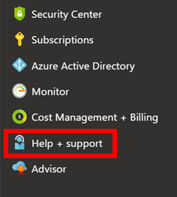
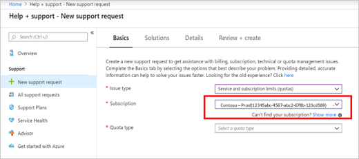
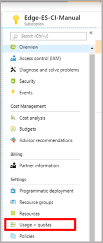

# Standard quota: Increase limits by region 

Azure Resource Manager supports two types of vCPU quotas for virtual machines:
* *Pay-as-you-go VMs* and *reserved VM instances* are subject to a *standard vCPU quota*.
* *Spot VMs* are subject to a *spot vCPU quota*. 

The standard vCPU quota for pay-as-you-go and reserved VM instances is enforced at two tiers for each subscription in each region:
* The first tier is the *total regional vCPUs limit* (across all VM series).
* The second tier is the *per-VM series vCPUs limit* (such as the D-series vCPUs).
 
Whenever you deploy a new spot VM, the total new and existing vCPU usage for that VM series must not exceed the approved vCPU quota for that particular VM series. Additionally, the total number of new and existing vCPUs that are deployed across all VM series should not exceed the total approved regional vCPU quota for the subscription. If either of these quotas is exceeded, the VM deployment isn't allowed. 

You can request an increase in the vCPU quota limit for the VM series by using the Azure portal. An increase in the VM series quota automatically increases the total regional vCPU limit by the same amount.

When you create a new subscription, the default total number of regional vCPUs might not be equal to the total default vCPU quota for all individual VM series. This discrepancy can result in a subscription with enough quota for each individual VM series that you want to deploy. But there might not be enough quota to accommodate the total regional vCPUs for all deployments. In this case, you must submit a request to explicitly increase the limit of the total number of regional vCPUs. The total regional vCPU limit can't exceed the total approved quota across all VM series for the region.

To learn more about standard vCPU quotas, see [Virtual machine vCPU quotas](https://docs.microsoft.com/azure/virtual-machines/windows/quotas) and [Azure subscription and service limits](https://aka.ms/quotalimits).

To learn more about increasing spot VM vCPU limits, see [Spot quota: Increase limits for all VM series](https://docs.microsoft.com/azure/azure-supportability/low-priority-quota).

You can request an increase in your vCPU standard quota limit by region in either of two ways, as described in the next sections.

## Request a quota increase by region from the "Help + support" pane

To request a vCPU quota increase by region from the **Help + support** pane, do the following: 

1. In the left pane of the [Azure portal](https://portal.azure.com), select **Help + support**.

   
 
1. In the **Help + support** pane, select **New support request**. 

    

1. In the **Issue type** drop-down list, select **Service and subscription limits (quotas)**.

   

1. In the **Subscription** drop-down list, select the subscription whose quota you want to increase.

   
   
1. In the **Quota type** drop-down list, select **Other Requests**.

   

1. In the **Problem Details** pane, in the **Description** box, provide the following additional information: 

    a. For **Deployment Model**, specify **Resource Manager**.  
    b. For **Region**, specify your required region (for example, **East US 2**).  
    c. For **New Limit**, specify a new vCPU limit for the region. This value shouldn't exceed the sum of the approved quotas for individual SKU series for this subscription.

    

1. Select **Save and continue** to continue creating the support request.

## Request a quota increase by region from the "Subscriptions" pane

To request a vCPU quota increase by region from the **Subscriptions** pane, do the following: 

1. In the left pane of the [Azure portal](https://portal.azure.com), select **Subscriptions**.

   

1. Select the subscription whose quota you want to increase.

   

1. In the left pane of your **\<Subscription name>** page, select **Usage + quotas**.

   

1. At the top right, select **Request increase**.

   

1. In the **Quota type** drop-down list, select **Other Requests**.

   

1. In the **Problem Details** pane, in the **Description** box, provide the following additional information: 

    a. For **Deployment Model**, specify **Resource Manager**.  
    b. For **Region**, specify your required region (for example, **East US 2**).  
    c. For **New Limit**, specify a new vCPU limit for the region. This value shouldn't exceed the sum of the approved quotas for individual SKU series for this subscription.

    

1. Select **Save and continue** to continue creating the support request.

