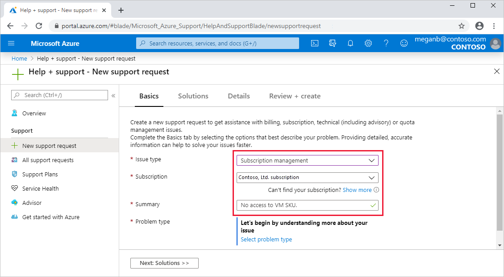
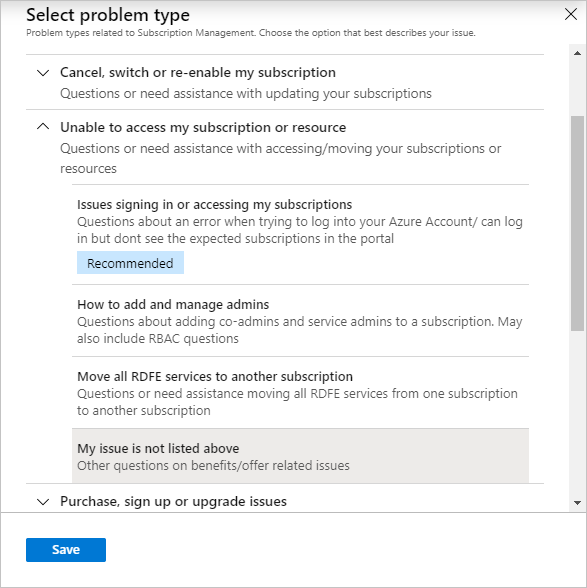

# Region or SKU unavailable

This article describes how to resolve the issue of an Azure subscription not having access to a region or a VM SKU.

## Symptoms

When deploying a virtual machine, you receive one of the following error messages:

```
Code: SkuNotAvailable
Message: The requested size for resource '<resource>' is currently not available in location 
'<location>' zones '<zone>' for subscription '<subscriptionID>'. Please try another size or 
deploy to a different location or zones. See https://aka.ms/azureskunotavailable for details.
```

```
Message: Your subscription doesn’t support virtual machine creation in <location>. Choose a 
different location. Supported locations are <list of locations>
```

```
Code: NotAvailableForSubscription
Message: This size is currently unavailable in this location for this subscription
```

When purchasing Reserved Virtual Machine Instances, you receive one of the following error messages:

```
Message: Your subscription doesn’t support virtual machine reservation in <location>. Choose a 
different location. Supported locations are: <list of locations>  
```

```
Message: This size is currently unavailable in this location for this subscription
```

When creating a support request to increase compute core quota, a region or a SKU family isn't available for selection.

## Solution

We first recommend that you consider an alternative region or SKU that meets your business needs.

If you're unable to find a suitable region or SKU, create a **Subscription management** [support request](https://portal.azure.com/#blade/Microsoft_Azure_Support/HelpAndSupportBlade/newsupportrequest) following these steps:

1. From the [Azure portal](https://portal.azure.com) menu, select **Help + support**. Then select **New support request**.

1. In **Basics**, for **Issue type**, select **Subscription management**.

1. Select a **Subscription** and enter a brief description in **Summary**.

   

1. For **Problem type**, choose **Select problem type**.

1. For **Select problem type**, choose an option, for instance, **Unable to access my subscription or resource** > **My issue is not listed above**. Select **Save**.

   

1. Select **Next: Solutions** to explore possible solutions. If necessary, select **Next: Details** to continue.

1. Enter any additional information you can provide, along with your contact information.

1. Select **Review + create**. After you verify your information, select **Create** to create the request.

## Send us your suggestions

We're always open to feedback and suggestions! Send us your [suggestions](https://feedback.azure.com/forums/266794-support-feedback). Additionally, you can engage with us on [Twitter](https://twitter.com/azuresupport) or the [Microsoft Q&A question page](https://docs.microsoft.com/answers/products/azure).

## Learn more

[Azure Support FAQ](https://azure.microsoft.com/support/faq)
