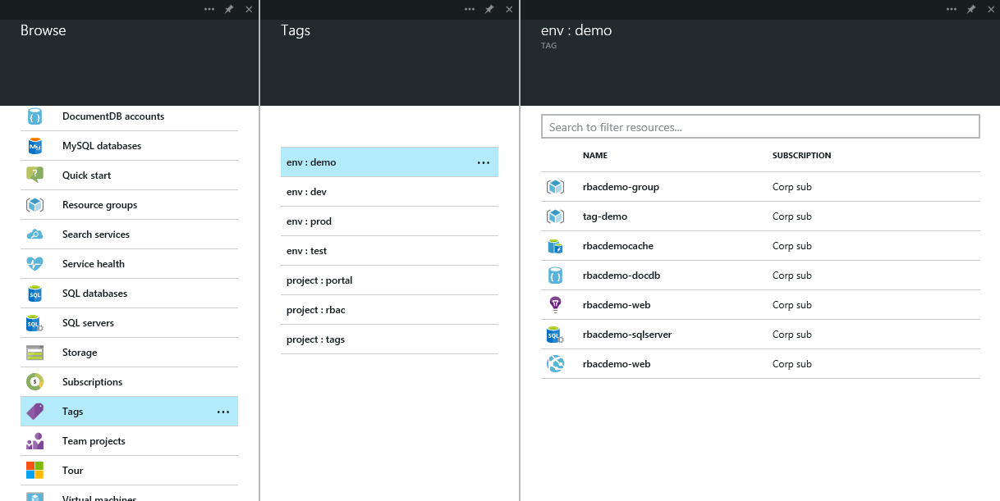

<properties urlDisplayName="" pageTitle="Using tags to organize your Azure resources" metaKeywords="" description="" metaCanonical="" services="" documentationCenter="" title="" authors="flanakin" solutions="" writer="" manager="carolz" editor=""/>

<tags ms.service="multiple" ms.workload="multiple" ms.tgt_pltfrm="ibiza" ms.devlang="na" ms.topic="article" ms.date="10/08/2014" ms.author="micflan" />

# Using tags to organize your Azure resources

The Azure Preview portal and the underlying Resource Manager are about organizing your resources and customizing your experience to be tailor-fit just for you. 

In the full Azure portal, subscriptions are the only way to categorize and group your resources. With the preview portal, [we introduced resource groups](http://azure.microsoft.com/en-us/documentation/articles/azure-preview-portal-using-resource-groups), which enable you to group related entities. This became even more valuable when [we introduced role-based access](http://azure.microsoft.com/en-us/documentation/articles/role-based-access-control-configure). Now, in that same spirit, you can tag your resources with key/value pairs to further categorize and view resources across resource groups and, within the portal, across subscriptions.

Group resources by team, project, or even environment to focus on exactly what you want to see, when you need to see it. 

## Tags in the Azure Preview portal

Tagging resources and resource groups in the preview portal is easy. Use the Browse hub to navigate to the resource or resource group you’d like to tag and click the Tags part in the Overview section at the top of the blade. 

This will open a blade with the list of tags that have already been applied. If this is your first tag, the list will be empty. To add a tag, simply specify a name and value and press Enter. After you've added a few tags, you'll notice autocomplete options based on pre-existing tag names and values to better ensure a consistent taxonomy across your resources and to avoid common mistakes, like misspellings.

From here, you can click on each individual tag to view a list of all the resources with the same tag. Of course, if this is your first tag, that list won't be very interesting. For now, let's jump over to PowerShell to tag all of our resources quickly.

## Tagging with PowerShell

First thing's first, grab the latest [Azure PowerShell module](http://azure.microsoft.com/en-us/documentation/articles/install-configure-powershell/). If this is your first time using the Azure PowerShell module, [read the documentation](http://azure.microsoft.com/en-us/documentation/articles/install-configure-powershell) to get up to speed. For the purposes of this article, we'll assume you're already added an account and selected a subscription with the resources you want to tag.

Tagging is only available for resources and resource groups available from [Resource Manager](http://msdn.microsoft.com/en-us/library/azure/dn790568.aspx), so the next thing we need to do is switch to use Resource Manager. For more information, see [Using Windows PowerShell with Resource Manager](http://azure.microsoft.com/en-us/documentation/articles/powershell-azure-resource-manager/).

  Switch-AzureMode AzureResourceManager

Tags exist directly on resources and resource groups, so to see what tags are already applied, we can simply get a resource or resource group with `Get-AzureResource` or `Get-AzureResourceGroup`, respectively. Let's start with a resource group.

This cmdlet returns several bits of metadata on the resource group including what tags have been applied, if any. To tag  a resource group, we'll simply use `Set-AzureResourceGroup` and specify a tag name and value.

Remember that tags are updated as a whole, so if you are adding one tag to a resource that's already been tagged, you'll need to save use an array with all the tags you want to keep. To remove one, simply save the array without the one you want to remove. 

The process is the same for resources, except you'll use the `Get-AzureResource` and `Set-AzureResource` cmdlets. To get resources or resource groups with a specific tag, use `Get-AzureResource` or `Get-AzureResourceGroup` cmdlet with the `-Tag` parameter.

## Tagging with Resource Manager

The preview portal and PowerShell both use the [Resource Manager REST API](http://msdn.microsoft.com/en-us/library/azure/dn790568.aspx) behind the scenes. If you need to integrate tagging into another environment, you can get tags with a GET on the resource id and update the set of tags with a PATCH call.

## Managing your taxonomy

Earlier, we talked about how autocomplete helps you ensure consistency and avoid mistakes. Autocomplete is populated based on the taxonomy of available tags setup for the subscription. Each tag you add to a resource or resource group is automatically added to the subscription-wide taxonomy, but you can also prepopulate that taxonomy with tag names and values you'd like to use as resources are tagged in the future.

To get a list of all tags within a subscription using PowerShell, use the `Get-AzureTag` cmdlet.

You may see tags that start with "hidden-" and "link:". These are internal tags, which you should ignore and avoid changing. 

Use the `New-AzureTag` cmdlet to add new tags to the taxonomy. These tags will be included in the autocomplete even though they haven't been applied to any resources or resource groups, yet. To remove a tag name/value, first remove the tag from any resources it may be used with and then use the `Remove-AzureTag` cmdlet to remove it from the taxonomy.

To view your taxonomy of tags in the portal, use the Browse hub to view Everything and then select Tags.

Pin the most important tags to your Startboard for quick access and you're ready to go. Have fun!

