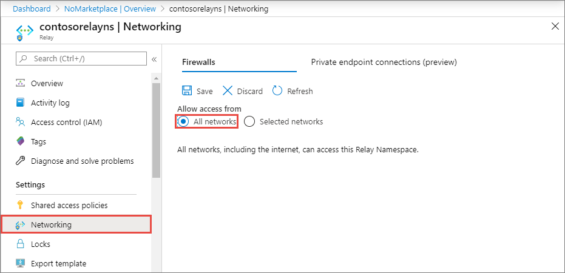
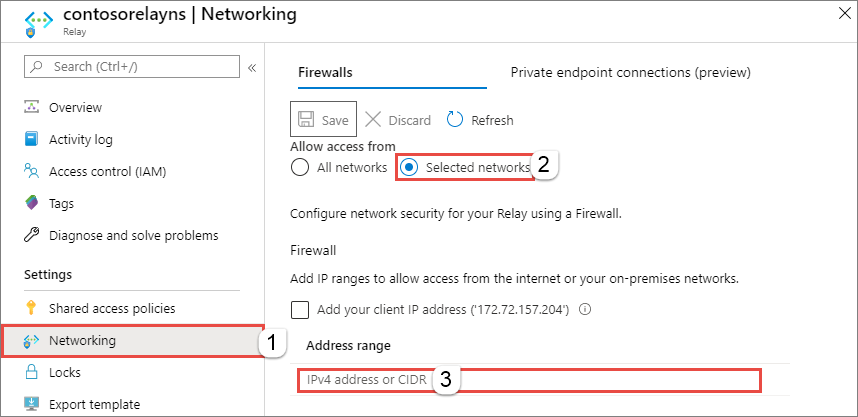

# Configure IP firewall for an Azure Relay namespace
By default, Relay namespaces are accessible from internet as long as the request comes with valid authentication and authorization. With IP firewall, you can restrict it further to only a set of IPv4 addresses or IPv4 address ranges in [CIDR (Classless Inter-Domain Routing)](https://en.wikipedia.org/wiki/Classless_Inter-Domain_Routing) notation.

This feature is helpful in scenarios in which Azure Relay should be only accessible from certain well-known sites. Firewall rules enable you to configure rules to accept traffic originating from specific IPv4 addresses. For example, if you use Relay with [Azure Express Route](../expressroute/expressroute-faqs.md#supported-services), you can create a **firewall rule** to allow traffic from only your on-premises infrastructure IP addresses. 


> [!IMPORTANT]
> This feature is currently in preview. 


## Enable IP firewall rules
The IP firewall rules are applied at the namespace level. Therefore, the rules apply to all connections from clients using any supported protocol. Any connection attempt from an IP address that does not match an allowed IP rule on the namespace is rejected as unauthorized. The response does not mention the IP rule. IP filter rules are applied in order, and the first rule that matches the IP address determines the accept or reject action.

### Use Azure portal
This section shows you how to use the Azure portal to create IP firewall rules for a namespace. 

1. Navigate to your **Relay namespace** in the [Azure portal](https://portal.azure.com).
2. On the left menu, select **Networking** option. If you select the **All networks** option in the  **Allow access from** section, the Relay namespace accepts connections from any IP address. This setting is equivalent to a rule that accepts the 0.0.0.0/0 IP address range. 

    
1. To restrict access to specific networks and IP addresses, select the **Selected networks** option. In the **Firewall** section, follow these steps:
    1. Select **Add your client IP address** option to give your current client IP the access to the namespace. 
    2. For **address range**, enter a specific IPv4 address or a range of IPv4 address in CIDR notation. 
    3. Specify whether you want to **allow trusted Microsoft services to bypass this firewall**. 

        
3. Select **Save** on the toolbar to save the settings. Wait for a few minutes for the confirmation to show up on the portal notifications.


### Use Resource Manager template
The following Resource Manager template enables adding an IP filter rule to an existing Relay namespace.

The template takes one parameter: **ipMask**, which is a single IPv4 address or a block of IP addresses in CIDR notation. For example, in CIDR notation 70.37.104.0/24 represents the 256 IPv4 addresses from 70.37.104.0 to 70.37.104.255, with 24 indicating the number of significant prefix bits for the range.

> [!NOTE]
> While there are no deny rules possible, the Azure Resource Manager template has the default action set to **"Allow"** which doesn't restrict connections.
> When making Virtual Network or Firewalls rules, we must change the
> ***"defaultAction"***
> 
> from
> ```json
> "defaultAction": "Allow"
> ```
> to
> ```json
> "defaultAction": "Deny"
> ```
>

```json
{
    "$schema": "https://schema.management.azure.com/schemas/2015-01-01/deploymentTemplate.json#",
    "contentVersion": "1.0.0.0",
    "parameters": {
      "relayNamespaceName": {
        "type": "string",
        "metadata": {
          "description": "Name of the Relay namespace"
        }
      },
      "location": {
        "type": "string",
        "metadata": {
          "description": "Location for Namespace"
        }
      }
    },
    "variables": {
      "namespaceNetworkRuleSetName": "[concat(parameters('relayNamespaceName'), concat('/', 'default'))]",
    },
    "resources": [
      {
        "apiVersion": "2018-01-01-preview",
        "name": "[parameters('relayNamespaceName')]",
        "type": "Microsoft.Relay/namespaces",
        "location": "[parameters('location')]",
        "sku": {
          "name": "Standard",
          "tier": "Standard"
        },
        "properties": { }
      },
      {
        "apiVersion": "2018-01-01-preview",
        "name": "[variables('namespaceNetworkRuleSetName')]",
        "type": "Microsoft.Relay/namespaces/networkruleset",
        "dependsOn": [
          "[concat('Microsoft.Relay/namespaces/', parameters('relayNamespaceName'))]"
        ],
        "properties": {
          "ipRules": 
          [
            {
                "ipMask":"10.1.1.1",
                "action":"Allow"
            },
            {
                "ipMask":"11.0.0.0/24",
                "action":"Allow"
            }
          ],
          "trustedServiceAccessEnabled": false,
          "defaultAction": "Deny"
        }
      }
    ],
    "outputs": { }
  }
```

To deploy the template, follow the instructions for [Azure Resource Manager](../azure-resource-manager/templates/deploy-powershell.md).


## Next steps
To learn about other network security-related features, see [Network security](network-security.md).


<!-- Links -->

[express-route]:  /azure/expressroute/expressroute-faqs#supported-services
