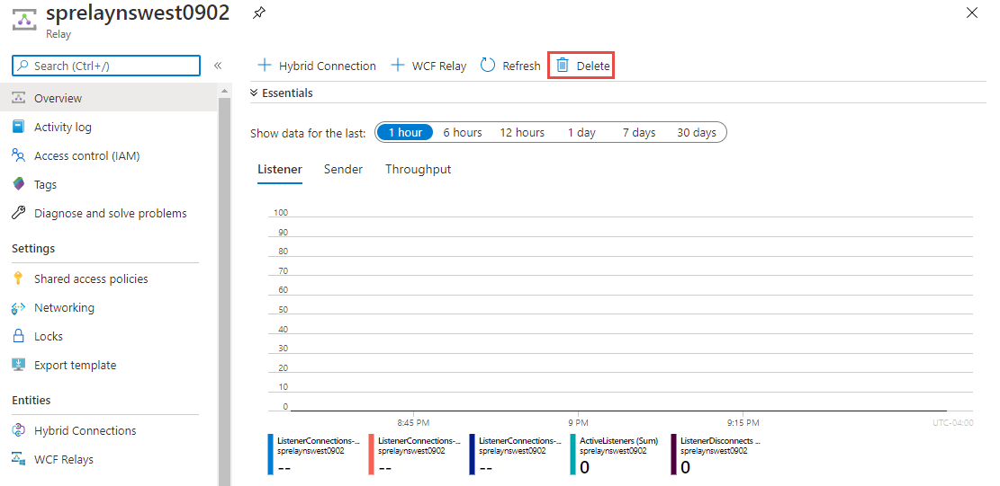

# Move an Azure Relay namespace to another region
This article shows you how to move an Azure Relay namespace from one region to another region. Here are the high-level steps:

1. **Export** the Relay namespace to an Azure Resource Manager template.
1. **Update location (region)** for resources in the template. Also, delete any **dynamic** WCF relays from the template. 

    WCF relays have two modes. In the first mode, the WCF relay is  explicitly created using the Azure portal or Azure Resource Manager template. On the **WCF Relays** page of the Azure portal, you see the **isDynamic** property set to **false** for a relay in this mode. 

    In the second mode, the WCF relay is autogenerated when a listener (server) connects for a given endpoint address. As long as the listener is connected to the relay, you see the relay in the list of WCF relays in the Azure portal. For a relay in this mode, the **isDynamic** property is set to **true** because it's dynamically generated. The dynamic WCF relay goes away when the listener disconnects. 
1. **Deploy** resources using the template to the target region.

## Prerequisites
Ensure that Azure Relay service is available in the target region. See [Products available by region](https://azure.microsoft.com/global-infrastructure/services/?products=service-bus&regions=all). 
 
## Prepare
To get started, export a Resource Manager template. This template contains settings that describe your Azure Relay namespace.

1. Sign in to the [Azure portal](https://portal.azure.com).
2. Select **All resources** and then select your Azure Relay namespace.
3. Select **Export template** under **Automation** in the left menu.
4. Choose **Download** on the **Export template** page.

    :::image type="content" source="./media/move-across-regions/download-template.png" alt-text="Download Resource Manager template":::
5. Locate the .zip file that you downloaded from the portal, and unzip that file to a folder of your choice. This zip file contains the template and parameters JSON files. 
1. Open the **template.json** file from the extracted folder in an editor of your choice.
1. Search for `location`, and replace the value for the property with the new name for the region. To obtain location codes, see [Azure locations](https://azure.microsoft.com/global-infrastructure/locations/). The code for a region is the region name with no spaces, for example, `West US` is equal to `westus`.
1. Remove definitions of **dynamic WCF relay** resources (type: `Microsoft.Relay/namespaces/WcfRelays`). Dynamic WCF relays are the ones that have **isDynamic** property set to **true** on the **Relays** page. In the following example, `echoservice` is a dynamic WCF relay and its definition should be removed from the template. 

    :::image type="content" source="./media/move-across-regions/dynamic-relays.png" alt-text="Dynamic relays":::

## Move
Deploy the template to create a Relay namespace in the target region. 

1. In the Azure portal, select **Create a resource**.
2. In **Search the Marketplace**, type **template deployment** for the search text, select **Template deployment (deploy using custom templates)**, and then press **ENTER**.

    :::image type="content" source="./media/move-across-regions/new-template-deployment.png" alt-text="New template deployment":::    
1. On the **Template deployment** page, select **Create**.

    :::image type="content" source="./media/move-across-regions/template-deployment-create-button.png" alt-text="New template deployment - create button":::        
1. On the **Custom deployment** page, select **Build your own template in the editor**.

    :::image type="content" source="./media/move-across-regions/build-template-link.png" alt-text="Build your own template in the editor - link":::            
1. On the **Edit template** page, select **Load file** on the toolbar, and then follow the instructions to load the **template.json** file that you downloaded in the last section.

    :::image type="content" source="./media/move-across-regions/select-template.png" alt-text="Select template":::                
1. Select **Save** to save the template. 

    :::image type="content" source="./media/move-across-regions/save-template.png" alt-text="Save template":::                    
1. On the **Custom deployment** page, follow these steps: 
    1. Select an Azure **subscription**. 
    2. Select an existing **resource group** or create one. 
    3. Select the target **location** or region. If you selected an existing resource group, this setting is read-only. 
    4. Enter a new **name for the namespace**.
    1. Select **Review + create**. 

        :::image type="content" source="./media/move-across-regions/deploy-template.png" alt-text="Deploy Resource Manager template":::
    1. On the **Review + create** page, select **Create** at the bottom of the page. 
    
## Verify
1. After the deployment is successful, select **Go to resource group**.

    :::image type="content" source="./media/move-across-regions/resource-group-navigation-link.png" alt-text="Go to resource group link":::    
1. On the **Resource group** page, select the Azure Relay namespace. 

    :::image type="content" source="./media/move-across-regions/select-namespace.png" alt-text="Select Azure Relay namespace":::    
1. On the **Azure Relay namespace** page, select **Hybrid Connections** or **WCF Relays** on the left menu to verify that hybrid connections and WCF relays are created. If you forgot to delete definitions for dynamic WCF relays before importing the template, delete them on the **WCF Relays** page. The dynamic WCF relays are created automatically when clients connect to the Relay namespace. 

## Discard or clean up
After the deployment, if you want to start over, you can delete the **target Azure Relay namespace**, and repeat the steps that are described in the [Prepare](#prepare) and [Move](#move) sections of this article.

To commit the changes and complete the move of a namespace, delete the **Azure Relay namespace** in the source region. 

To delete an Azure Relay namespace (source or target) by using the Azure portal:

1. In the search window at the top of Azure portal, type **Relays**, and select **Relays** from **Services** in the search results. You see all Azure Relay namespaces in a list.
2. Select the target namespace to delete to open the **Relay** page. 
1. On the **Relay** page, select **Delete** from the toolbar. 

    
3. On the **Delete Namespace** page, type the name of the Azure Relay namespace to confirm the deletion, and then select **Delete**. 

## Next steps
In this tutorial, you moved an Azure Relay namespace from one region to another region. To learn more about moving resources between regions and disaster recovery in Azure, refer to:

- [Move resources to a new resource group or subscription](../azure-resource-manager/management/move-resource-group-and-subscription.md)
