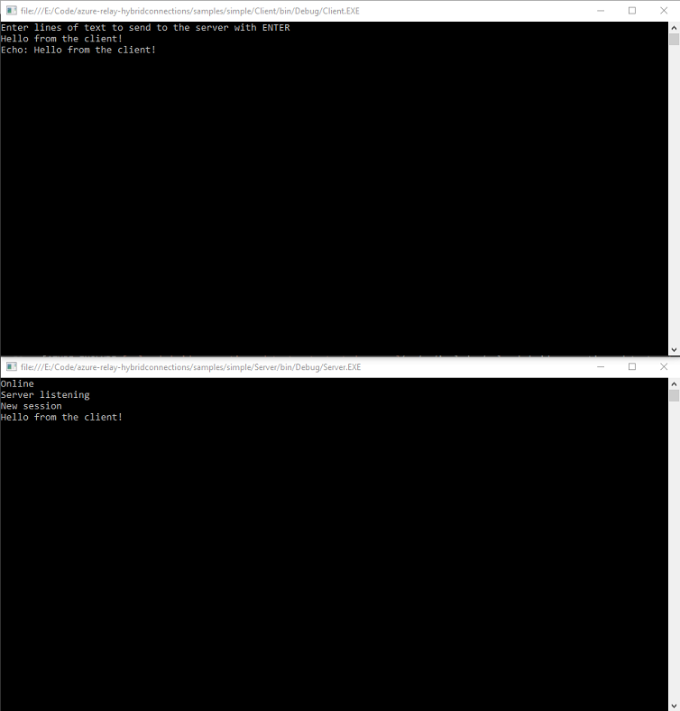

# Get started with Relay Hybrid Connections WebSockets in .NET
[!INCLUDE [relay-selector-hybrid-connections](../../includes/relay-selector-hybrid-connections.md)]

In this quickstart, you create .NET sender and receiver applications that send and receive messages by using Hybrid Connections WebSockets in Azure Relay. 
To learn about Azure Relay in general, see [Azure Relay](relay-what-is-it.md). 

In this quickstart, you take the following steps:

1. Create a Relay namespace by using the Azure portal.
2. Create a hybrid connection in that namespace by using the Azure portal.
3. Write a server (listener) console application to receive messages.
4. Write a client (sender) console application to send messages.
5. Run applications. 

## Prerequisites

To complete this tutorial, you need the following prerequisites:

* [Visual Studio 2015 or later](https://www.visualstudio.com). The examples in this tutorial use Visual Studio 2017.
* An Azure subscription. If you don't have one, [create a free account](https://azure.microsoft.com/free/) before you begin.

## Create a namespace
[!INCLUDE [relay-create-namespace-portal](../../includes/relay-create-namespace-portal.md)]

## Create a hybrid connection
[!INCLUDE [relay-create-hybrid-connection-portal](../../includes/relay-create-hybrid-connection-portal.md)]

## Create a server application (listener)
In Visual Studio, write a C# console application to listen for and receive messages from the relay.

[!INCLUDE [relay-hybrid-connections-dotnet-get-started-server](../../includes/relay-hybrid-connections-dotnet-get-started-server.md)]

## Create a client application (sender)
In Visual Studio, write a C# console application to send messages to the relay.

[!INCLUDE [relay-hybrid-connections-dotnet-get-started-client](../../includes/relay-hybrid-connections-dotnet-get-started-client.md)]

## Run the applications
1. Run the server application.
2. Run the client application and enter some text.
3. Ensure that the server application console displays the text that was entered in the client application.

    

Congratulations, you've created a complete Hybrid Connections application!

## Next steps
In this quickstart, you created .NET client and server applications that used WebSockets to send and receive messages. The Hybrid Connections feature of Azure Relay also supports using HTTP to send and receive messages. To learn how to use HTTP with Azure Relay Hybrid Connections, see the [HTTP quickstart](relay-hybrid-connections-http-requests-dotnet-get-started.md).

In this quickstart, you used .NET Framework to create client and server applications. To learn how to write client and server applications using Node.js, see the [Node.js WebSockets quickstart](relay-hybrid-connections-node-get-started.md) or the [Node.js HTTP quickstart](relay-hybrid-connections-http-requests-dotnet-get-started.md).

