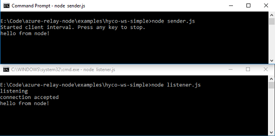

# Get started with Relay Hybrid Connections WebSockets in Node.js

[!INCLUDE [relay-selector-hybrid-connections](./includes/relay-selector-hybrid-connections.md)]

In this quickstart, you create Node.js sender and receiver applications that send and receive messages by using Hybrid Connections WebSockets in Azure Relay. 
To learn about Azure Relay in general, see [Azure Relay](relay-what-is-it.md). 

In this quickstart, you take the following steps: 

1. Create a Relay namespace by using the Azure portal.
2. Create a hybrid connection in that namespace by using the Azure portal.
3. Write a server (listener) console application to receive messages.
4. Write a client (sender) console application to send messages.
5. Run applications. 

## Prerequisites

- [Node.js](https://nodejs.org/en/).
- An Azure subscription. If you don't have one, [create a free account](https://azure.microsoft.com/free/) before you begin.

## Create a namespace
[!INCLUDE [relay-create-namespace-portal](./includes/relay-create-namespace-portal.md)]

## Create a hybrid connection
[!INCLUDE [relay-create-hybrid-connection-portal](./includes/relay-create-hybrid-connection-portal.md)]

## Create a server application (listener)
To listen and receive messages from the Relay, write a Node.js console application.

[!INCLUDE [relay-hybrid-connections-node-get-started-server](./includes/relay-hybrid-connections-node-get-started-server.md)]

## Create a client application (sender)
To send messages to the Relay, write a Node.js console application.

[!INCLUDE [relay-hybrid-connections-node-get-started-client](./includes/relay-hybrid-connections-node-get-started-client.md)]

## Run the applications

1. Run the server application: from a Node.js command prompt type `node listener.js`.
2. Run the client application: from a Node.js command prompt type `node sender.js`, and enter some text.
3. Ensure that the server application console outputs the text that was entered in the client application.

    

Congratulations, you have created an end-to-end Hybrid Connections application using Node.js!

## Next steps
In this quickstart, you created Node.js client and server applications that used WebSockets to send and receive messages. The Hybrid Connections feature of Azure Relay also supports using HTTP to send and receive messages. To learn how to use HTTP with Azure Relay Hybrid Connections, see the [Node.js HTTP quickstart](relay-hybrid-connections-http-requests-node-get-started.md).

In this quickstart, you used Node.js to create client and server applications. To learn how to write client and server applications using .NET Framework, see the [.NET WebSockets quickstart](relay-hybrid-connections-dotnet-get-started.md) or the [.NET HTTP quickstart](relay-hybrid-connections-http-requests-dotnet-get-started.md).

