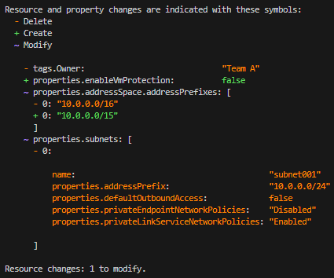
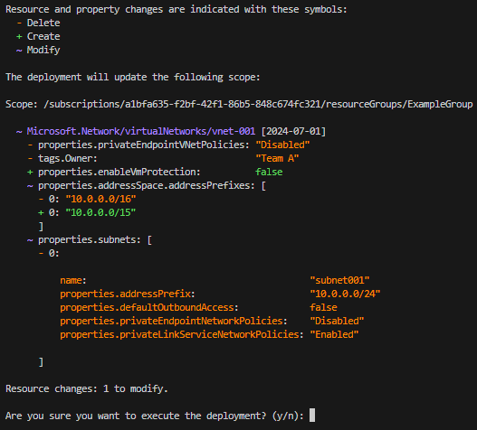

# Bicep deployment what-if operation

Before deploying a Bicep file, you can preview the changes that will happen. Azure Resource Manager provides the what-if operation to let you see how resources will change if you deploy the Bicep file. The what-if operation doesn't make any changes to existing resources. Instead, it predicts the changes if the specified Bicep file is deployed.

You can use the what-if operation with Azure PowerShell, Azure CLI, or REST API operations. What-if is supported for resource group, subscription, management group, and tenant level deployments.

During What-If operations, the evaluation and expansion of `templateLink` are not supported. As a result, any resources deployed using template links within nested deployments, including template spec references, will not be visible in the What-If operation results.

### Training resources

If you would rather learn about the what-if operation through step-by-step guidance, see [Preview Azure deployment changes by using what-if](/training/modules/arm-template-whatif/).

[!INCLUDE [permissions](../../../includes/template-deploy-permissions.md)]

## What-if limits

What-if expands nested templates until these limits are reached:

- 500 nested templates.
- 800 resource groups in a cross resource-group deployment.
- 5 minutes taken for expanding the nested templates.

When one of the limits is reached, the remaining resources' [change type](#change-types) is set to **Ignore**.

## Install Azure PowerShell module

To use what-if in PowerShell, you must have version **4.2 or later of the Az module**.

To install the module, use:

```powershell
Install-Module -Name Az -Force
```

For more information about installing modules, see [Install Azure PowerShell](/powershell/azure/install-azure-powershell).

## Install Azure CLI module

To use what-if in Azure CLI, you must have Azure CLI 2.14.0 or later. If needed, [install the latest version of Azure CLI](/cli/azure/install-azure-cli).

## See results

When you use what-if in PowerShell or Azure CLI, the output includes color-coded results that help you see the different types of changes.



The text output is:

```powershell
Resource and property changes are indicated with these symbols:
  - Delete
  + Create
  ~ Modify

The deployment will update the following scope:

Scope: /subscriptions/./resourceGroups/ExampleGroup

  ~ Microsoft.Network/virtualNetworks/vnet-001 [2018-10-01]
    - tags.Owner: "Team A"
    ~ properties.addressSpace.addressPrefixes: [
      - 0: "10.0.0.0/16"
      + 0: "10.0.0.0/15"
      ]
    ~ properties.subnets: [
      - 0:

          name:                     "subnet001"
          properties.addressPrefix: "10.0.0.0/24"

      ]

Resource changes: 1 to modify.
```

> [!NOTE]
> The what-if operation can't resolve the [reference function](./bicep-functions-resource.md#reference). Every time you set a property to a template expression that includes the reference function, what-if reports the property will change. This behavior happens because what-if compares the current value of the property (such as `true` or `false` for a boolean value) with the unresolved template expression. Obviously, these values will not match. When you deploy the Bicep file, the property will only change when the template expression resolves to a different value.

## What-if commands

### Azure PowerShell

To preview changes before deploying a Bicep file, use [New-AzResourceGroupDeployment](/powershell/module/az.resources/new-azresourcegroupdeployment) or [New-AzSubscriptionDeployment](/powershell/module/az.resources/new-azdeployment). Add the `-Whatif` switch parameter to the deployment command.

- `New-AzResourceGroupDeployment -Whatif` for resource group deployments
- `New-AzSubscriptionDeployment -Whatif` and `New-AzDeployment -Whatif` for subscription level deployments

You can use the `-Confirm` switch parameter to preview the changes and get prompted to continue with the deployment.

- `New-AzResourceGroupDeployment -Confirm` for resource group deployments
- `New-AzSubscriptionDeployment -Confirm` and `New-AzDeployment -Confirm` for subscription level deployments

The preceding commands return a text summary that you can manually inspect. To get an object that you can programmatically inspect for changes, use [Get-AzResourceGroupDeploymentWhatIfResult](/powershell/module/az.resources/get-azresourcegroupdeploymentwhatifresult) or [Get-AzSubscriptionDeploymentWhatIfResult](/powershell/module/az.resources/get-azdeploymentwhatifresult).

- `$results = Get-AzResourceGroupDeploymentWhatIfResult` for resource group deployments
- `$results = Get-AzSubscriptionDeploymentWhatIfResult` or `$results = Get-AzDeploymentWhatIfResult` for subscription level deployments

### Azure CLI

To preview changes before deploying a Bicep file, use:

- [az deployment group what-if](/cli/azure/deployment/group#az-deployment-group-what-if) for resource group deployments
- [az deployment sub what-if](/cli/azure/deployment/sub#az-deployment-sub-what-if) for subscription level deployments
- [az deployment mg what-if](/cli/azure/deployment/mg#az-deployment-mg-what-if) for management group deployments
- [az deployment tenant what-if](/cli/azure/deployment/tenant#az-deployment-tenant-what-if) for tenant deployments

You can use the `--confirm-with-what-if` switch (or its short form `-c`) to preview the changes and get prompted to continue with the deployment. Add this switch to:

- [az deployment group create](/cli/azure/deployment/group#az-deployment-group-create)
- [az deployment sub create](/cli/azure/deployment/sub#az-deployment-sub-create).
- [az deployment mg create](/cli/azure/deployment/mg#az-deployment-mg-create)
- [az deployment tenant create](/cli/azure/deployment/tenant#az-deployment-tenant-create)

For example, use `az deployment group create --confirm-with-what-if` or `-c` for resource group deployments.

The preceding commands return a text summary that you can manually inspect. To get a JSON object that you can programmatically inspect for changes, use the `--no-pretty-print` switch. For example, use `az deployment group what-if --no-pretty-print` for resource group deployments.

If you want to return the results without colors, open your [Azure CLI configuration](/cli/azure/azure-cli-configuration) file. Set **no_color** to **yes**.

### Azure REST API

For REST API, use:

- [Deployments - What If](/rest/api/resources/deployments/whatif) for resource group deployments
- [Deployments - What If At Subscription Scope](/rest/api/resources/deployments/whatifatsubscriptionscope) for subscription deployments
- [Deployments - What If At Management Group Scope](/rest/api/resources/deployments/whatifatmanagementgroupscope) for management group deployments
- [Deployments - What If At Tenant Scope](/rest/api/resources/deployments/whatifattenantscope) for tenant deployments.

## Change types

The what-if operation lists seven different types of changes:

- **Create**: The resource doesn't currently exist but is defined in the Bicep file. The resource will be created.
- **Delete**: This change type only applies when using [complete mode](../templates/deployment-modes.md) for JSON template deployment. The resource exists, but isn't defined in the Bicep file. With complete mode, the resource will be deleted. Only resources that [support complete mode deletion](../templates/deployment-complete-mode-deletion.md) are included in this change type.
- **Ignore**: The resource exists, but isn't defined in the Bicep file. The resource won't be deployed or modified. When you reach the limits for expanding nested templates, you will encounter this change type. See [What-if limits](#what-if-limits).
- **NoChange**: The resource exists, and is defined in the Bicep file. The resource will be redeployed, but the properties of the resource won't change. This change type is returned when [ResultFormat](#result-format) is set to `FullResourcePayloads`, which is the default value.
- **NoEffect**: The property is ready-only and will be ignored by the service. For example, the `sku.tier` property is always set to match `sku.name` in the [`Microsoft.ServiceBus`](/azure/templates/microsoft.servicebus/namespaces) namespace.
- **Modify**: The resource exists, and is defined in the Bicep file. The resource will be redeployed, and the properties of the resource will change. This change type is returned when [ResultFormat](#result-format) is set to `FullResourcePayloads`, which is the default value.
- **Deploy**: The resource exists, and is defined in the Bicep file. The resource will be redeployed. The properties of the resource may or may not change. The operation returns this change type when it doesn't have enough information to determine if any properties will change. You only see this condition when [ResultFormat](#result-format) is set to `ResourceIdOnly`.

## Result format

You control the level of detail that is returned about the predicted changes. You have two options:

- **FullResourcePayloads** - returns a list of resources that will change and details about the properties that will change
- **ResourceIdOnly** - returns a list of resources that will change

The default value is **FullResourcePayloads**.

For PowerShell deployment commands, use the `-WhatIfResultFormat` parameter. In the programmatic object commands, use the `ResultFormat` parameter.

For Azure CLI, use the `--result-format` parameter.

The following results show the two different output formats:

- Full resource payloads

  ```powershell
  Resource and property changes are indicated with these symbols:
    - Delete
    + Create
    ~ Modify

  The deployment will update the following scope:

  Scope: /subscriptions/./resourceGroups/ExampleGroup

    ~ Microsoft.Network/virtualNetworks/vnet-001 [2018-10-01]
      - tags.Owner: "Team A"
      ~ properties.addressSpace.addressPrefixes: [
        - 0: "10.0.0.0/16"
        + 0: "10.0.0.0/15"
        ]
      ~ properties.subnets: [
        - 0:

          name:                     "subnet001"
          properties.addressPrefix: "10.0.0.0/24"

        ]

  Resource changes: 1 to modify.
  ```

- Resource ID only

  ```powershell
  Resource and property changes are indicated with this symbol:
    ! Deploy

  The deployment will update the following scope:

  Scope: /subscriptions/./resourceGroups/ExampleGroup

    ! Microsoft.Network/virtualNetworks/vnet-001

  Resource changes: 1 to deploy.
  ```

## Run what-if operation

### Set up environment

To see how what-if works, let's runs some tests. First, deploy a Bicep file that creates a virtual network. You'll use this virtual network to test how changes are reported by what-if. Download a copy of the Bicep file.

:::code language="bicep" source="~/azure-docs-bicep-samples/samples/deploy-what-if/what-if-before.bicep":::

To deploy the Bicep file, use:

# [PowerShell](#tab/azure-powershell)

```azurepowershell
New-AzResourceGroup `
  -Name ExampleGroup `
  -Location centralus
New-AzResourceGroupDeployment `
  -ResourceGroupName ExampleGroup `
  -TemplateFile "what-if-before.bicep"
```

# [Azure CLI](#tab/azure-cli)

```azurecli
az group create \
  --name ExampleGroup \
  --location "Central US"
az deployment group create \
  --resource-group ExampleGroup \
  --template-file "what-if-before.bicep"
```

---

### Test modification

After the deployment completes, you're ready to test the what-if operation. This time you deploy a Bicep file that changes the virtual network. It's missing one of the original tags, a subnet has been removed, and the address prefix has changed. Download a copy of the Bicep file.

:::code language="bicep" source="~/azure-docs-bicep-samples/samples/deploy-what-if/what-if-after.bicep":::

To view the changes, use:

# [PowerShell](#tab/azure-powershell)

```azurepowershell
New-AzResourceGroupDeployment `
  -Whatif `
  -ResourceGroupName ExampleGroup `
  -TemplateFile "what-if-after.bicep"
```

# [Azure CLI](#tab/azure-cli)

```azurecli
az deployment group what-if \
  --resource-group ExampleGroup \
  --template-file "what-if-after.bicep"
```

---

The what-if output appears similar to:


The text output is:

```powershell
Resource and property changes are indicated with these symbols:
  - Delete
  + Create
  ~ Modify

The deployment will update the following scope:

Scope: /subscriptions/./resourceGroups/ExampleGroup

  ~ Microsoft.Network/virtualNetworks/vnet-001 [2018-10-01]
    - tags.Owner:                    "Team A"
    + properties.enableVmProtection: false
    ~ properties.addressSpace.addressPrefixes: [
      - 0: "10.0.0.0/16"
      + 0: "10.0.0.0/15"
      ]
    ~ properties.subnets: [
      - 0:

          name:                     "subnet001"
          properties.addressPrefix: "10.0.0.0/24"

      ]

Resource changes: 1 to modify.
```

Notice at the top of the output that colors are defined to indicate the type of changes.

At the bottom of the output, it shows the tag Owner was deleted. The address prefix changed from 10.0.0.0/16 to 10.0.0.0/15. The subnet named subnet001 was deleted. Remember these changes weren't deployed. You see a preview of the changes that will happen if you deploy the Bicep file.

Some of the properties that are listed as deleted won't actually change. Properties can be incorrectly reported as deleted when they aren't in the Bicep file, but are automatically set during deployment as default values. This result is considered "noise" in the what-if response. The final deployed resource will have the values set for the properties. As the what-if operation matures, these properties will be filtered out of the result.

## Programmatically evaluate what-if results

Now, let's programmatically evaluate the what-if results by setting the command to a variable.

# [PowerShell](#tab/azure-powershell)

```azurepowershell
$results = Get-AzResourceGroupDeploymentWhatIfResult `
  -ResourceGroupName ExampleGroup `
  --template-file "what-if-after.bicep"
```

You can see a summary of each change.

```azurepowershell
foreach ($change in $results.Changes)
{
  $change.Delta
}
```

# [Azure CLI](#tab/azure-cli)

```azurecli
results=$(az deployment group what-if --resource-group ExampleGroup --template-file "what-if-after.bicep" --no-pretty-print)
```

---

## Confirm deletion

To preview changes before deploying a Bicep file, use the confirm switch parameter with the deployment command. If the changes are as you expected, respond that you want the deployment to complete.

# [PowerShell](#tab/azure-powershell)

```azurepowershell
New-AzResourceGroupDeployment `
  -ResourceGroupName ExampleGroup `
  -Confirm `
  -TemplateFile "what-if-after.bicep"
```

# [Azure CLI](#tab/azure-cli)

```azurecli
az deployment group create \
  --resource-group ExampleGroup \
  --confirm-with-what-if \
  --template-file "what-if-after.bicep"
```

---



The text output is:

```powershell
Resource and property changes are indicated with these symbols:
  - Delete
  + Create
  ~ Modify

The deployment will update the following scope:

Scope: /subscriptions/./resourceGroups/ExampleGroup

  ~ Microsoft.Network/virtualNetworks/vnet-001 [2018-10-01]
    - tags.Owner:                    "Team A"
    + properties.enableVmProtection: false
    ~ properties.addressSpace.addressPrefixes: [
      - 0: "10.0.0.0/16"
      + 0: "10.0.0.0/15"
      ]
    ~ properties.subnets: [
      - 0:

          name:                     "subnet001"
          properties.addressPrefix: "10.0.0.0/24"

      ]

Resource changes: 1 to modify.

Are you sure you want to execute the deployment?
[Y] Yes  [A] Yes to All  [N] No  [L] No to All  [S] Suspend  [?] Help (default is "Y"):
```

You see the expected changes and can confirm that you want the deployment to run.

## Clean up resources

When you no longer need the example resources, use Azure CLI or Azure PowerShell to delete the resource group.

# [CLI](#tab/CLI)

```azurecli
az group delete --name ExampleGroup
```

# [PowerShell](#tab/PowerShell)

```azurepowershell
Remove-AzResourceGroup -Name ExampleGroup
```

---

## SDKs

You can use the what-if operation through the Azure SDKs.

- For Python, use [what-if](/python/api/azure-mgmt-resource/azure.mgmt.resource.resources.v2019_10_01.operations.deploymentsoperations#what-if-resource-group-name--deployment-name--properties--location-none--custom-headers-none--raw-false--polling-true----operation-config-).

- For Java, use [DeploymentWhatIf Class](/java/api/com.azure.resourcemanager.resources.models.deploymentwhatif).

- For .NET, use [DeploymentWhatIf Class](/dotnet/api/microsoft.azure.management.resourcemanager.models.deploymentwhatif).

## Next steps

- To use the what-if operation in a pipeline, see [Test ARM templates with What-If in a pipeline](https://4bes.nl/2021/03/06/test-arm-templates-with-what-if/).
- If you notice incorrect results from the what-if operation, please report the issues at [https://aka.ms/whatifissues](https://aka.ms/whatifissues).
- For a Learn module that demonstrates using what-if, see [Preview changes and validate Azure resources by using what-if and the ARM template test toolkit](/training/modules/arm-template-test/).
