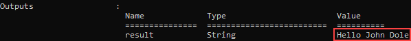
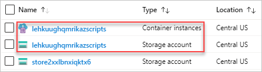
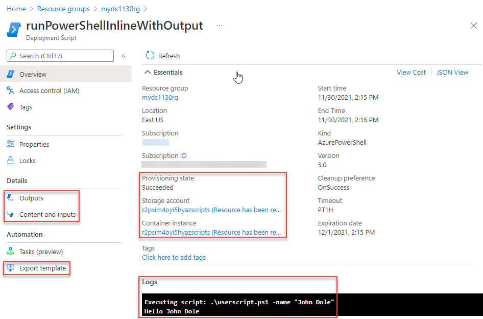

# Use deployment scripts in Bicep

Learn how to use deployment scripts in Bicep. With the [`deploymentScripts`](/azure/templates/microsoft.resources/deploymentscripts) resource, users can execute scripts in Bicep deployments and review execution results.

These scripts can be used for performing custom steps such as:

- add users to a directory
- perform data plane operations, for example, copy blobs or seed database
- look up and validate a license key
- create a self-signed certificate
- create an object in Azure Active Directory (Azure AD)
- look up IP Address blocks from custom system

The benefits of deployment script:

- Easy to code, use, and debug. You can develop deployment scripts in your favorite development environments. The scripts can be embedded in Bicep files or in external script files.
- You can specify the script language and platform. Currently, Azure PowerShell and Azure CLI deployment scripts on the Linux environment are supported.
- Allow passing command-line arguments to the script.
- Can specify script outputs and pass them back to the deployment.

The deployment script resource is only available in the regions where Azure Container Instance is available.  See [Resource availability for Azure Container Instances in Azure regions](../../container-instances/container-instances-region-availability.md). Currently, deployment script only uses public networking.

> [!IMPORTANT]
> The deployment script service requires two supporting resources for script execution and troubleshooting: a storage account and a container instance. You can specify an existing storage account, otherwise the script service creates one for you. The two automatically-created supporting resources are usually deleted by the script service when the deployment script execution gets in a terminal state. You are billed for the supporting resources until they are deleted. For the price information, see [Container Instances pricing](https://azure.microsoft.com/pricing/details/container-instances/) and [Azure Storage pricing](https://azure.microsoft.com/pricing/details/storage/). To learn more, see [Clean-up deployment script resources](#clean-up-deployment-script-resources).

> [!NOTE]
> Retry logic for Azure sign in is now built in to the wrapper script. If you grant permissions in the same Bicep file as your deployment scripts, the deployment script service retries sign in for 10 minutes with 10-second interval until the managed identity role assignment is replicated.

### Training resources

If you would rather learn about deployment scripts through step-by-step guidance, see [Extend ARM templates by using deployment scripts](/training/modules/extend-resource-manager-template-deployment-scripts).

## Configure the minimum permissions

For deployment script API version 2020-10-01 or later, there are two principals involved in deployment script execution:

- **Deployment principal** (the principal used to deploy the Bicep file): this principal is used to create underlying resources required for the deployment script resource to execute—a storage account and an Azure container instance. To configure the least-privilege permissions, assign a custom role with the following properties to the deployment principal:

    ```json
    {
      "roleName": "deployment-script-minimum-privilege-for-deployment-principal",
      "description": "Configure least privilege for the deployment principal in deployment script",
      "type": "customRole",
      "IsCustom": true,
      "permissions": [
        {
          "actions": [
            "Microsoft.Storage/storageAccounts/*",
            "Microsoft.ContainerInstance/containerGroups/*",
            "Microsoft.Resources/deployments/*",
            "Microsoft.Resources/deploymentScripts/*"
          ],
        }
      ],
      "assignableScopes": [
        "[subscription().id]"
      ]
    }
    ```

    If the Azure Storage and the Azure Container Instance resource providers haven't been registered, you also need to add `Microsoft.Storage/register/action` and `Microsoft.ContainerInstance/register/action`.

- **Deployment script principal**: This principal is only required if the deployment script needs to authenticate to Azure and call Azure CLI/PowerShell. There are two ways to specify the deployment script principal:

  - Specify a [user-assigned managed identity]() in the `identity` property (see [Sample Bicep files](#sample-bicep-files)). When specified, the script service calls `Connect-AzAccount -Identity` before invoking the deployment script. The managed identity must have the required access to complete the operation in the script. Currently, only user-assigned managed identity is supported for the `identity` property. To login with a different identity, use the second method in this list.
  - Pass the service principal credentials as secure environment variables, and then can call [Connect-AzAccount](/powershell/module/az.accounts/connect-azaccount) or [az login](/cli/azure/reference-index#az-login) in the deployment script.

  If a managed identity is used, the deployment principal needs the **Managed Identity Operator** role (a built-in role) assigned to the managed identity resource.

## Sample Bicep files

The following Bicep file is an example. For more information, see the latest [Bicep schema](/azure/templates/microsoft.resources/deploymentscripts?tabs=bicep).

```bicep
resource runPowerShellInline 'Microsoft.Resources/deploymentScripts@2020-10-01' = {
  name: 'runPowerShellInline'
  location: resourceGroup().location
  kind: 'AzurePowerShell'
  tags: {
    tagName1: 'tagValue1'
    tagName2: 'tagValue2'
  }
  identity: {
    type: 'UserAssigned'
    userAssignedIdentities: {
      '/subscriptions/01234567-89AB-CDEF-0123-456789ABCDEF/resourceGroups/myResourceGroup/providers/Microsoft.ManagedIdentity/userAssignedIdentities/myID': {}
    }
  }
  properties: {
    forceUpdateTag: '1'
    containerSettings: {
      containerGroupName: 'mycustomaci'
      subnetIds: [
        {
          id: '/subscriptions/01234567-89AB-CDEF-0123-456789ABCDEF/resourceGroups/myResourceGroup/providers/Microsoft.Network/virtualNetworks/myVnet/subnets/mySubnet'
        }
      ]
    }
    storageAccountSettings: {
      storageAccountName: 'myStorageAccount'
      storageAccountKey: 'myKey'
    }
    azPowerShellVersion: '9.7' // or azCliVersion: '2.47.0'
    arguments: '-name \\"John Dole\\"'
    environmentVariables: [
      {
        name: 'UserName'
        value: 'jdole'
      }
      {
        name: 'Password'
        secureValue: 'jDolePassword'
      }
    ]
    scriptContent: '''
      param([string] $name)
      $output = 'Hello {0}. The username is {1}, the password is {2}.' -f $name,${Env:UserName},${Env:Password}
      Write-Output $output
      $DeploymentScriptOutputs = @{}
      $DeploymentScriptOutputs['text'] = $output
    ''' // or primaryScriptUri: 'https://raw.githubusercontent.com/Azure/azure-docs-bicep-samples/main/samples/deployment-script/inlineScript.ps1'
    supportingScriptUris: []
    timeout: 'PT30M'
    cleanupPreference: 'OnSuccess'
    retentionInterval: 'P1D'
  }
}
```

Property value details:

- <a id='identity'></a>`identity`: For deployment script API version 2020-10-01 or later, a user-assigned managed identity is optional unless you need to perform any Azure-specific actions in the script or running deployment script in private network. For more information, see [Access private virtual network](#access-private-virtual-network). For the API version 2019-10-01-preview, a managed identity is required as the deployment script service uses it to execute the scripts. When the identity property is specified, the script service calls `Connect-AzAccount -Identity` before invoking the user script. Currently, only user-assigned managed identity is supported. To login with a different identity, you can call [Connect-AzAccount](/powershell/module/az.accounts/connect-azaccount) in the script.
- `tags`: Deployment script tags. If the deployment script service generates a storage account and a container instance, the tags are passed to both resources, which can be used to identify them. Another way to identify these resources is through their suffixes, which contain "azscripts". For more information, see [Monitor and troubleshoot deployment scripts](#monitor-and-troubleshoot-deployment-scripts).
- `kind`: Specify the type of script. Currently, Azure PowerShell and Azure CLI scripts are supported. The values are **AzurePowerShell** and **AzureCLI**.
- `forceUpdateTag`: Changing this value between Bicep file deployments forces the deployment script to re-execute. If you use the `newGuid()` or the `utcNow()` functions, both functions can only be used in the default value for a parameter. To learn more, see [Run script more than once](#run-script-more-than-once).
- `containerSettings`: Specify the settings to customize Azure Container Instance. Deployment script requires a new Azure Container Instance. You can't specify an existing Azure Container Instance. However, you can customize the container group name by using `containerGroupName`. If not specified, the group name is automatically generated. You can also specify subnetIds for running the deployment script in a private network. For more information, see [Access private virtual network](#access-private-virtual-network).
- `storageAccountSettings`: Specify the settings to use an existing storage account. If `storageAccountName` is not specified, a storage account is automatically created. See [Use an existing storage account](#use-existing-storage-account).
- `azPowerShellVersion`/`azCliVersion`: Specify the module version to be used. See a list of [supported Azure PowerShell versions](https://mcr.microsoft.com/v2/azuredeploymentscripts-powershell/tags/list). The version determines which container image to use:

  - **Az version greater than or equal to 9** uses Ubuntu 22.04.
  - **Az version greater than or equal to 6 but less than 9** uses Ubuntu 20.04.
  - **Az version less than 6** uses Ubuntu 18.04.

  > [!IMPORTANT]
  > It is advisable to upgrade to the latest version of Ubuntu, as Ubuntu 18.04 is nearing its end of life and will no longer receive security updates beyond [May 31st, 2023](https://ubuntu.com/18-04).

  See a list of [supported Azure CLI versions](https://mcr.microsoft.com/v2/azure-cli/tags/list).

  > [!IMPORTANT]
  > Deployment script uses the available CLI images from Microsoft Container Registry (MCR). It typically takes approximatedly one month to certify a CLI image for deployment script. Don't use the CLI versions that were released within 30 days. To find the release dates for the images, see [Azure CLI release notes](/cli/azure/release-notes-azure-cli). If an unsupported version is used, the error message lists the supported versions.

- `arguments`: Specify the parameter values. The values are separated by spaces.

  Deployment Scripts splits the arguments into an array of strings by invoking the [CommandLineToArgvW](/windows/win32/api/shellapi/nf-shellapi-commandlinetoargvw) system call. This step is necessary because the arguments are passed as a [command property](/rest/api/container-instances/2022-09-01/container-groups/create-or-update#containerexec)
    to Azure Container Instance, and the command property is an array of string.

  If the arguments contain escaped characters, double escaped the characters. For example, in the previous sample Bicep, The argument is `-name \"John Dole\"`. The escaped string is `-name \\"John Dole\\"`.

  To pass a Bicep parameter of type object as an argument, convert the object to a string by using the [string()](./bicep-functions-string.md#string) function, and then use the [replace()](./bicep-functions-string.md#replace) function to replace any `"` into `\\"`. For example:

  ```json
  replace(string(parameters('tables')), '"', '\\"')
  ```

  For more information, see the [sample Bicep file](https://raw.githubusercontent.com/Azure/azure-docs-bicep-samples/main/samples/deployment-script/deploymentscript-jsonEscape.bicep).

- `environmentVariables`: Specify the environment variables to pass over to the script. For more information, see [Develop deployment scripts](#develop-deployment-scripts).
- `scriptContent`: Specify the script content. To run an external script, use `primaryScriptUri` instead. For examples, see [Use inline script](#use-inline-scripts) and [Use external script](#use-external-scripts).
- `primaryScriptUri`: Specify a publicly accessible URL to the primary deployment script with supported file extensions. For more information, see [Use external scripts](#use-external-scripts).
- `supportingScriptUris`: Specify an array of publicly accessible URLs to supporting files that are called in either `scriptContent` or `primaryScriptUri`. For more information, see [Use external scripts](#use-external-scripts).
- `timeout`: Specify the maximum allowed script execution time specified in the [ISO 8601 format](https://en.wikipedia.org/wiki/ISO_8601). Default value is **P1D**.
- `cleanupPreference`. Specify the preference of cleaning up the two supporting deployment resources, the storage account and the container instance, when the script execution gets in a terminal state. Default setting is **Always**, which means deleting the supporting resources despite the terminal state (Succeeded, Failed, Canceled). To learn more, see [Clean up deployment script resources](#clean-up-deployment-script-resources).
- `retentionInterval`: Specify the interval for which the service retains the deployment script resource after the deployment script execution reaches a terminal state. The deployment script resource is deleted when this duration expires. Duration is based on the [ISO 8601 pattern](https://en.wikipedia.org/wiki/ISO_8601). The retention interval is between 1 and 26 hours (PT26H). This property is used when `cleanupPreference` is set to **OnExpiration**. To learn more, see [Clean up deployment script resources](#clean-up-deployment-script-resources).

### More samples

- [Sample 1](https://raw.githubusercontent.com/Azure/azure-docs-bicep-samples/master/samples/deployment-script/deploymentscript-keyvault.bicep): create a key vault and use deployment script to assign a certificate to the key vault.
- [Sample 2](https://raw.githubusercontent.com/Azure/azure-docs-bicep-samples/master/samples/deployment-script/deploymentscript-keyvault-subscription.bicep): create a resource group at the subscription level, create a key vault in the resource group, and then use deployment script to assign a certificate to the key vault.
- [Sample 3](https://raw.githubusercontent.com/Azure/azure-docs-bicep-samples/master/samples/deployment-script/deploymentscript-keyvault-mi.bicep): create a user-assigned managed identity, assign the contributor role to the identity at the resource group level, create a key vault, and then use deployment script to assign a certificate to the key vault.
- [Sample 4](https://github.com/Azure/azure-quickstart-templates/tree/master/quickstarts/microsoft.resources/deployment-script-azcli-graph-azure-ad): manually create a user-assigned managed identity and assign it permission to use the Microsoft Graph API to create Azure AD applications; in the Bicep file, use a deployment script to create an Azure AD application and service principal, and output the object IDs and client ID.

## Use inline scripts

The following Bicep file has one resource defined with the `Microsoft.Resources/deploymentScripts` type. The highlighted part is the inline script.

:::code language="bicep" source="~/azure-docs-bicep-samples/samples/deployment-script/inlineScript.bicep" range="1-26" highlight="12-18":::

The script takes a parameter, and output the parameter value. `DeploymentScriptOutputs` is used for storing outputs. The output line shows how to access the stored values. `Write-Output` is used for debugging purpose. To learn how to access the output file, see [Monitor and troubleshoot deployment scripts](#monitor-and-troubleshoot-deployment-scripts). For the property descriptions, see [Sample Bicep files](#sample-bicep-files).

Save the preceding content into a Bicep file called **inlineScript.bicep**, and use the following PowerShell script to deploy the Bicep file.

```azurepowershell-interactive
$resourceGroupName = Read-Host -Prompt "Enter the name of the resource group to be created"
$location = Read-Host -Prompt "Enter the location (i.e. centralus)"

New-AzResourceGroup -Name $resourceGroupName -Location $location

New-AzResourceGroupDeployment -ResourceGroupName $resourceGroupName -TemplateFile "inlineScript.bicep"

Write-Host "Press [ENTER] to continue ..."
```

The output looks like:



## Load script file

You can use the [loadTextContent](bicep-functions-files.md#loadtextcontent) function to load a script file as a string. This function enables you to keep the script in a separate file and retrieve it as a deployment script. The path you provide to the script file is relative to the Bicep file.

The following example loads a script from a file and uses it for a deployment script.

:::code language="bicep" source="~/azure-docs-bicep-samples/syntax-samples/functions/loadTextContent/loaddeploymentscript.bicep" highlight="13" :::

## Use external scripts

In addition to inline scripts, you can also use external script files. Only primary PowerShell scripts with the _ps1_ file extension are supported. For CLI scripts, the primary scripts can have any extensions (or without an extension), as long as the scripts are valid bash scripts. To use external script files, replace `scriptContent` with `primaryScriptUri`. For example:

```json
"primaryScriptUri": "https://raw.githubusercontent.com/Azure/azure-docs-bicep-samples/master/samples/deployment-script/inlineScript.ps1",
```

For a usage example, see the [external script](https://github.com/Azure/azure-docs-bicep-samples/blob/main/samples/deployment-script/externalScript.bicep).

The external script files must be accessible. To secure your script files that are stored in Azure storage accounts, generate a SAS token and include it in the URI for the template. Set the expiry time to allow enough time to complete the deployment. For more information, see [Deploy private ARM template with SAS token](../templates/secure-template-with-sas-token.md).

You're responsible for ensuring the integrity of the scripts that are referenced by deployment script, either `primaryScriptUri` or `supportingScriptUris`. Reference only scripts that you trust.

## Use supporting scripts

You can separate complicated logics into one or more supporting script files. The `supportingScriptUris` property allows you to provide an array of URIs to the supporting script files if needed:

```bicep
scriptContent: '''
    ...
    ./Create-Cert.ps1
    ...
'''

supportingScriptUris: [
  'https://raw.githubusercontent.com/Azure/azure-docs-bicep-samples/master/samples/deployment-script/create-cert.ps1'
],
```

Supporting script files can be called from both inline scripts and primary script files. Supporting script files have no restrictions on the file extension.

The supporting files are copied to `azscripts/azscriptinput` at the runtime. Use relative path to reference the supporting files from inline scripts and primary script files.

## Work with outputs from PowerShell script

The following Bicep file shows how to pass values between two `deploymentScripts` resources:

:::code language="bicep" source="~/azure-docs-bicep-samples/samples/deployment-script/passValues.bicep" range="1-46" highlight="18-19,34":::

In the first resource, you define a variable called `$DeploymentScriptOutputs`, and use it to store the output values. Use resource symbolic name to access the output values.

## Work with outputs from CLI script

Different from the PowerShell deployment script, CLI/bash support doesn't expose a common variable to store script outputs, instead, there's an environment variable called `AZ_SCRIPTS_OUTPUT_PATH` that stores the location where the script outputs file resides. If a deployment script is run from a Bicep file, this environment variable is set automatically for you by the Bash shell. The value of `AZ_SCRIPTS_OUTPUT_PATH` is */mnt/azscripts/azscriptoutput/scriptoutputs.json*.

Deployment script outputs must be saved in the `AZ_SCRIPTS_OUTPUT_PATH` location, and the outputs must be a valid JSON string object. The contents of the file must be saved as a key-value pair. For example, an array of strings is stored as `{ "MyResult": [ "foo", "bar"] }`.  Storing just the array results, for example `[ "foo", "bar" ]`, is invalid.

:::code language="bicep" source="~/azure-docs-bicep-samples/samples/deployment-script/passValue-cli.bicep" range="1-36" highlight="30":::

[jq](https://stedolan.github.io/jq/) is used in the previous sample. It comes with the container images. See [Configure development environment](#configure-development-environment).

## Use existing storage account

Two supporting resources, a storage account and a container instance, are needed for script execution and troubleshooting. You have the options to specify an existing storage account, otherwise the storage account along with the container instance are automatically created by the script service. The requirements for using an existing storage account:

- Supported storage account kinds are:

    | SKU             | Supported Kind     |
    |-----------------|--------------------|
    | Premium_LRS     | FileStorage        |
    | Premium_ZRS     | FileStorage        |
    | Standard_GRS    | Storage, StorageV2 |
    | Standard_GZRS   | StorageV2          |
    | Standard_LRS    | Storage, StorageV2 |
    | Standard_RAGRS  | Storage, StorageV2 |
    | Standard_RAGZRS | StorageV2          |
    | Standard_ZRS    | StorageV2          |

    These combinations support file shares. For more information, see [Create an Azure file share](../../storage/files/storage-how-to-create-file-share.md) and [Types of storage accounts](../../storage/common/storage-account-overview.md).

- Storage account firewall rules aren't supported yet. For more information, see [Configure Azure Storage firewalls and virtual networks](../../storage/common/storage-network-security.md).
- Deployment principal must have permissions to manage the storage account, which includes read, create, delete file shares.

To specify an existing storage account, add the following Bicep to the property element of `Microsoft.Resources/deploymentScripts`:

```bicep
storageAccountSettings: {
  storageAccountName: 'myStorageAccount'
  storageAccountKey: 'myKey'
}
```

- `storageAccountName`: specify the name of the storage account.
- `storageAccountKey`: specify one of the storage account keys. You can use the [listKeys()](./bicep-functions-resource.md#listkeys) function to retrieve the key. For example:

    ```bicep
    storageAccountSettings: {
      storageAccountName: 'myStorageAccount'
      storageAccountKey: listKeys(resourceId('Microsoft.Storage/storageAccounts', storageAccountName), '2019-06-01').keys[0].value
    }
    ```

See [Sample Bicep file](#sample-bicep-files) for a complete `Microsoft.Resources/deploymentScripts` definition sample.

When an existing storage account is used, the script service creates a file share with a unique name. See [Clean up deployment script resources](#clean-up-deployment-script-resources) for how the script service cleans up the file share.

## Develop deployment scripts

### Handle nonterminating errors

You can control how PowerShell responds to nonterminating errors by using the `$ErrorActionPreference` variable in your deployment script. If the variable isn't set in your deployment script, the script service uses the default value **Continue**.

The script service sets the resource provisioning state to **Failed** when the script encounters an error despite the setting of `$ErrorActionPreference`.

### Use environment variables

Deployment script uses these environment variables:

|Environment variable|Default value|System reserved|
|--------------------|-------------|---------------|
|AZ_SCRIPTS_AZURE_ENVIRONMENT|AzureCloud|N|
|AZ_SCRIPTS_CLEANUP_PREFERENCE|OnExpiration|N|
|AZ_SCRIPTS_OUTPUT_PATH|<AZ_SCRIPTS_PATH_OUTPUT_DIRECTORY>/<AZ_SCRIPTS_PATH_SCRIPT_OUTPUT_FILE_NAME>|Y|
|AZ_SCRIPTS_PATH_INPUT_DIRECTORY|/mnt/azscripts/azscriptinput|Y|
|AZ_SCRIPTS_PATH_OUTPUT_DIRECTORY|/mnt/azscripts/azscriptoutput|Y|
|AZ_SCRIPTS_PATH_USER_SCRIPT_FILE_NAME|Azure PowerShell: userscript.ps1; Azure CLI: userscript.sh|Y|
|AZ_SCRIPTS_PATH_PRIMARY_SCRIPT_URI_FILE_NAME|primaryscripturi.config|Y|
|AZ_SCRIPTS_PATH_SUPPORTING_SCRIPT_URI_FILE_NAME|supportingscripturi.config|Y|
|AZ_SCRIPTS_PATH_SCRIPT_OUTPUT_FILE_NAME|scriptoutputs.json|Y|
|AZ_SCRIPTS_PATH_EXECUTION_RESULTS_FILE_NAME|executionresult.json|Y|
|AZ_SCRIPTS_USER_ASSIGNED_IDENTITY|/subscriptions/|N|

For more information about using `AZ_SCRIPTS_OUTPUT_PATH`, see [Work with outputs from CLI script](#work-with-outputs-from-cli-script).

### Pass secured strings to deployment script

Setting environment variables (EnvironmentVariable) in your container instances allows you to provide dynamic configuration of the application or script run by the container. Deployment script handles nonsecured and secured environment variables in the same way as Azure Container Instance. For more information, see [Set environment variables in container instances](../../container-instances/container-instances-environment-variables.md#secure-values). For an example, see [Sample Bicep file](#sample-bicep-files).

The max allowed size for environment variables is 64 KB.

## Monitor and troubleshoot deployment scripts

The script service creates two supporting resources, a [storage account](../../storage/common/storage-account-overview.md) and a [container instance](../../container-instances/container-instances-overview.md), for script execution (unless you specify an existing storage account and/or an existing container instance). If these supporting resources are automatically created by the script service, both resources have the `azscripts` suffix in the resource names.



The user script, the execution results, and the stdout file are stored in the files shares of the storage account. There's a folder called `azscripts`. In the folder, there are two more folders for the input and the output files: `azscriptinput` and `azscriptoutput`.

The output folder contains a _executionresult.json_ and the script output file. You can see the script execution error message in _executionresult.json_. The output file is created only when the script is executed successfully. The input folder contains a system PowerShell script file and the user deployment script files. You can replace the user deployment script file with a revised one, and rerun the deployment script from the Azure container instance.

### Use the Azure portal

After you deploy a deployment script resource, the resource is listed under the resource group in the Azure portal. The following screenshot shows the **Overview** page of a deployment script resource:



The overview page displays some important information of the resource, such as **Provisioning state**, **Storage account**, **Container instance**, and **Logs**.

From the left menu, you can view the deployment script content, the arguments passed to the script, and the output. You can also export the JSON template for the deployment script including the deployment script.

### Use PowerShell

Using Azure PowerShell, you can manage deployment scripts at subscription or resource group scope:

- [Get-AzDeploymentScript](/powershell/module/az.resources/get-azdeploymentscript): Gets or lists deployment scripts.
- [Get-AzDeploymentScriptLog](/powershell/module/az.resources/get-azdeploymentscriptlog): Gets the log of a deployment script execution.
- [Remove-AzDeploymentScript](/powershell/module/az.resources/remove-azdeploymentscript): Removes a deployment script and its associated resources.
- [Save-AzDeploymentScriptLog](/powershell/module/az.resources/save-azdeploymentscriptlog): Saves the log of a deployment script execution to disk.

The `Get-AzDeploymentScript` output is similar to:

```output
Name                : runPowerShellInlineWithOutput
Id                  : /subscriptions/01234567-89AB-CDEF-0123-456789ABCDEF/resourceGroups/myds0618rg/providers/Microsoft.Resources/deploymentScripts/runPowerShellInlineWithOutput
ResourceGroupName   : myds0618rg
Location            : centralus
SubscriptionId      : 01234567-89AB-CDEF-0123-456789ABCDEF
ProvisioningState   : Succeeded
Identity            : /subscriptions/01234567-89AB-CDEF-0123-456789ABCDEF/resourceGroups/mydentity1008rg/providers/Microsoft.ManagedIdentity/userAssignedIdentities/myuami
ScriptKind          : AzurePowerShell
AzPowerShellVersion : 9.7
StartTime           : 5/11/2023 7:46:45 PM
EndTime             : 5/11/2023 7:49:45 PM
ExpirationDate      : 5/12/2023 7:49:45 PM
CleanupPreference   : OnSuccess
StorageAccountId    : /subscriptions/01234567-89AB-CDEF-0123-456789ABCDEF/resourceGroups/myds0618rg/providers/Microsoft.Storage/storageAccounts/ftnlvo6rlrvo2azscripts
ContainerInstanceId : /subscriptions/01234567-89AB-CDEF-0123-456789ABCDEF/resourceGroups/myds0618rg/providers/Microsoft.ContainerInstance/containerGroups/ftnlvo6rlrvo2azscripts
Outputs             :
                      Key                 Value
                      ==================  ==================
                      text                Hello John Dole

RetentionInterval   : P1D
Timeout             : PT1H
```

### Use Azure CLI

Using Azure CLI, you can manage deployment scripts at subscription or resource group scope:

- [az deployment-scripts delete](/cli/azure/deployment-scripts#az-deployment-scripts-delete): Delete a deployment script.
- [az deployment-scripts list](/cli/azure/deployment-scripts#az-deployment-scripts-list): List all deployment scripts.
- [az deployment-scripts show](/cli/azure/deployment-scripts#az-deployment-scripts-show): Retrieve a deployment script.
- [az deployment-scripts show-log](/cli/azure/deployment-scripts#az-deployment-scripts-show-log): Show deployment script logs.

The list command output is similar to:

```json
[
  {
    "arguments": "-name \\\"John Dole\\\"",
    "azPowerShellVersion": "9.7",
    "cleanupPreference": "OnSuccess",
    "containerSettings": {
      "containerGroupName": null
    },
    "environmentVariables": null,
    "forceUpdateTag": "20220625T025902Z",
    "id": "/subscriptions/01234567-89AB-CDEF-0123-456789ABCDEF/resourceGroups/myds0624rg/providers/Microsoft.Resources/deploymentScripts/runPowerShellInlineWithOutput",
    "identity": {
      "tenantId": "01234567-89AB-CDEF-0123-456789ABCDEF",
      "type": "userAssigned",
      "userAssignedIdentities": {
        "/subscriptions/01234567-89AB-CDEF-0123-456789ABCDEF/resourceGroups/myidentity1008rg/providers/Microsoft.ManagedIdentity/userAssignedIdentities/myuami": {
          "clientId": "01234567-89AB-CDEF-0123-456789ABCDEF",
          "principalId": "01234567-89AB-CDEF-0123-456789ABCDEF"
        }
      }
    },
    "kind": "AzurePowerShell",
    "location": "centralus",
    "name": "runPowerShellInlineWithOutput",
    "outputs": {
      "text": "Hello John Dole"
    },
    "primaryScriptUri": null,
    "provisioningState": "Succeeded",
    "resourceGroup": "myds0624rg",
    "retentionInterval": "1 day, 0:00:00",
    "scriptContent": "\r\n          param([string] $name)\r\n          $output = \"Hello {0}\" -f $name\r\n          Write-Output $output\r\n          $DeploymentScriptOutputs = @{}\r\n          $DeploymentScriptOutputs['text'] = $output\r\n        ",
    "status": {
      "containerInstanceId": "/subscriptions/01234567-89AB-CDEF-0123-456789ABCDEF/resourceGroups/myds0624rg/providers/Microsoft.ContainerInstance/containerGroups/64lxews2qfa5uazscripts",
      "endTime": "2023-05-11T03:00:16.796923+00:00",
      "error": null,
      "expirationTime": "2023-05-12T03:00:16.796923+00:00",
      "startTime": "2023-05-11T02:59:07.595140+00:00",
      "storageAccountId": "/subscriptions/01234567-89AB-CDEF-0123-456789ABCDEF/resourceGroups/myds0624rg/providers/Microsoft.Storage/storageAccounts/64lxews2qfa5uazscripts"
    },
    "storageAccountSettings": null,
    "supportingScriptUris": null,
    "systemData": {
      "createdAt": "2023-05-11T02:59:04.750195+00:00",
      "createdBy": "someone@contoso.com",
      "createdByType": "User",
      "lastModifiedAt": "2023-05-11T02:59:04.750195+00:00",
      "lastModifiedBy": "someone@contoso.com",
      "lastModifiedByType": "User"
    },
    "tags": null,
    "timeout": "1:00:00",
    "type": "Microsoft.Resources/deploymentScripts"
  }
]
```

### Use REST API

You can get the deployment script resource deployment information at the resource group level and the subscription level by using REST API:

```rest
/subscriptions/<SubscriptionID>/resourcegroups/<ResourceGroupName>/providers/microsoft.resources/deploymentScripts/<DeploymentScriptResourceName>?api-version=2020-10-01
```

```rest
/subscriptions/<SubscriptionID>/providers/microsoft.resources/deploymentScripts?api-version=2020-10-01
```

The following example uses [ARMClient](https://github.com/projectkudu/ARMClient):

```azurepowershell
armclient login
armclient get /subscriptions/01234567-89AB-CDEF-0123-456789ABCDEF/resourcegroups/myrg/providers/microsoft.resources/deploymentScripts/myDeployementScript?api-version=2020-10-01
```

The output is similar to:

```json
{
  "kind": "AzurePowerShell",
  "identity": {
    "type": "userAssigned",
    "tenantId": "01234567-89AB-CDEF-0123-456789ABCDEF",
    "userAssignedIdentities": {
      "/subscriptions/01234567-89AB-CDEF-0123-456789ABCDEF/resourceGroups/myidentity1008rg/providers/Microsoft.ManagedIdentity/userAssignedIdentities/myuami": {
        "principalId": "01234567-89AB-CDEF-0123-456789ABCDEF",
        "clientId": "01234567-89AB-CDEF-0123-456789ABCDEF"
      }
    }
  },
  "location": "centralus",
  "systemData": {
    "createdBy": "someone@contoso.com",
    "createdByType": "User",
    "createdAt": "2023-05-11T02:59:04.7501955Z",
    "lastModifiedBy": "someone@contoso.com",
    "lastModifiedByType": "User",
    "lastModifiedAt": "2023-05-11T02:59:04.7501955Z"
  },
  "properties": {
    "provisioningState": "Succeeded",
    "forceUpdateTag": "20220625T025902Z",
    "azPowerShellVersion": "9.7",
    "scriptContent": "\r\n          param([string] $name)\r\n          $output = \"Hello {0}\" -f $name\r\n          Write-Output $output\r\n          $DeploymentScriptOutputs = @{}\r\n          $DeploymentScriptOutputs['text'] = $output\r\n        ",
    "arguments": "-name \\\"John Dole\\\"",
    "retentionInterval": "P1D",
    "timeout": "PT1H",
    "containerSettings": {},
    "status": {
      "containerInstanceId": "/subscriptions/01234567-89AB-CDEF-0123-456789ABCDEF/resourceGroups/myds0624rg/providers/Microsoft.ContainerInstance/containerGroups/64lxews2qfa5uazscripts",
      "storageAccountId": "/subscriptions/01234567-89AB-CDEF-0123-456789ABCDEF/resourceGroups/myds0624rg/providers/Microsoft.Storage/storageAccounts/64lxews2qfa5uazscripts",
      "startTime": "2023-05-11T02:59:07.5951401Z",
      "endTime": "2023-05-11T03:00:16.7969234Z",
      "expirationTime": "2023-05-12T03:00:16.7969234Z"
    },
    "outputs": {
      "text": "Hello John Dole"
    },
    "cleanupPreference": "OnSuccess"
  },
  "id": "/subscriptions/01234567-89AB-CDEF-0123-456789ABCDEF/resourceGroups/myds0624rg/providers/Microsoft.Resources/deploymentScripts/runPowerShellInlineWithOutput",
  "type": "Microsoft.Resources/deploymentScripts",
  "name": "runPowerShellInlineWithOutput"
}

```

The following REST API returns the log:

```rest
/subscriptions/<SubscriptionID>/resourcegroups/<ResourceGroupName>/providers/microsoft.resources/deploymentScripts/<DeploymentScriptResourceName>/logs?api-version=2020-10-01
```

It only works before the deployment script resources are deleted.

To see the deploymentScripts resource in the portal, select **Show hidden types**:


## Clean up deployment script resources

The two automatically created supporting resources can never outlive the `deploymentScript` resource, unless there are failures deleting them. The life cycle of the supporting resources is controlled by the `cleanupPreference` property, the life cycle of the `deploymentScript` resource is controlled by the `retentionInterval` property:

- `cleanupPreference`: Specify the clean-up preference of the two supporting resources when the script execution gets in a terminal state. The supported values are:

  - **Always**: Delete the two supporting resources once script execution gets in a terminal state. If an existing storage account is used, the script service deletes the file share created by the service. Because the `deploymentScripts` resource may still be present after the supporting resources are cleaned up, the script service persists the script execution results, for example, stdout, outputs, and return value before the resources are deleted.
  - **OnSuccess**: Delete the two supporting resources only when the script execution is successful. If an existing storage account is used, the script service removes the file share only when the script execution is successful.

    If the script execution is not successful, the script service waits until the `retentionInterval` expires before it cleans up the supporting resources and then the deployment script resource.
  - **OnExpiration**: Delete the two supporting resources only when the `retentionInterval` setting is expired. If an existing storage account is used, the script service removes the file share, but retains the storage account.

  The container instance and storage account are deleted according to the `cleanupPreference`. However, if the script fails and `cleanupPreference` isn't set to **Always**, the deployment process automatically keeps the container running for one hour or until the container is cleaned up. You can use the time to troubleshoot the script. If you want to keep the container running after successful deployments, add a sleep step to your script. For example, add [Start-Sleep](/powershell/module/microsoft.powershell.utility/start-sleep) to the end of your script. If you don't add the sleep step, the container is set to a terminal state and can't be accessed even if it hasn't been deleted yet.

- `retentionInterval`: Specify the time interval that a `deploymentScript` resource will be retained and after which will be expired and deleted.

> [!NOTE]
> It is not recommended to use the storage account and the container instance that are generated by the script service for other purposes. The two resources might be removed depending on the script life cycle.

## Run script more than once

Deployment script execution is an idempotent operation. If none of the `deploymentScripts` resource properties (including the inline script) are changed, the script doesn't execute when you redeploy the Bicep file. The deployment script service compares the resource names in the Bicep file with the existing resources in the same resource group. There are two options if you want to execute the same deployment script multiple times:

- Change the name of your `deploymentScripts` resource. For example, use the [utcNow](./bicep-functions-date.md#utcnow) Bicep function as the resource name or as a part of the resource name. Changing the resource name creates a new `deploymentScripts` resource. It's good for keeping a history of script execution.

    > [!NOTE]
    > The `utcNow` function can only be used in the default value for a parameter.

- Specify a different value in the `forceUpdateTag` property. For example, use `utcNow` as the value.

> [!NOTE]
> Write the deployment scripts that are idempotent. This ensures that if they run again accidentally, it will not cause system changes. For example, if the deployment script is used to create an Azure resource, verify the resource doesn't exist before creating it, so the script will succeed or you don't create the resource again.

## Configure development environment

You can use a preconfigured container image as your deployment script development environment. For more information, see [Configure development environment for deployment scripts](../templates/deployment-script-template-configure-dev.md).

After the script is tested successfully, you can use it as a deployment script in your Bicep files.

## Deployment script error codes

| Error code | Description |
|------------|-------------|
| DeploymentScriptInvalidOperation | The deployment script resource definition in the Bicep file contains invalid property names. |
| DeploymentScriptResourceConflict | Can't delete a deployment script resource that is in nonterminal state and the execution hasn't exceeded 1 hour. Or can't rerun the same deployment script with the same resource identifier (same subscription, resource group name, and resource name) but different script body content at the same time. |
| DeploymentScriptOperationFailed | The deployment script operation failed internally. Contact Microsoft support. |
| DeploymentScriptStorageAccountAccessKeyNotSpecified | The access key hasn't been specified for the existing storage account.|
| DeploymentScriptContainerGroupContainsInvalidContainers | A container group created by the deployment script service got externally modified, and invalid containers got added. |
| DeploymentScriptContainerGroupInNonterminalState | Two or more deployment script resources use the same Azure container instance name in the same resource group, and one of them hasn't finished its execution yet. |
| DeploymentScriptStorageAccountInvalidKind | The existing storage account of the BlobBlobStorage or BlobStorage type doesn't support file shares, and can't be used. |
| DeploymentScriptStorageAccountInvalidKindAndSku | The existing storage account doesn't support file shares. For a list of supported storage account kinds, see [Use existing storage account](#use-existing-storage-account). |
| DeploymentScriptStorageAccountNotFound | The storage account doesn't exist or has been deleted by an external process or tool. |
| DeploymentScriptStorageAccountWithServiceEndpointEnabled | The storage account specified has a service endpoint. A storage account with a service endpoint isn't supported. |
| DeploymentScriptStorageAccountInvalidAccessKey | Invalid access key specified for the existing storage account. |
| DeploymentScriptStorageAccountInvalidAccessKeyFormat | Invalid storage account key format. See [Manage storage account access keys](../../storage/common/storage-account-keys-manage.md). |
| DeploymentScriptExceededMaxAllowedTime | Deployment script execution time exceeded the timeout value specified in the deployment script resource definition. |
| DeploymentScriptInvalidOutputs | The deployment script output isn't a valid JSON object. |
| DeploymentScriptContainerInstancesServiceLoginFailure | The user-assigned managed identity wasn't able to sign in after 10 attempts with 1-minute interval. |
| DeploymentScriptContainerGroupNotFound | A Container group created by deployment script service got deleted by an external tool or process. |
| DeploymentScriptDownloadFailure | Failed to download a supporting script. See [Use supporting script](#use-supporting-scripts).|
| DeploymentScriptError | The user script threw an error. |
| DeploymentScriptBootstrapScriptExecutionFailed | The bootstrap script threw an error. Bootstrap script is the system script that orchestrates the deployment script execution. |
| DeploymentScriptExecutionFailed | Unknown error during the deployment script execution. |
| DeploymentScriptContainerInstancesServiceUnavailable | When creating the Azure container instance (ACI), ACI threw a service unavailable error. |
| DeploymentScriptContainerGroupInNonterminalState | When creating the Azure container instance (ACI), another deployment script is using the same ACI name in the same scope (same subscription, resource group name, and resource name). |
| DeploymentScriptContainerGroupNameInvalid | The Azure container instance name (ACI) specified doesn't meet the ACI requirements. See [Troubleshoot common issues in Azure Container Instances](../../container-instances/container-instances-troubleshooting.md#issues-during-container-group-deployment).|

## Use Microsoft Graph within a deployment script

A deployment script can use [Microsoft Graph](/graph/overview) to create and work with objects in Azure AD.

### Commands

When you use Azure CLI deployment scripts, you can use commands within the `az ad` command group to work with applications, service principals, groups, and users. You can also directly invoke Microsoft Graph APIs by using the `az rest` command.

When you use Azure PowerShell deployment scripts, you can use the `Invoke-RestMethod` cmdlet to directly invoke the Microsoft Graph APIs.

### Permissions

The identity that your deployment script uses needs to be authorized to work with the Microsoft Graph API, with the appropriate permissions for the operations it performs. You must authorize the identity outside of your Bicep file, such as by precreating a user-assigned managed identity and assigning it an app role for Microsoft Graph. For more information, [see this quickstart example](https://github.com/Azure/azure-quickstart-templates/tree/master/quickstarts/microsoft.resources/deployment-script-azcli-graph-azure-ad).

## Access private virtual network

With Microsoft.Resources/deploymentScripts version 2023-08-01, you can run deployment scripts in private networks with some additional configurations.

- Create a user-assigned managed identity, and specify it in the `identity` property. To assign the identity, see [Identity](#identity).
- Create a storage account in the private network, and specify the deployment script to use the existing storage account. To specify an existing storage account, see [Use existing storage account](#use-existing-storage-account). Some additional configuration is required for the storage account.

    1. Open the storage account in the [Azure portal](https://portal.azure.com).
    1. From the left menu, select **Access Control (IAM)**, and then select the **Role assignments** tab.
    1. Add the `Storage File Data Privileged Contributor` role to the user-assignment managed identity.
    1. From the left menu, under **Security + networking**, select **Networking**, and then select **Firewalls and virtual networks**.
    1. Select **Enabled from selected virtual networks and IP addresses**.

        :::image type="content" source="./media/deployment-script-bicep/resource-manager-deployment-script-access-vnet-config-storage.png" alt-text="Screenshot of configuring storage account for accessing private network.":::

    1. Under **Virtual networks**, add a subnet. On the screenshot, the subnet is called *dspvnVnet*.
    1. Under **Exceptions**, select **Allow Azure services on the trusted services list to access this storage account**.

The following Bicep file shows how to configure the environment for running a deployment script:

```bicep
@maxLength(10) // required max length since the storage account has a max of 26 chars
param prefix string
param location string = resourceGroup().location
param userAssignedIdentityName string = '${prefix}Identity'
param storageAccountName string = '${prefix}stg${uniqueString(resourceGroup().id)}'
param vnetName string = '${prefix}Vnet'
param subnetName string = '${prefix}Subnet'

resource vnet 'Microsoft.Network/virtualNetworks@2023-05-01' = {
  name: vnetName
  location: location
  properties: {
    addressSpace: {
      addressPrefixes: [
        '10.0.0.0/16'
      ]
    }
    enableDdosProtection: false
    subnets: [
      {
        name: subnetName
        properties: {
          addressPrefix: '10.0.0.0/24'
          serviceEndpoints: [
            {
              service: 'Microsoft.Storage'
            }
          ]
          delegations: [
            {
              name: 'Microsoft.ContainerInstance.containerGroups'
              properties: {
                serviceName: 'Microsoft.ContainerInstance/containerGroups'
              }
            }
          ]
        }
      }
    ]
  }
}

resource subnet 'Microsoft.Network/virtualNetworks/subnets@2023-05-01' existing = {
  parent: vnet
  name: subnetName
}
resource storageAccount 'Microsoft.Storage/storageAccounts@2023-01-01' = {
  name: storageAccountName
  location: location
  sku: {
    name: 'Standard_LRS'
  }
  kind: 'StorageV2'
  properties: {
    networkAcls: {
      bypass: 'AzureServices'
      virtualNetworkRules: [
        {
          id: subnet.id
          action: 'Allow'
          state: 'Succeeded'
        }
      ]
      defaultAction: 'Deny'
    }
  }
}

resource userAssignedIdentity 'Microsoft.ManagedIdentity/userAssignedIdentities@2023-01-31' = {
  name: userAssignedIdentityName
  location: location
}

resource storageFileDataPrivilegedContributor 'Microsoft.Authorization/roleDefinitions@2022-04-01' existing = {
  name: '69566ab7-960f-475b-8e7c-b3118f30c6bd' // Storage File Data Priveleged Contributor
  scope: tenant()
}

resource roleAssignment 'Microsoft.Authorization/roleAssignments@2022-04-01' = {
  scope: storageAccount

  name: guid(storageFileDataPrivilegedContributor.id, userAssignedIdentity.id, storageAccount.id)
  properties: {
    principalId: userAssignedIdentity.properties.principalId
    roleDefinitionId: storageFileDataPrivilegedContributor.id
    principalType: 'ServicePrincipal'
  }
}
```

You can use the following Bicep file to test the deployment:

```bicep
param prefix string

param location string  = resourceGroup().location
param utcValue string = utcNow()

param storageAccountName string
param vnetName string
param subnetName string
param userAssignedIdentityName string

resource vnet 'Microsoft.Network/virtualNetworks@2023-05-01' existing = {
  name: vnetName

  resource subnet 'subnets' existing = {
    name: subnetName
  }
}

resource userAssignedIdentity 'Microsoft.ManagedIdentity/userAssignedIdentities@2023-01-31' existing = {
  name: userAssignedIdentityName
}

resource dsTest 'Microsoft.Resources/deploymentScripts@2023-08-01' = {
  name: '${prefix}DS'
  location: location
  identity: {
    type: 'userAssigned'
    userAssignedIdentities: {
      '${userAssignedIdentity.id}': {}
    }
  }
  kind: 'AzureCLI'
  properties: {
    forceUpdateTag: utcValue
    azCliVersion: '2.47.0'
    storageAccountSettings: {
      storageAccountName: storageAccountName
    }
    containerSettings: {
      subnetIds: [
        {
          id: vnet::subnet.id
        }
      ]
    }
    scriptContent: 'echo "Hello world!"'
    retentionInterval: 'P1D'
    cleanupPreference: 'OnExpiration'
  }
}
```

## Next steps

In this article, you learned how to use deployment scripts. To walk through a Learn module:

> [!div class="nextstepaction"]
> [Extend ARM templates by using deployment scripts](/training/modules/extend-resource-manager-template-deployment-scripts)
