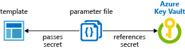

# Use Azure Key Vault to pass secure parameter value during Bicep deployment

Instead of putting a secure value (like a password) directly in your Bicep file or parameters file, you can retrieve the value from an [Azure Key Vault](../../key-vault/general/overview.md) during a deployment. When a [module](./modules.md) expects a `string` parameter with `secure:true` modifier, you can use the [getSecret function](bicep-functions-resource.md#getsecret) to obtain a key vault secret. The value is never exposed because you only reference its key vault ID.

> [!IMPORTANT]
> This article focuses on how to pass a sensitive value as a template parameter. When the secret is passed as a parameter, the key vault can exist in a different subscription than the resource group you're deploying to.
>
> This article doesn't cover how to set a virtual machine property to a certificate's URL in a key vault. For a quickstart template of that scenario, see [Install a certificate from Azure Key Vault on a Virtual Machine](https://github.com/Azure/azure-quickstart-templates/tree/master/demos/vm-winrm-keyvault-windows).

## Deploy key vaults and secrets

To access a key vault during Bicep deployment, set `enabledForTemplateDeployment` on the key vault to `true`.

If you already have a key vault, make sure it allows template deployments.

# [Azure CLI](#tab/azure-cli)

```azurecli-interactive
az keyvault update  --name ExampleVault --enabled-for-template-deployment true
```

# [PowerShell](#tab/azure-powershell)

```azurepowershell-interactive
Set-AzKeyVaultAccessPolicy -VaultName ExampleVault -EnabledForTemplateDeployment
```

---

To create a new key vault and add a secret, use:

# [Azure CLI](#tab/azure-cli)

```azurecli-interactive
az group create --name ExampleGroup --location centralus
az keyvault create \
  --name ExampleVault \
  --resource-group ExampleGroup \
  --location centralus \
  --enabled-for-template-deployment true
az keyvault secret set --vault-name ExampleVault --name "ExamplePassword" --value "hVFkk965BuUv"
```

# [PowerShell](#tab/azure-powershell)

```azurepowershell-interactive
New-AzResourceGroup -Name ExampleGroup -Location centralus
New-AzKeyVault `
  -VaultName ExampleVault `
  -resourceGroupName ExampleGroup `
  -Location centralus `
  -EnabledForTemplateDeployment
$secretvalue = ConvertTo-SecureString 'hVFkk965BuUv' -AsPlainText -Force
$secret = Set-AzKeyVaultSecret -VaultName ExampleVault -Name 'ExamplePassword' -SecretValue $secretvalue
```

---

As the owner of the key vault, you automatically have access to create secrets. If the user working with secrets isn't the owner of the key vault, grant access with:

# [Azure CLI](#tab/azure-cli)

```azurecli-interactive
az keyvault set-policy \
  --upn <user-principal-name> \
  --name ExampleVault \
  --secret-permissions set delete get list
```

# [PowerShell](#tab/azure-powershell)

```azurepowershell-interactive
$userPrincipalName = "<Email Address of the deployment operator>"

Set-AzKeyVaultAccessPolicy `
  -VaultName ExampleVault `
  -UserPrincipalName <user-principal-name> `
  -PermissionsToSecrets set,delete,get,list
```

---

For more information about creating key vaults and adding secrets, see:

- [Set and retrieve a secret by using CLI](../../key-vault/secrets/quick-create-cli.md)
- [Set and retrieve a secret by using PowerShell](../../key-vault/secrets/quick-create-powershell.md)
- [Set and retrieve a secret by using the portal](../../key-vault/secrets/quick-create-portal.md)
- [Set and retrieve a secret by using .NET](../../key-vault/secrets/quick-create-net.md)
- [Set and retrieve a secret by using Node.js](../../key-vault/secrets/quick-create-node.md)

## Grant access to the secrets

The user who deploys the Bicep file must have the `Microsoft.KeyVault/vaults/deploy/action` permission for the scope of the resource group and key vault. The [Owner](../../role-based-access-control/built-in-roles.md#owner) and [Contributor](../../role-based-access-control/built-in-roles.md#contributor) roles both grant this access. If you created the key vault, you're the owner and have the permission.

The following procedure shows how to create a role with the minimum permission, and how to assign the user.

1. Create a custom role definition JSON file:

    ```json
    {
      "Name": "Key Vault Bicep deployment operator",
      "IsCustom": true,
      "Description": "Lets you deploy a Bicep file with the access to the secrets in the Key Vault.",
      "Actions": [
        "Microsoft.KeyVault/vaults/deploy/action"
      ],
      "NotActions": [],
      "DataActions": [],
      "NotDataActions": [],
      "AssignableScopes": [
        "/subscriptions/00000000-0000-0000-0000-000000000000"
      ]
    }
    ```

    Replace "00000000-0000-0000-0000-000000000000" with the subscription ID.

2. Create the new role using the JSON file:

    # [Azure CLI](#tab/azure-cli)

    ```azurecli-interactive
    az role definition create --role-definition "<path-to-role-file>"
    az role assignment create \
      --role "Key Vault Bicep deployment operator" \
      --scope /subscriptions/<Subscription-id>/resourceGroups/<resource-group-name> \
      --assignee <user-principal-name>
    ```

    # [PowerShell](#tab/azure-powershell)

    ```azurepowershell-interactive
    New-AzRoleDefinition -InputFile "<path-to-role-file>"
    New-AzRoleAssignment `
      -ResourceGroupName ExampleGroup `
      -RoleDefinitionName "Key Vault resource manager template deployment operator" `
      -SignInName <user-principal-name>
    ```

    ---

    The samples assign the custom role to the user on the resource group level.

When using a key vault with the Bicep file for a [Managed Application](../managed-applications/overview.md), you must grant access to the **Appliance Resource Provider** service principal. For more information, see [Access Key Vault secret when deploying Azure Managed Applications](../managed-applications/key-vault-access.md).

## Use getSecret function

You can use the [getSecret function](./bicep-functions-resource.md#getsecret) to obtain a key vault secret and pass the value to a `string` parameter of a module. The `getSecret` function can only be called on a `Microsoft.KeyVault/vaults` resource and can be used only with parameter with `@secure()` decorator.

The following Bicep file creates an Azure SQL server. The `adminPassword` parameter has a `@secure()` decorator.

```bicep
param sqlServerName string
param adminLogin string

@secure()
param adminPassword string

resource sqlServer 'Microsoft.Sql/servers@2020-11-01-preview' = {
  name: sqlServerName
  location: resourceGroup().location
  properties: {
    administratorLogin: adminLogin
    administratorLoginPassword: adminPassword
    version: '12.0'
  }
}
```

Let's use the preceding Bicep file as a module given the file name is *sql.bicep* in the same directory as the main Bicep file.

The following Bicep file consumes the sql.bicep as a module.  The Bicep file references an existing key vault, and calls the `getSecret` function to retrieve the key vault secret, and then passes the value as a parameter to the module.

```bicep
param sqlServerName string
param adminLogin string

param subscriptionId string
param kvResourceGroup string
param kvName string

resource kv 'Microsoft.KeyVault/vaults@2023-02-01' existing = {
  name: kvName
  scope: resourceGroup(subscriptionId, kvResourceGroup )
}

module sql './sql.bicep' = {
  name: 'deploySQL'
  params: {
    sqlServerName: sqlServerName
    adminLogin: adminLogin
    adminPassword: kv.getSecret('vmAdminPassword')
  }
}
```

Also, `getSecret` function (or with the namespace qualifier `az.getSecret`) can be used in a `.bicepparam` file to retrieve the value of a secret from a key vault.

```bicep
using './main.bicep'

param secureUserName = getSecret('exampleSubscription', 'exampleResourceGroup', 'exampleKeyVault', 'exampleSecretUserName', 'exampleSecretVersion')
param securePassword = az.getSecret('exampleSubscription', 'exampleResourceGroup', 'exampleKeyVault', 'exampleSecretPassword')
```

## Reference secrets in parameters file

If you don't want to use a module, you can reference the key vault directly in the parameters file. The following image shows how the parameters file references the secret and passes that value to the Bicep file.



> [!NOTE]
> Currently you can only reference the key vault in JSON parameters files. You can't reference key vault in Bicep parameters file.

The following Bicep file deploys a SQL server that includes an administrator password. The password parameter is set to a secure string. But the Bicep doesn't specify where that value comes from.

```bicep
param location string = resourceGroup().location
param adminLogin string

@secure()
param adminPassword string

param sqlServerName string

resource sqlServer 'Microsoft.Sql/servers@2022-11-01-preview' = {
  name: sqlServerName
  location: location
  properties: {
    administratorLogin: adminLogin
    administratorLoginPassword: adminPassword
    version: '12.0'
  }
}
```

---

Now, create a parameters file for the preceding Bicep file. In the parameters file, specify a parameter that matches the name of the parameter in the Bicep file. For the parameter value, reference the secret from the key vault. You reference the secret by passing the resource identifier of the key vault and the name of the secret:

In the following parameters file, the key vault secret must already exist, and you provide a static value for its resource ID.

```json
{
  "$schema": "https://schema.management.azure.com/schemas/2019-04-01/deploymentParameters.json#",
  "contentVersion": "1.0.0.0",
  "parameters": {
    "adminLogin": {
      "value": "exampleadmin"
    },
    "adminPassword": {
      "reference": {
        "keyVault": {
          "id": "/subscriptions/<subscription-id>/resourceGroups/<rg-name>/providers/Microsoft.KeyVault/vaults/<vault-name>"
        },
        "secretName": "ExamplePassword"
      }
    },
    "sqlServerName": {
      "value": "<your-server-name>"
    }
  }
}
```

If you need to use a version of the secret other than the current version, include the `secretVersion` property.

```json
"secretName": "ExamplePassword",
"secretVersion": "cd91b2b7e10e492ebb870a6ee0591b68"
```

Deploy the template and pass in the parameters file:

# [Azure CLI](#tab/azure-cli)

```azurecli-interactive
az group create --name SqlGroup --location westus2
az deployment group create \
  --resource-group SqlGroup \
  --template-file <Bicep-file> \
  --parameters <parameters-file>
```

# [PowerShell](#tab/azure-powershell)

```azurepowershell-interactive
New-AzResourceGroup -Name $resourceGroupName -Location $location
New-AzResourceGroupDeployment `
  -ResourceGroupName $resourceGroupName `
  -TemplateFile <Bicep-file> `
  -TemplateParameterFile <parameters-file>
```

---

## Next steps

- For general information about key vaults, see [What is Azure Key Vault?](../../key-vault/general/overview.md)
- For complete examples of referencing key secrets, see [key vault examples](https://github.com/rjmax/ArmExamples/tree/master/keyvaultexamples) on GitHub.
- For a Learn module that covers passing a secure value from a key vault, see [Manage complex cloud deployments by using advanced ARM template features](/training/modules/manage-deployments-advanced-arm-template-features/).
