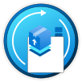

# Learn modules for Bicep

Once you're ready to see how Bicep can help simplify and accelerate your deployments to Azure, proceed to the many hands-on courses from Microsoft Learn.

> [!TIP]
> [Follow Learn Live sessions](/events/learntv/learnlive-iac-and-bicep/) to learn about Bicep from subject matter experts on demand and in real time.

## Get started

Learn provides free access to resources that can help you apply concepts in Azure.If you're new to Bicep, one way to get started is by reviewing the following Learn module. You'll learn how Bicep makes it easier to define how your Azure resources should be configured and deployed in a way that's automated and repeatable. You’ll deploy several Azure resources to see how Bicep works.

[</img>](/training/modules/build-first-bicep-template/)

[Build your first Bicep template](/training/modules/build-first-bicep-template/)

## Learn more

Follow these learning paths to discover more Bicep features:

:::row:::
:::column:::
  [</img>](/training/paths/fundamentals-bicep/)

  [Part 1: Fundamentals of Bicep](/training/paths/fundamentals-bicep/)
:::column-end:::
:::column:::
  [</img>](/training/paths/intermediate-bicep/)

  [Part 2: Intermediate Bicep](/training/paths/intermediate-bicep/)
:::column-end:::
:::column:::
  [</img>](/training/paths/advanced-bicep/)

  [Part 3: Advanced Bicep](/training/paths/advanced-bicep/)
:::column-end:::
:::row-end:::

## Use Bicep in a deployment pipeline

After that, you might be interested in adding your Bicep code to a deployment pipeline. Take one of these two learning paths based on the tool that you want to use:

:::row:::
:::column:::
  [</img>](/training/paths/bicep-azure-pipelines/)
    
  [Option 1: Deploy Azure resources by using Bicep and Azure Pipelines](/training/paths/bicep-azure-pipelines/)
:::column-end:::
:::column:::
  [</img>](/training/paths/bicep-github-actions/)

  [Option 2: Deploy Azure resources by using Bicep and GitHub Actions](/training/paths/bicep-github-actions/)
:::column-end:::
:::row-end:::

## Use deployment stacks

Learn how to use deployment stacks to manage resource lifecycles:

:::row:::
:::column:::
  [</img>](/training/modules/manage-resource-lifecycles-deployment-stacks/)
    
  [Manage resource lifecycles with deployment stacks](/training/modules/manage-resource-lifecycles-deployment-stacks)
:::column-end:::
:::row-end:::

## Next steps

* See [Bicep quickstart](./quickstart-create-bicep-use-visual-studio-code.md) for a brief introduction to Bicep.
* See [best practices for Bicep](./best-practices.md) for suggestions about how to improve your Bicep files.