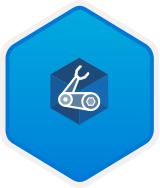
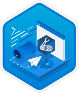
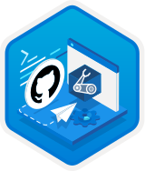

# Learn modules for Bicep

Ready to see how Bicep can help simplify and accelerate your deployments to Azure? Check out the many hands-on courses.

> [!TIP]
> Want to learn Bicep live from subject matter experts? [Follow on-demand Learn Live sessions with our experts.](/events/learntv/learnlive-iac-and-bicep/)

## Get started

If you're new to Bicep, a great way to get started is by reviewing the following Learn module. You'll learn how Bicep makes it easier to define how your Azure resources should be configured and deployed in a way that's automated and repeatable. You’ll deploy several Azure resources so you can see for yourself how Bicep works. We provide free access to Azure resources to help you practice the concepts.

[</img>](/training/modules/build-first-bicep-template/)

[Build your first Bicep template](/training/modules/build-first-bicep-template/)

## Learn more

To learn even more about Bicep's features, take these learning paths:

:::row:::
:::column:::
  [</img>](/training/paths/fundamentals-bicep/)

  [Part 1: Fundamentals of Bicep](/training/paths/fundamentals-bicep/)
:::column-end:::
:::column:::
  [</img>](/training/paths/intermediate-bicep/)

  [Part 2: Intermediate Bicep](/training/paths/intermediate-bicep/)
:::column-end:::
:::column:::
  [</img>](/training/paths/advanced-bicep/)

  [Part 3: Advanced Bicep](/training/paths/advanced-bicep/)
:::column-end:::
:::row-end:::

## Use Bicep in a deployment pipeline

After that, you might be interested in adding your Bicep code to a deployment pipeline. Take one of these two learning paths based on the tool you want to use:

:::row:::
:::column:::
  [</img>](/training/paths/bicep-azure-pipelines/)
    
  [Option 1: Deploy Azure resources by using Bicep and Azure Pipelines](/training/paths/bicep-azure-pipelines/)
:::column-end:::
:::column:::
  [</img>](/training/paths/bicep-github-actions/)

  [Option 2: Deploy Azure resources by using Bicep and GitHub Actions](/training/paths/bicep-github-actions/)
:::column-end:::
:::row-end:::

## Next steps

* For a short introduction to Bicep, see [Bicep quickstart](quickstart-create-bicep-use-visual-studio-code.md).
* For suggestions about how to improve your Bicep files, see [Best practices for Bicep](best-practices.md).
