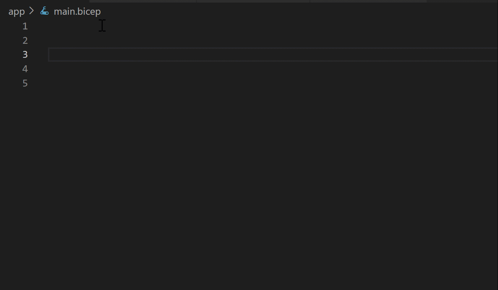

# What is Bicep?

Bicep is a domain-specific language (DSL) that uses declarative syntax to deploy Azure resources. In a Bicep file, you define the infrastructure you want to deploy to Azure, and then use that file throughout the development lifecycle to repeatedly deploy your infrastructure. Your resources are deployed in a consistent manner.

Bicep provides concise syntax, reliable type safety, and support for code reuse. Bicep offers a first-class authoring experience for your [infrastructure-as-code](/devops/deliver/what-is-infrastructure-as-code) solutions in Azure.

## Benefits of Bicep

Bicep provides the following advantages:

- **Support for all resource types and API versions**: Bicep immediately supports all preview and GA versions for Azure services. As soon as a resource provider introduces new resource types and API versions, you can use them in your Bicep file. You don't have to wait for tools to be updated before using the new services.
- **Simple syntax**: When compared to the equivalent JSON template, Bicep files are more concise and easier to read. Bicep requires no previous knowledge of programming languages. Bicep syntax is declarative and specifies which resources and resource properties you want to deploy.

  The following examples show the difference between a Bicep file and the equivalent JSON template. Both examples deploy a storage account.

  # [Bicep](#tab/bicep)

  ```bicep
  param location string = resourceGroup().location
  param storageAccountName string = 'toylaunch${uniqueString(resourceGroup().id)}'

  resource storageAccount 'Microsoft.Storage/storageAccounts@2021-06-01' = {
    name: storageAccountName
    location: location
    sku: {
      name: 'Standard_LRS'
    }
    kind: 'StorageV2'
    properties: {
      accessTier: 'Hot'
    }
  }
  ```

  # [JSON](#tab/json)

  ```json
  {
    "$schema": "https://schema.management.azure.com/schemas/2019-04-01/deploymentTemplate.json#",
    "contentVersion": "1.0.0.0",
    "parameters": {
      "location": {
        "type": "string",
        "defaultValue": "[resourceGroup().location]"
      },
      "storageAccountName": {
        "type": "string",
        "defaultValue": "[format('toylaunch{0}', uniqueString(resourceGroup().id))]"
      }
    },
    "resources": [
      {
        "type": "Microsoft.Storage/storageAccounts",
        "apiVersion": "2021-06-01",
        "name": "[parameters('storageAccountName')]",
        "location": "[parameters('location')]",
        "sku": {
          "name": "Standard_LRS"
        },
        "kind": "StorageV2",
        "properties": {
          "accessTier": "Hot"
        }
      }
    ]
  }
  ```

  ---

- **Authoring experience**: When you use the [Bicep Extension for VS Code](https://marketplace.visualstudio.com/items?itemName=ms-azuretools.vscode-bicep) to create your Bicep files, you get a first-class authoring experience. The editor provides rich type-safety, intellisense, and syntax validation.

  

  You can also create Bicep files in Visual Studio with the [Bicep extension for Visual Studio](https://marketplace.visualstudio.com/items?itemName=ms-azuretools.visualstudiobicep).

- **Repeatable results**: Repeatedly deploy your infrastructure throughout the development lifecycle and have confidence your resources are deployed in a consistent manner. Bicep files are idempotent, which means you can deploy the same file many times and get the same resource types in the same state. You can develop one file that represents the desired state, rather than developing lots of separate files to represent updates.
- **Orchestration**: You don't have to worry about the complexities of ordering operations. Resource Manager orchestrates the deployment of interdependent resources so they're created in the correct order. When possible, Resource Manager deploys resources in parallel so your deployments finish faster than serial deployments. You deploy the file through one command, rather than through multiple imperative commands.

   :::image type="content" source="./media/overview/bicep-processing.png" alt-text="Bicep deployment comparison" border="false":::

- **Modularity**: You can break your Bicep code into manageable parts by using [modules](./modules.md). The module deploys a set of related resources. Modules enable you to reuse code and simplify development. Add the module to a Bicep file anytime you need to deploy those resources.
- **Integration with Azure services**: Bicep is integrated with Azure services such as Azure Policy, template specs, and Blueprints.
- **Preview changes**: You can use the [what-if operation](./deploy-what-if.md) to get a preview of changes before deploying the Bicep file. With what-if, you see which resources will be created, updated, or deleted, and any resource properties that will be changed. The what-if operation checks the current state of your environment and eliminates the need to manage state.
- **No state or state files to manage**: All state is stored in Azure. Users can collaborate and have confidence their updates are handled as expected.
- **No cost and open source**: Bicep is completely free. You don't have to pay for premium capabilities. It's also supported by Microsoft support.

## Get started

To start with Bicep:

1. **Install the tools**. See [Set up Bicep development and deployment environments](./install.md). Or, you can use the [VS Code Devcontainer/Codespaces repo](https://github.com/Azure/vscode-remote-try-bicep) to get a pre-configured authoring environment.
2. **Complete the [quickstart](./quickstart-create-bicep-use-visual-studio-code.md) and the [Learn modules for Bicep](./learn-bicep.md)**.

To decompile an existing ARM template to Bicep, see [Decompiling ARM template JSON to Bicep](./decompile.md). You can use the [Bicep Playground](https://aka.ms/bicepdemo) to view Bicep and equivalent JSON side by side.

To learn about the resources that are available in your Bicep file, see [Bicep resource reference](/azure/templates/)

Bicep examples can be found in the [Bicep GitHub repo](https://github.com/Azure/azure-quickstart-templates/tree/master/quickstarts)

## About the language

Bicep isn't intended as a general programming language to write applications. A Bicep file declares Azure resources and resource properties, without writing a sequence of programming commands to create resources.

To track the status of the Bicep work, see the [Bicep project repository](https://github.com/Azure/bicep).

To learn about Bicep, see the following video.

> [!VIDEO https://www.youtube.com/embed/sc1kJfcRQgY]

You can use Bicep instead of JSON to develop your Azure Resource Manager templates (ARM templates). The JSON syntax to create an ARM template can be verbose and require complicated expressions. Bicep syntax reduces that complexity and improves the development experience. Bicep is a transparent abstraction over ARM template JSON and doesn't lose any of the JSON template capabilities. During deployment, the Bicep CLI converts a Bicep file into ARM template JSON.

Resource types, API versions, and properties that are valid in an ARM template are valid in a Bicep file.

Bicep offers an easier and more concise syntax when compared to the equivalent JSON. You don't use bracketed expressions `[...]`. Instead, you directly call functions, and get values from parameters and variables. You give each deployed resource a symbolic name, which makes it easy to reference that resource in your template.

For a full comparison of the syntax, see [Comparing JSON and Bicep for templates](compare-template-syntax.md).

Bicep automatically manages dependencies between resources. You can avoid setting `dependsOn` when the symbolic name of a resource is used in another resource declaration.

The structure of the Bicep file is more flexible than the JSON template. You can declare parameters, variables, and outputs anywhere in the file. In JSON, you have to declare all parameters, variables, and outputs within the corresponding sections of the template.

## Next steps

Get started with the [Quickstart](./quickstart-create-bicep-use-visual-studio-code.md).

For answers to common questions, see [Frequently asked questions for Bicep](frequently-asked-questions.yml).
