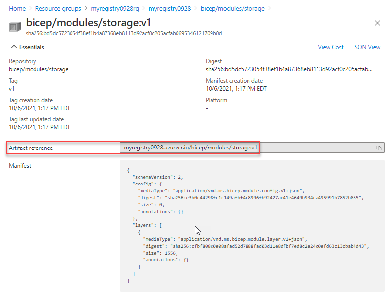

# Create private registry for Bicep modules (Preview)

To share [modules](modules.md) within your organization, you can create a private module registry. You publish modules to that registry and give read access to users who need to deploy the modules. After the modules are shared in the registries, you can reference them from your Bicep files.

To work with module registries, you must have Bicep CLI version **x.xx or later**.

## Configure private registry

A Bicep registry is hosted on [Azure Container Registry (ACR)](../../container-registry/container-registry-intro.md). Use the following steps to configure your registry for modules.

1. If you already have a container registry, you can use it. If you need to create a container registry, see [Quickstart: Create a container registry by using a Bicep file](../../container-registry/container-registry-get-started-bicep.md). 

   You can use any of the available registry SKUs for the module registry. Registry [geo-replication](../../container-registry/container-registry-geo-replication.md) provides users with a local presence or as a hot-backup.

1. Get the login server name. You need this name when linking to the registry from your Bicep files. 

   To get the login server name, use [Get-AzContainerRegistry](/powershell/module/az.containerregistry/get-azcontainerregistry).

   ```azurepowershell
   Get-AzContainerRegistry -ResourceGroupName "<resource-group-name>" -Name "<registry-name>"
   ```

   Or, use [az acr show](/cli/azure/acr#az_acr_show).

   ```azurecli
   az acr show --resource-group <resource-group-name> --name <registry-name>
   ```

   The format of the login server name is: `<registry-name>.azurecr.io`.

1. To publish modules to a registry, you must have permission to **push** an image. To deploy a module from a registry, you must have permission to **pull** the image. For more information about the roles that grant adequate access, see [Azure Container Registry roles and permissions](../../container-registry/container-registry-roles.md).

1. Depending on the type of account you use to deploy the module, you may need to customize which credentials are used. These credentials are needed to get the modules from the registry. By default, credentials are obtained from Azure CLI or Azure PowerShell. You can customize the precedence for getting the credentials in the **bicepconfig.json** file. For more information, see [Credentials for restoring modules](bicep-config.md#credentials-for-restoring-modules).

1. For more security, you can require access through a private endpoint. For more information, see [Connect privately to an Azure container registry using Azure Private Link](../../container-registry/container-registry-private-link.md).

## Publish files to registry

After setting up the container registry, you can publish files to it. Use the [publish](bicep-cli.md#publish) command and provide any Bicep files you intend to use as modules. Specify the target location for the module in your registry.

```azurecli
az bicep publish storage.bicep --target br/exampleregistry.azurecr.io/bicep/modules/storage:v1
```

## View files in registry

To see the published module in the portal:

1. Sign in to the [Azure portal](https://portal.azure.com).
1. Search for **container registries**.
1. Select your registry.
1. Select **Repositories** from the left menu.
1. Select the module path (repository).  In the preceding example, the module path name is **bicep/modules/storage**.
1. Select the tag. In the preceding example, the tag is **v1**.
1. The **Artifact reference** matches the reference you'll use in the Bicep file.

   

You're now ready to reference the file in the registry from a Bicep file. For examples of the syntax to use for referencing an external module, see [Bicep modules](modules.md).

## Next steps

* To learn about modules, see [Bicep modules](modules.md).
* To configure aliases for a module registry, see [Add custom settings in the Bicep config file](private-module-registry.md).
* For more information about publishing and restoring modules, see [Bicep CLI commands](bicep-cli.md).
