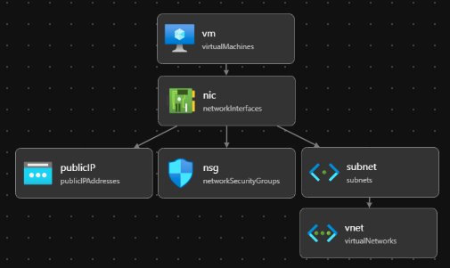

# Create Bicep files by using Visual Studio Code

This article shows you how to use Visual Studio Code to create Bicep files.

## Install VS Code

To set up your environment for Bicep development, see [Install Bicep tools](install.md). After completing those steps, you'll have [Visual Studio Code](https://code.visualstudio.com/) and the [Bicep extension](https://marketplace.visualstudio.com/items?itemName=ms-azuretools.vscode-bicep). You also have either the latest [Azure CLI](/cli/azure/) or the latest [Azure PowerShell module](/powershell/azure/new-azureps-module-az).

## Bicep commands

Visual Studio Code comes with several Bicep commands.

Open or create a Bicep file in VS Code, select the **View** menu and then select **Command Palette**. You can also use **F1** or the key combination <kbd>Ctrl+Shift+P</kbd> to bring up the command palette. Type **Bicep** to list the Bicep commands.

:::image type="content" source="./media/visual-studio-code/visual-studio-code-bicep-commands.png" alt-text="Screenshot of Visual Studio Code Bicep commands in the command palette.":::

These commands include:

- [Build ARM Template](#build-arm-template)
- [Create Bicep Configuration File](#create-bicep-configuration-file)
- [Decompile into Bicep](#decompile-into-bicep)
- [Deploy Bicep File](#deploy-bicep-file)
- [Generate Parameters File](#generate-parameters-file)
- [Import Kubernetes Manifest (preview)](#import-kubernetes-manifest-preview)
- [Insert Resource](#insert-resource)
- [Open Bicep Visualizer](#open-bicep-visualizer)
- [Open Bicep Visualizer to the side](#open-bicep-visualizer)
- [Restore Bicep Modules (Force)](#restore-bicep-modules)

These commands are also shown in the context menu when you right-click a Bicep file:

:::image type="content" source="./media/visual-studio-code/visual-studio-code-bicep-context-menu.png" alt-text="Screenshot of Visual Studio Code Bicep commands in the context menu for Bicep files.":::

When you right-click a JSON file:

:::image type="content" source="./media/visual-studio-code/visual-studio-code-bicep-context-menu-json.png" alt-text="Screenshot of Visual Studio Code Bicep commands in the context menu for ARM JSON templates.":::

### Build ARM template

The `build` command converts a Bicep file to an Azure Resource Manager template (ARM template). The new JSON template is stored in the same folder with the same file name.  If a file with the same file name exists, it overwrites the old file.  For more information, see [Bicep CLI commands](./bicep-cli.md#bicep-cli-commands).

### Create Bicep configuration file

The [Bicep configuration file (bicepconfig.json)](./bicep-config.md) can be used to customize your Bicep development experience. You can add `bicepconfig.json` in multiple directories. The configuration file closest to the bicep file in the directory hierarchy is used. When you select this command, the extension opens a dialog for you to select a folder. The default folder is where you store the Bicep file. If a `bicepconfig.json` file already exists in the folder, you can overwrite the existing file.

To create a Bicep configuration file:

1. Open Visual Studio Code.
1. From the **View** menu, select **Command Palette** (or press <kbd>Ctrl/Cmd+Shift+P</kbd>), and then select **Bicep: Create Bicep Configuration File**.
1. Select the file directory where you want to place the file.
1. Save the configuration file when you're done.

### Decompile into Bicep

This command decompiles an ARM JSON template into a Bicep file, and places it in the same directory as the ARM JSON template. The new file has the same file name with the *.bicep* extension. If a Bicep file with the same file name already exists in the same folder, Visual Studio Code prompts you to overwrite the existing file or create a copy.

### Deploy Bicep file

You can deploy Bicep files directly from Visual Studio Code. Select **Deploy Bicep file** from the command palette or from the context menu. The extension prompts you to sign in Azure, select subscription, create/select resource group, and enter parameter values.

[!INCLUDE [Visual Studio Code authentication](../../../includes/resource-manager-vscode-authentication.md)]

### Generate parameters file

This command creates a parameter file in the same folder as the Bicep file. You can choose to create a Bicep parameter file or a JSON parameter file. The new Bicep parameter file name is `<bicep-file-name>.bicepparam`, while the new JSON parameter file name is `<bicep-file-name>.parameters.json`.

### Import Kubernetes manifest (Preview)

This command imports a [Kubernetes manifest file](../../aks/concepts-clusters-workloads.md#deployments-and-yaml-manifests), and creates a [Bicep module](./modules.md). For more information, see [Bicep extensibility Kubernetes provider](./bicep-extensibility-kubernetes-provider.md), and [Quickstart: Deploy Azure applications to Azure Kubernetes Service (AKS) cluster using Bicep Kubernetes provider (Preview)](../../aks/learn/quick-kubernetes-deploy-bicep-extensibility-kubernetes-provider.md).

### Insert resource

The `insert resource` command adds a resource declaration in the Bicep file by providing the resource ID of an existing resource. After you select **Insert Resource**, enter the resource ID in the command palette. It takes a few moments to insert the resource.

You can find the resource ID by using one of these methods:

- Use [Azure Resource extension for Visual Studio Code](https://marketplace.visualstudio.com/items?itemName=ms-azuretools.vscode-azureresourcegroups).

    :::image type="content" source="./media/visual-studio-code/visual-studio-code-azure-resources-extension.png" alt-text="Screenshot of Visual Studio Code Azure Resources extension.":::

- Use the [Azure portal](https://portal.azure.com).
- Use Azure CLI or Azure PowerShell:

  # [CLI](#tab/CLI)

  ```azurecli
  az resource list
  ```

  # [PowerShell](#tab/PowerShell)

  ```azurepowershell
  Get-AzResource
  ```

  ---

Similar to exporting templates, the process tries to create a usable resource. However, most of the inserted resources require some modification before they can be used to deploy Azure resources.

For more information, see [Decompiling ARM template JSON to Bicep](./decompile.md).

### Open Bicep visualizer

The visualizer shows the resources defined in the Bicep file with the resource dependency information. The diagram is the visualization of a [Linux virtual machine Bicep file](https://github.com/Azure/azure-quickstart-templates/blob/master/quickstarts/microsoft.compute/vm-simple-linux/main.bicep).

[](./media/visual-studio-code/visual-studio-code-bicep-visualizer-expanded.png#lightbox)

You can also open the visualizer side-by-side with the Bicep file.

### Restore Bicep modules

When your Bicep file uses modules that are published to a registry, the restore command gets copies of all the required modules from the registry. It stores those copies in a local cache. For more information, see [restore](./bicep-cli.md#restore).

## View type document

From Visual Studio Code, you can easily open the template reference for the resource type you're working on. To do so, hover your cursor over the resource symbolic name, and then select **View type document**.

:::image type="content" source="./media/visual-studio-code/visual-studio-code-bicep-view-type-document.png" alt-text="Screenshot of Visual Studio Code Bicep view type document.":::

## Paste as Bicep

You can paste a JSON snippet from an ARM template to Bicep file. Visual Studio Code automatically decompiles the JSON to Bicep. This feature is only available with the Bicep extension version 0.14.0 or newer. This feature is enabled by default. To disable the feature, see [VS Code and Bicep extension](./install.md#visual-studio-code-and-bicep-extension).

By using this feature, you can paste:

- Full ARM JSON templates.
- Single resource or multiple resources.
- JSON values, such as objects, arrays, and strings. A string with double-quotes is converted to single-quotes.

For example, you can start with the following Bicep file:

```bicep
@description('Storage Account type')
@allowed([
  'Standard_LRS'
  'Standard_GRS'
  'Standard_ZRS'
  'Premium_LRS'
])
param storageAccountsku string = 'Standard_LRS'

@description('Location for all resources.')
param location string = resourceGroup().location

var storageAccountName = '${uniqueString(resourceGroup().id)}storage'

resource storageAccount 'Microsoft.Storage/storageAccounts@2021-08-01' = {
  name: storageAccountName
  location: location
  sku: {
    name: storageAccountsku
  }
  kind: 'StorageV2'
  tags: {
    ObjectName: storageAccountName
  }
  properties: {}
}

output storageAccountName string = storageAccountName
```

And, paste the following JSON:

```json
{
  "type": "Microsoft.Batch/batchAccounts",
  "apiVersion": "2021-06-01",
  "name": "[parameters('batchAccountName')]",
  "location": "[parameters('location')]",
  "tags": {
    "ObjectName": "[parameters('batchAccountName')]"
  },
  "properties": {
    "autoStorage": {
      "storageAccountId": "[resourceId('Microsoft.Storage/storageAccounts', variables('storageAccountName'))]"
    }
  }
}
```

Visual Studio Code automatically converts the JSON to Bicep. Notice that you also need to add the parameter named `batchAccountName`.

You can undo the decompilation by using <kbd>Ctrl+Z</kbd>. The original JSON appears in the file.

## Next steps

To walk through a quickstart, see [Quickstart: Create Bicep files with Visual Studio Code](./quickstart-create-bicep-use-visual-studio-code.md).
