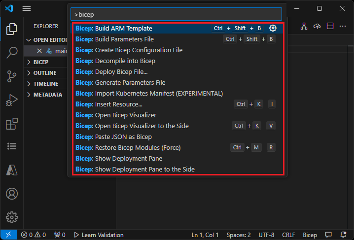

# Create Bicep files by using Visual Studio Code

This article shows you how to use Visual Studio Code to create Bicep files

## Install VS Code

To set up your environment for Bicep development, see [Install Bicep tools](install.md). After completing those steps, you'll have [Visual Studio Code](https://code.visualstudio.com/) and the [Bicep extension](https://marketplace.visualstudio.com/items?itemName=ms-azuretools.vscode-bicep). You also have either the latest [Azure CLI](/cli/azure/) or the latest [Azure PowerShell module](/powershell/azure/new-azureps-module-az).

## Bicep commands

Visual Studio Code comes with several Bicep commands.

Open or create a Bicep file in VS Code, select the **View** menu and then select **Command Palette**. You can also use the key combination **[CTRL]+[SHIFT]+P** to bring up the command palette.



### Build

The `build` command converts a Bicep file to an Azure Resource Manager template (ARM template). The new JSON template is stored in the same folder with the same file name.  If a file with the same file name exists, it overwrites the old file.  For more information, see [Bicep CLI commands](./bicep-cli.md#bicep-cli-commands).

### Insert Resource

The `insert resource` command adds a resource declaration in the Bicep file by providing the resource ID of an existing resource. After you select **Insert Resource**, enter the resource ID in the command palette. It takes a few moments to insert the resource.

You can find the resource ID from the Azure portal, or by using:

# [CLI](#tab/CLI)

```azurecli
az resource list
```

# [PowerShell](#tab/PowerShell)

```azurepowershell
Get-AzResource
```

---

Similar to exporting templates, the process tries to create a usable resource. However, most of the inserted resources require some modification before they can be used to deploy Azure resources.

For more information, see [Decompiling ARM template JSON to Bicep](./decompile.md).

### Open Visualizer

The visualizer shows the resources defined in the Bicep file with the resource dependency information. The diagram is the visualization of a [Linux virtual machine Bicep file](https://github.com/Azure/azure-quickstart-templates/blob/master/quickstarts/microsoft.compute/vm-simple-linux/main.bicep).

[](./media/visual-studio-code/visual-studio-code-bicep-visualizer-expanded.png#lightbox)

## Next steps

To walk through a quickstart, see [Quickstart: Create Bicep files with Visual Studio Code](./quickstart-create-bicep-use-visual-studio-code.md).
