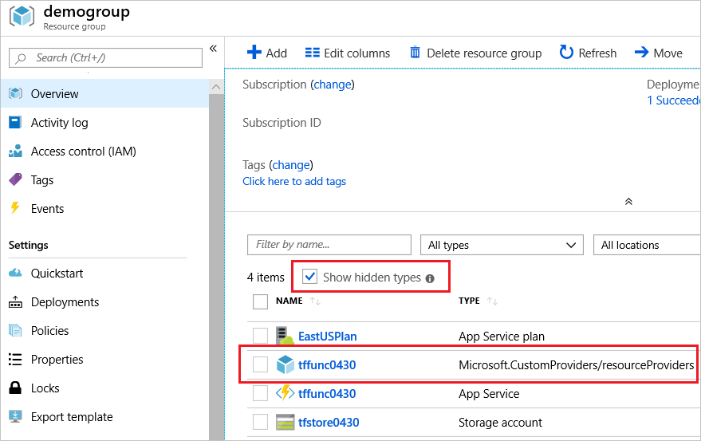

# Quickstart: Create a custom provider and deploy custom resources

In this quickstart, you create your own resource provider and deploy custom resource types for that resource provider. For more information about custom providers, see [Azure Custom Providers Preview overview](overview.md).

## Prerequisites

- If you don't have an Azure subscription, create a [free account](https://azure.microsoft.com/free/?WT.mc_id=A261C142F) before you begin.
- To complete the steps in this quickstart, you need to call `REST` operations. There are [different ways of sending REST requests](/rest/api/azure/).

# [Azure CLI](#tab/azure-cli)

Prepare your environment for the Azure CLI.

[!INCLUDE [azure-cli-prepare-your-environment-no-header.md](../../../includes/azure-cli-prepare-your-environment-no-header.md)]

Azure CLI examples use `az rest` for `REST` requests. For more information, see [az rest](/cli/azure/reference-index#az_rest).

# [PowerShell](#tab/azure-powershell)

- The PowerShell commands are run locally using PowerShell 7 or later and the Azure PowerShell modules. For more information, see [Install Azure PowerShell](/powershell/azure/install-az-ps).
- If you don't already have a tool for `REST` operations, install the [ARMClient](https://github.com/projectkudu/ARMClient). It's an open-source command-line tool that simplifies invoking the Azure Resource Manager API.
- After the **ARMClient** is installed you can display usage information from a PowerShell command prompt by typing: `armclient.exe`. Or, go to the [ARMClient wiki](https://github.com/projectkudu/ARMClient/wiki).

---

## Deploy custom provider

To set up the custom provider, deploy an [example template](https://github.com/Azure/azure-docs-json-samples/blob/master/custom-providers/customprovider.json) to your Azure subscription.

After deploying the template, your subscription has the following resources:

- Function App with the operations for the resources and actions.
- Storage Account for storing users that are created through the custom provider.
- Custom Provider that defines the custom resource types and actions. It uses the function app endpoint for sending requests.
- Custom resource from the custom provider.

To deploy the custom provider, use Azure CLI, PowerShell, or the Azure portal:

# [Azure CLI](#tab/azure-cli)

This example prompts you to enter a resource group, location, and provider's function app name. The names are stored in variables that are used in other commands. The [az group create](/cli/azure/group#az_group_create) and [az deployment group create](/cli/azure/deployment/group#az_deployment_group_create) commands deploy the resources.

```azurecli-interactive
read -p "Enter a resource group name:" rgName &&
read -p "Enter the location (i.e. eastus):" location &&
read -p "Enter the provider's function app name:" funcName &&
templateUri="https://raw.githubusercontent.com/Azure/azure-docs-json-samples/master/custom-providers/customprovider.json" &&
az group create --name $rgName --location "$location" &&
az deployment group create --resource-group $rgName --template-uri $templateUri --parameters funcName=$funcName &&
echo "Press [ENTER] to continue ..." &&
read
```

# [PowerShell](#tab/azure-powershell)

This example prompts you to enter a resource group, location, and provider's function app name. The names are stored in variables that are used in other commands. The [New-AzResourceGroup](/powershell/module/az.resources/new-azresourcegroup) and [New-AzResourceGroupDeployment](/powershell/module/az.resources/new-azresourcegroupdeployment) commands deploy the resources.

```powershell
$rgName = Read-Host -Prompt "Enter a resource group name"
$location = Read-Host -Prompt "Enter the location (i.e. eastus)"
$funcName = Read-Host -Prompt "Enter the provider's function app name"
$templateUri = "https://raw.githubusercontent.com/Azure/azure-docs-json-samples/master/custom-providers/customprovider.json"
New-AzResourceGroup -Name $rgName -Location "$location"
New-AzResourceGroupDeployment -ResourceGroupName $rgName -TemplateUri $templateUri -funcName $funcName
Read-Host -Prompt "Press [ENTER] to continue ..."
```

---

You can also deploy the solution from the Azure portal. Select the **Deploy to Azure** button to open the template in the Azure portal.

[](https://portal.azure.com/#create/Microsoft.Template/uri/https%3A%2F%2Fraw.githubusercontent.com%2FAzure%2Fazure-docs-json-samples%2Fmaster%2Fcustom-providers%2Fcustomprovider.json)

## View custom provider and resource

In the portal, the custom provider is a hidden resource type. To confirm that the resource provider was deployed, navigate to the resource group. Select the option to **Show hidden types**.



To see the custom resource type that you deployed, use the `GET` operation on your resource type.

```http
GET https://management.azure.com/subscriptions/<sub-id>/resourceGroups/<rg-name>/providers/Microsoft.CustomProviders/resourceProviders/<provider-name>/users?api-version=2018-09-01-preview
```

# [Azure CLI](#tab/azure-cli)

```azurecli-interactive
subID=$(az account show --query id --output tsv)
requestURI="https://management.azure.com/subscriptions/$subID/resourceGroups/$rgName/providers/Microsoft.CustomProviders/resourceProviders/$funcName/users?api-version=2018-09-01-preview"
az rest --method get --uri $requestURI
```

You receive the response:

```json
{
  "value": [
    {
      "id": "/subscriptions/<sub-id>/resourceGroups/<rg-name>/providers/Microsoft.CustomProviders/resourceProviders/<provider-name>/users/santa",
      "name": "santa",
      "properties": {
        "FullName": "Santa Claus",
        "Location": "NorthPole",
        "provisioningState": "Succeeded"
      },
      "resourceGroup": "<rg-name>",
      "type": "Microsoft.CustomProviders/resourceProviders/users"
    }
  ]
}
```

# [PowerShell](#tab/azure-powershell)

```powershell
$subID = (Get-AzContext).Subscription.Id
$requestURI = "https://management.azure.com/subscriptions/$subID/resourceGroups/$rgName/providers/Microsoft.CustomProviders/resourceProviders/$funcName/users?api-version=2018-09-01-preview"

armclient GET $requestURI
```

You receive the response:

```json
{
  "value": [
    {
      "properties": {
        "provisioningState": "Succeeded",
        "FullName": "Santa Claus",
        "Location": "NorthPole"
      },
      "id": "/subscriptions/<sub-id>/resourceGroups/<rg-name>/providers/Microsoft.CustomProviders/resourceProviders/<provider-name>/users/santa",
      "name": "santa",
      "type": "Microsoft.CustomProviders/resourceProviders/users"
    }
  ]
}
```

---

## Call action

Your custom provider also has an action named `ping`. The code that processes the request is implemented in the function app. The `ping` action replies with a greeting.

To send a `ping` request, use the `POST` operation on your custom provider.

```http
POST https://management.azure.com/subscriptions/<sub-id>/resourceGroups/<rg-name>/providers/Microsoft.CustomProviders/resourceProviders/<provider-name>/ping?api-version=2018-09-01-preview
```

# [Azure CLI](#tab/azure-cli)

```azurecli-interactive
pingURI="https://management.azure.com/subscriptions/$subID/resourceGroups/$rgName/providers/Microsoft.CustomProviders/resourceProviders/$funcName/ping?api-version=2018-09-01-preview"
az rest --method post --uri $pingURI
```

You receive the response:

```json
{
  "message": "hello <function-name>.azurewebsites.net",
  "pingcontent": {
    "source": "<function-name>.azurewebsites.net"
  }
}
```

# [PowerShell](#tab/azure-powershell)

```powershell
$pingURI = "https://management.azure.com/subscriptions/$subID/resourceGroups/$rgName/providers/Microsoft.CustomProviders/resourceProviders/$funcName/ping?api-version=2018-09-01-preview"

armclient POST $pingURI
```

You receive the response:

```json
{
  "pingcontent": {
    "source": "<function-name>.azurewebsites.net"
  },
  "message": "hello <function-name>.azurewebsites.net"
}
```

---

## Create a resource type

To create the custom resource type, you can deploy the resource in a template. This approach is shown in the template you deployed in this quickstart. You can also send a `PUT` request for the resource type.

```http
PUT https://management.azure.com/subscriptions/<sub-id>/resourceGroups/<rg-name>/providers/Microsoft.CustomProviders/resourceProviders/<provider-name>/users/<resource-name>?api-version=2018-09-01-preview

{"properties":{"FullName": "Test User", "Location": "Earth"}}
```

# [Azure CLI](#tab/azure-cli)

```azurecli-interactive
addURI="https://management.azure.com/subscriptions/$subID/resourceGroups/$rgName/providers/Microsoft.CustomProviders/resourceProviders/$funcName/users/testuser?api-version=2018-09-01-preview"
az rest --method put --uri $addURI --body "{'properties':{'FullName': 'Test User', 'Location': 'Earth'}}"
```

You receive the response:

```json
{
  "id": "/subscriptions/<sub-ID>/resourceGroups/<rg-name>/providers/Microsoft.CustomProviders/resourceProviders/<provider-name>/users/testuser",
  "name": "testuser",
  "properties": {
    "FullName": "Test User",
    "Location": "Earth",
    "provisioningState": "Succeeded"
  },
  "resourceGroup": "<rg-name>",
  "type": "Microsoft.CustomProviders/resourceProviders/users"
}
```

# [PowerShell](#tab/azure-powershell)

```powershell
$addURI = "https://management.azure.com/subscriptions/$subID/resourceGroups/$rgName/providers/Microsoft.CustomProviders/resourceProviders/$funcName/users/testuser?api-version=2018-09-01-preview"
$requestBody = "{'properties':{'FullName': 'Test User', 'Location': 'Earth'}}"

armclient PUT $addURI $requestBody
```

You receive the response:

```json
{
  "properties": {
    "provisioningState": "Succeeded",
    "FullName": "Test User",
    "Location": "Earth"
  },
  "id": "/subscriptions/<sub-ID>/resourceGroups/<rg-name>/providers/Microsoft.CustomProviders/resourceProviders/<provider-name>/users/testuser",
  "name": "testuser",
  "type": "Microsoft.CustomProviders/resourceProviders/users"
}
```

---

## Custom resource provider commands

Use the [custom-providers](/cli/azure/custom-providers/resource-provider) commands to work with your custom resource provider.

### List custom resource providers

Use the `list` command to display all the custom resource providers in a subscription. The default lists the current subscription's custom resource providers, or you can specify the `--subscription` parameter. To list for a resource group, use the `--resource-group` parameter.

```azurecli-interactive
az custom-providers resource-provider list --subscription $subID
```

```json
[
  {
    "actions": [
      {
        "endpoint": "https://<provider-name>.azurewebsites.net/api/{requestPath}",
        "name": "ping",
        "routingType": "Proxy"
      }
    ],
    "id": "/subscriptions/<sub-id>/resourceGroups/<rg-name>/providers/Microsoft.CustomProviders/resourceproviders/<provider-name>",
    "location": "eastus",
    "name": "<provider-name>",
    "provisioningState": "Succeeded",
    "resourceGroup": "<rg-name>",
    "resourceTypes": [
      {
        "endpoint": "https://<provider-name>.azurewebsites.net/api/{requestPath}",
        "name": "users",
        "routingType": "Proxy, Cache"
      }
    ],
    "tags": {},
    "type": "Microsoft.CustomProviders/resourceproviders",
    "validations": null
  }
]
```

### Show the properties

Use the `show` command to display the custom resource provider's properties. The output format resembles the `list` output.

```azurecli-interactive
az custom-providers resource-provider show --resource-group $rgName --name $funcName
```

### Create a new resource

Use the `create` command to create or update a custom resource provider. This example updates the `actions` and `resourceTypes`.

```azurecli-interactive
az custom-providers resource-provider create --resource-group $rgName --name $funcName \
--action name=ping endpoint=https://myTestSite.azurewebsites.net/api/{requestPath} routing_type=Proxy \
--resource-type name=users endpoint=https://myTestSite.azurewebsites.net/api{requestPath} routing_type="Proxy, Cache"
```

```json
"actions": [
  {
    "endpoint": "https://myTestSite.azurewebsites.net/api/{requestPath}",
    "name": "ping",
    "routingType": "Proxy"
  }
],

"resourceTypes": [
  {
    "endpoint": "https://myTestSite.azurewebsites.net/api{requestPath}",
    "name": "users",
    "routingType": "Proxy, Cache"
  }
],
```

### Update the provider's tags

The `update` command only updates tags for a custom resource provider. In the Azure portal, the custom resource provider's app service shows the tag.

```azurecli-interactive
az custom-providers resource-provider update --resource-group $rgName --name $funcName --tags new=tag
```

```json
"tags": {
  "new": "tag"
},
```

### Delete a custom resource provider

The `delete` command prompts you and deletes only the custom resource provider. The storage account, app service, and app service plan aren't deleted. After the provider is deleted, you're returned to a command prompt.

```azurecli-interactive
az custom-providers resource-provider delete --resource-group $rgName --name $funcName
```

## Next steps

For an introduction to custom providers, see the following article:

> [!div class="nextstepaction"]
> [Azure Custom Providers Preview overview](overview.md)
