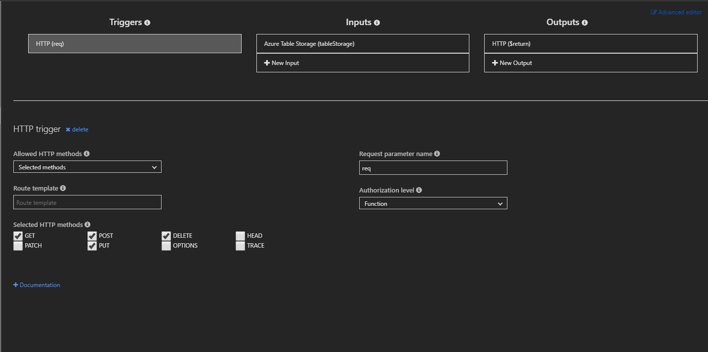

# Set up Azure Functions for Azure Custom Providers

A custom provider is a contract between Azure and an endpoint. With custom providers, you can change workflows in Azure. This tutorial shows how to set up an Azure function app to work as a custom provider endpoint.

## Create the Azure function app

> [!NOTE]
> In this tutorial, you create a simple service endpoint that uses an Azure function app. However, a custom provider can use any publicly accessible endpoint. Alternatives include Azure Logic Apps, Azure API Management, and the Web Apps feature of Azure App Service.

To start this tutorial, you should first follow the tutorial [Create your first Azure function app in the Azure portal](../../azure-functions/functions-create-first-azure-function.md). That tutorial creates a .NET core webhook function that can be modified in the Azure portal. It is also the foundation for the current tutorial.

## Install Azure Table storage bindings

To install the Azure Table storage bindings:

1. Go to the **Integrate** tab for the HttpTrigger.
1. Select **+ New Input**.
1. Select **Azure Table Storage**.
1. Install the Microsoft.Azure.WebJobs.Extensions.Storage extension if it isn't already installed.
1. In the **Table parameter name** box, enter **tableStorage**.
1. In the **Table name** box, enter **myCustomResources**.
1. Select **Save** to save the updated input parameter.


## Update RESTful HTTP methods

To set up the Azure function to include the custom provider RESTful request methods:

1. Go to the **Integrate** tab for the HttpTrigger.
1. Under **Selected HTTP methods**, select **GET**, **POST**, **DELETE**, and **PUT**.



## Add Azure Resource Manager NuGet packages

> [!NOTE]
> If your C# project file is missing from the project directory, you can add it manually. Or it will appear after the Microsoft.Azure.WebJobs.Extensions.Storage extension is installed on the function app.

Next, update the C# project file to include helpful NuGet libraries. These libraries make it easier to parse incoming requests from custom providers. Follow the steps to [add extensions from the portal](../../azure-functions/install-update-binding-extensions-manual.md) and update the C# project file to include the following package references:

```xml
<PackageReference Include="Microsoft.Azure.WebJobs.Extensions.Storage" Version="3.0.4" />
<PackageReference Include="Microsoft.Azure.Management.ResourceManager.Fluent" Version="1.22.2" />
<PackageReference Include="Microsoft.Azure.WebJobs.Script.ExtensionsMetadataGenerator" Version="1.1.*" />
```

The following XML element is an example C# project file:

```xml
<Project Sdk="Microsoft.NET.Sdk">
  <PropertyGroup>
    <TargetFramework>netstandard2.0</TargetFramework>
    <WarningsAsErrors />
  </PropertyGroup>
  <ItemGroup>
    <PackageReference Include="Microsoft.Azure.WebJobs.Extensions.Storage" Version="3.0.4" />
    <PackageReference Include="Microsoft.Azure.Management.ResourceManager.Fluent" Version="1.22.2" />
    <PackageReference Include="Microsoft.Azure.WebJobs.Script.ExtensionsMetadataGenerator" Version="1.1.*" />
  </ItemGroup>
</Project>
```

## Next steps

In this tutorial, you set up an Azure function app to work as an Azure custom provider endpoint.

To learn how to author a RESTful custom provider endpoint, see [Tutorial: Authoring a RESTful custom provider endpoint](./tutorial-custom-providers-function-authoring.md).

