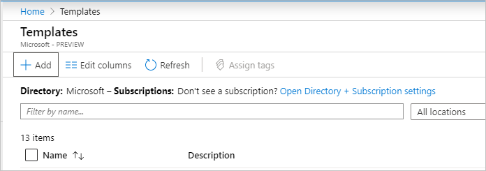
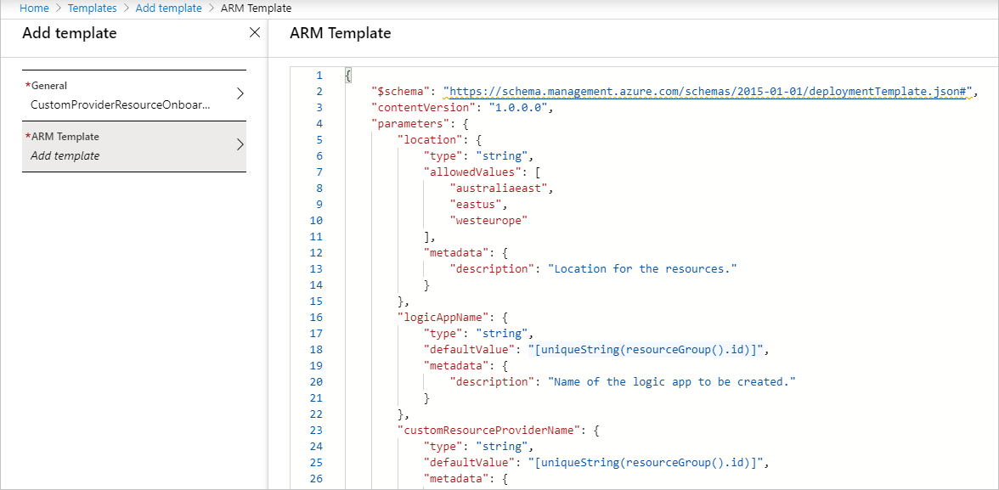
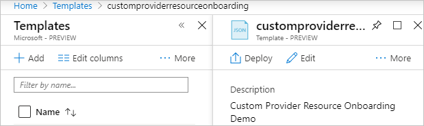
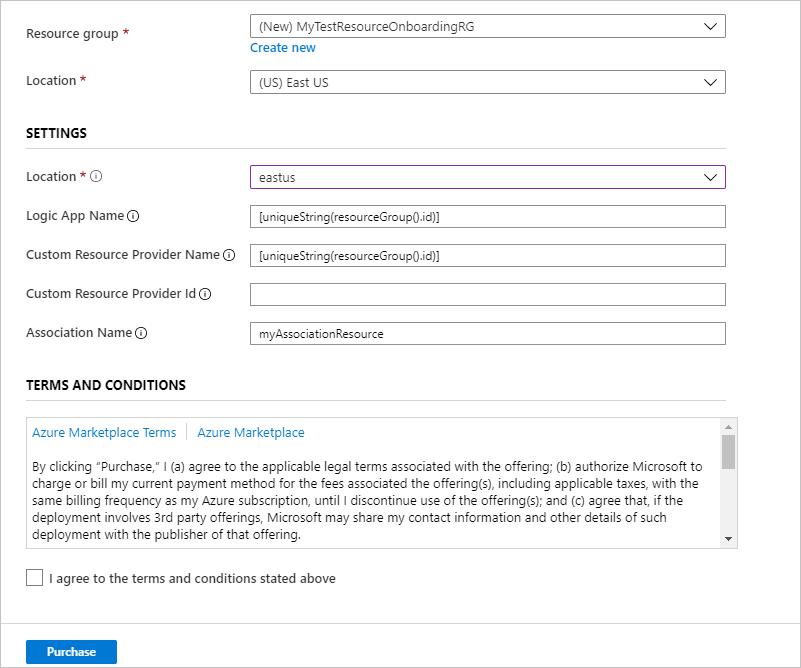
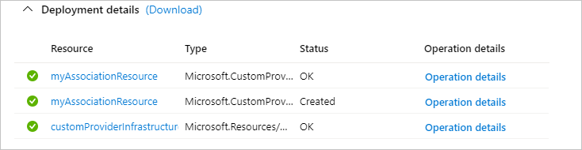
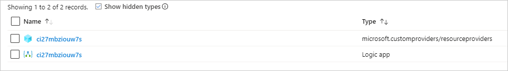
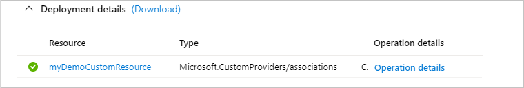

# Tutorial: Resource onboarding with Azure Custom Providers

In this tutorial, you'll deploy to Azure a custom resource provider that extends the Azure Resource Manager API with the Microsoft.CustomProviders/associations resource type. The tutorial shows how to extend existing resources that are outside the resource group where the custom provider instance is located. In this tutorial, the custom resource provider is powered by an Azure logic app, but you can use any public API endpoint.

## Prerequisites

To complete this tutorial, you need to know:

* The capabilities of [Azure Custom Providers](overview.md).
* Basic information about [resource onboarding with custom providers](concepts-resource-onboarding.md).

## Get started with resource onboarding

In this tutorial, there are two pieces that need to be deployed: the custom provider and the association. To make the process easier, you can optionally use a single template that deploys both.

The template will use these resources:

* Microsoft.CustomProviders/resourceProviders
* Microsoft.Logic/workflows
* Microsoft.CustomProviders/associations

```json
{
    "$schema": "https://schema.management.azure.com/schemas/2015-01-01/deploymentTemplate.json#",
    "contentVersion": "1.0.0.0",
    "parameters": {
        "location": {
            "type": "string",
            "allowedValues": [
                "australiaeast",
                "eastus",
                "westeurope"
            ],
            "metadata": {
                "description": "Location for the resources."
            }
        },
        "logicAppName": {
            "type": "string",
            "defaultValue": "[uniqueString(resourceGroup().id)]",
            "metadata": {
                "description": "Name of the logic app to be created."
            }
        },
        "customResourceProviderName": {
            "type": "string",
            "defaultValue": "[uniqueString(resourceGroup().id)]",
            "metadata": {
                "description": "Name of the custom provider to be created."
            }
        },
        "customResourceProviderId": {
            "type": "string",
            "defaultValue": "",
            "metadata": {
                "description": "The resource ID of an existing custom provider. Provide this to skip deployment of new logic app and custom provider."
            }
        },
        "associationName": {
            "type": "string",
            "defaultValue": "myAssociationResource",
            "metadata": {
                "description": "Name of the custom resource that is being created."
            }
        }
    },
    "resources": [
        {
            "type": "Microsoft.Resources/deployments",
            "apiVersion": "2017-05-10",
            "condition": "[empty(parameters('customResourceProviderId'))]",
            "name": "customProviderInfrastructureTemplate",
            "properties": {
                "mode": "Incremental",
                "template": {
                    "$schema": "https://schema.management.azure.com/schemas/2015-01-01/deploymentTemplate.json#",
                    "contentVersion": "1.0.0.0",
                    "parameters": {
                        "logicAppName": {
                            "type": "string",
                            "defaultValue": "[parameters('logicAppName')]"
                        }
                    },
                    "resources": [
                        {
                            "type": "Microsoft.Logic/workflows",
                            "apiVersion": "2017-07-01",
                            "name": "[parameters('logicAppName')]",
                            "location": "[parameters('location')]",
                            "properties": {
                                "state": "Enabled",
                                "definition": {
                                    "$schema": "https://schema.management.azure.com/providers/Microsoft.Logic/schemas/2016-06-01/workflowdefinition.json#",
                                    "actions": {
                                        "Switch": {
                                            "cases": {
                                                "Case": {
                                                    "actions": {
                                                        "CreateCustomResource": {
                                                            "inputs": {
                                                                "body": {
                                                                    "properties": "@addProperty(triggerBody().Body['properties'], 'myDynamicProperty', 'myDynamicValue')"
                                                                },
                                                                "statusCode": 200
                                                            },
                                                            "kind": "Http",
                                                            "type": "Response"
                                                        }
                                                    },
                                                    "case": "CREATE"
                                                }
                                            },
                                            "default": {
                                                "actions": {
                                                    "DefaultHttpResponse": {
                                                        "inputs": {
                                                            "statusCode": 200
                                                        },
                                                        "kind": "Http",
                                                        "type": "Response"
                                                    }
                                                }
                                            },
                                            "expression": "@triggerBody().operationType",
                                            "type": "Switch"
                                        }
                                    },
                                    "contentVersion": "1.0.0.0",
                                    "outputs": {},
                                    "parameters": {},
                                    "triggers": {
                                        "CustomProviderWebhook": {
                                            "inputs": {
                                                "schema": {}
                                            },
                                            "kind": "Http",
                                            "type": "Request"
                                        }
                                    }
                                }
                            }
                        },
                        {
                            "type": "Microsoft.CustomProviders/resourceProviders",
                            "apiVersion": "2018-09-01-preview",
                            "name": "[parameters('customResourceProviderName')]",
                            "location": "[parameters('location')]",
                            "properties": {
                                "resourceTypes": [
                                    {
                                        "name": "associations",
                                        "mode": "Secure",
                                        "routingType": "Webhook,Cache,Extension",
                                        "endpoint": "[[listCallbackURL(concat(resourceId('Microsoft.Logic/workflows', parameters('logicAppName')), '/triggers/CustomProviderWebhook'), '2017-07-01').value]"
                                    }
                                ]
                            }
                        }
                    ],
                    "outputs": {
                        "customProviderResourceId": {
                            "type": "string",
                            "value": "[resourceId('Microsoft.CustomProviders/resourceProviders', parameters('customResourceProviderName'))]"
                        }
                    }
                }
            }
        },
        {
            "type": "Microsoft.CustomProviders/associations",
            "apiVersion": "2018-09-01-preview",
            "name": "[parameters('associationName')]",
            "location": "global",
            "properties": {
                "targetResourceId": "[if(empty(parameters('customResourceProviderId')), reference('customProviderInfrastructureTemplate').outputs.customProviderResourceId.value, parameters('customResourceProviderId'))]",
                "myCustomInputProperty": "myCustomInputValue",
                "myCustomInputObject": {
                    "Property1": "Value1"
                }
            }
        }
    ],
    "outputs": {
        "associationResource": {
            "type": "object",
            "value": "[reference(parameters('associationName'), '2018-09-01-preview', 'Full')]"
        }
    }
}
```

### Deploy the custom provider infrastructure

The first part of the template deploys the custom provider infrastructure. This infrastructure defines the effect of the associations resource. If you're not familiar with custom providers, see [Custom provider basics](overview.md).

Let's deploy the custom provider infrastructure. Either copy, save, and deploy the preceding template, or follow along and deploy the infrastructure by using the Azure portal.

1. Go to the [Azure portal](https://portal.azure.com).

2. Search for **templates** in **All Services** or by using the main search box:

   

3. Select **Add** on the **Templates** pane:

   

4. Under **General**, enter a **Name** and **Description** for the new template:

   

5. Create the Resource Manager template by copying in the JSON template from the "Get started with resource onboarding" section of this article:

   

6. Select **Add** to create the template. If the new template doesn't appear, select **Refresh**.

7. Select the newly created template and then select **Deploy**:

   

8. Enter the settings for the required fields and then select the subscription and resource group. You can leave the **Custom Resource Provider Id** box empty.

   | Setting name | Required? | Description |
   | ------------ | -------- | ----------- |
   | Location | Yes | The location for the resources in the template. |
   | Logic App Name | No | The name of the logic app. |
   | Custom Resource Provider Name | No | The custom resource provider name. |
   | Custom Resource Provider Id | No | An existing custom resource provider that supports the association resource. If you specify a value here, the logic app and custom provider deployment will be skipped. |
   | Association Name | No | The name of the association resource. |

   Sample parameters:

   

9. Go to the deployment and wait for it to finish. You should see something like the following screenshot. You should see the new association resource as an output:

   

   Here's the resource group, with **Show hidden types** selected:

   

10. Explore the logic app **Runs history** tab to see the calls for the association create:

    

## Deploy additional associations

After you have the custom provider infrastructure set up, you can easily deploy more associations. The resource group for additional associations doesn't have to be the same as the resource group where you deployed the custom provider infrastructure. To create an association, you need to have Microsoft.CustomProviders/resourceproviders/write permissions on the specified Custom Resource Provider ID.

1. Go to the custom provider **Microsoft.CustomProviders/resourceProviders** resource in the resource group of the previous deployment. You'll need to select the **Show hidden types** check box:

   

2. Copy the Resource ID property of the custom provider.

3. Search for **templates** in **All Services** or by using the main search box:

   

4. Select the previously created template and then select **Deploy**:

   

5. Enter the settings for the required fields and then select the subscription and a different resource group. For the **Custom Resource Provider Id** setting, enter the Resource ID that you copied from the custom provider that you deployed earlier.

6. Go to the deployment and wait for it to finish. It should now deploy only the new associations resource:

   

If you want, you can go back to the logic app **Run history** and see that another call was made to the logic app. You can update the logic app to augment additional functionality for each created association.

## Getting help

If you have questions about Azure Custom Providers, try asking them on [Stack Overflow](https://stackoverflow.com/questions/tagged/azure-custom-providers). A similar question might have already been answered, so check first before posting. Add the tag `azure-custom-providers` to get a fast response!

