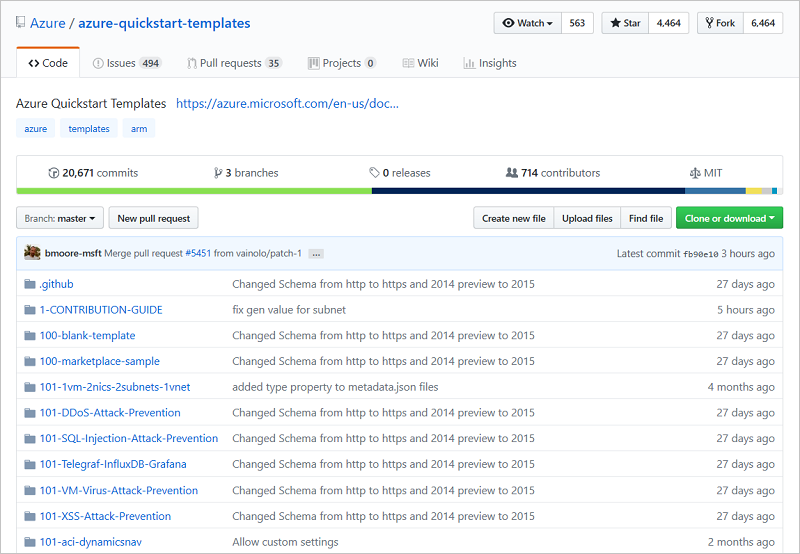
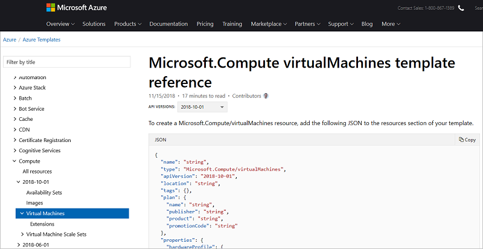

# Create Azure Resource Manager template

This article describes the process and decisions you make when creating an Azure Resource Manager template. It provides an overview of examples and features that may help you when authoring your template. The article assumes you're deploying resources to a resource group. If you need to deploy resources to your Azure subscription, such as creating Azure Policies or role-based access control assignments, see [Create resource groups and resources for an Azure subscription](deploy-to-subscription.md).

## Select JSON editor

The Resource Manager template is a JSON file. You need a good authoring tool to work on the JSON file. You have many options, but if you don't already have an editor that you prefer, install [VS Code](https://code.visualstudio.com/). After installing VS Code, add the [Azure Resource Manager Tools extension](https://marketplace.visualstudio.com/items?itemName=msazurermtools.azurerm-vscode-tools). This extension adds many features that simplify template authoring.

## Create blank template

In VS Code, create a new JSON file named **azuredeploy.json**. Add the following blank template:

```json
{
    "$schema": "http://schema.management.azure.com/schemas/2015-01-01/deploymentTemplate.json#",
    "contentVersion": "1.0.0.0",
    "parameters": {  },
    "variables": {  },
    "functions": [  ],
    "resources": [  ],
    "outputs": {  }
}
```

Let's review the parts of the template to understand how the template works. The [parameters](resource-manager-templates-parameters.md) section shows values you can specify during deployment to customize the infrastructure that is deployed. The [variables](resource-manager-templates-variables.md) section shows values that are used throughout the template. The [functions](resource-group-authoring-templates.md#functions) section shows customized template expression that used in your template. The [resources](resource-manager-templates-resources.md) section shows the Azure resources that are deployed to your subscription. The [outputs](resource-manager-templates-outputs.md) section shows values that are returned after deployment has finished.

## Look for similar template

Often, you can find an existing template that deploys a solution that is similar to what you need. The [Azure Quickstart Templates GitHub repository](https://github.com/Azure/azure-quickstart-templates) has hundreds of templates from community contributors.



Search through that repository for a template that is similar to what you need. It's okay if the template doesn't do exactly what you need, you can customize it.

After finding a template, copy the **azuredeploy.json** file from the repository. Replace the contents of the template file you created in VS Code with the copied contents.

## Review template functions

You may notice expressions in your template that are surrounded by brackets, such as `"[some-expression]"`. These expressions use template functions to dynamically construct values during deployment.

For example, you often see an expression like `"name": "[parameters('siteName')]"`. Or, a more complex expression that uses several functions looks like `"[reference(resourceId(parameters('storageResourceGroup'), 'Microsoft.Storage/storageAccounts', parameters('storageAccountName')), '2018-07-01')]"`.

To understand what the functions do, review the [template function reference](resource-group-template-functions.md) documentation.

## Add resources

You probably want to customize the template to make sure it does exactly what you want. First, review the resources that are deployed. You may need to add, remove, or change resources in the template. For descriptions and syntax of the resources, see [Azure Resource Manager template reference](/azure/templates/).



After reviewing those properties, make any required changes. For recommendations about how to define resources, see [resources - recommended practices](template-best-practices.md#resources).

## Add or remove parameters

You might also need to adjust the parameters for your template. You can add or remove parameters based on how much customization you want to enable during deployment. For recommendations about how to use parameters, see [parameters - recommended practices](template-best-practices.md#parameters).

## Add tags

You can add tags to your resources to logically organize by categories, and divide billing costs. Adding tags is easy, you apply them in the JSON for the resource. For example, the following storage account has two tags:

```json
{
    "$schema": "https://schema.management.azure.com/schemas/2015-01-01/deploymentTemplate.json#",
    "contentVersion": "1.0.0.0",
    "resources": [
      {
        "apiVersion": "2016-01-01",
        "type": "Microsoft.Storage/storageAccounts",
        "name": "[concat('storage', uniqueString(resourceGroup().id))]",
        "location": "[resourceGroup().location]",
        "tags": {
          "Dept": "Finance",
          "Environment": "Production"
        },
        "sku": {
          "name": "Standard_LRS"
        },
        "kind": "Storage",
        "properties": { }
      }
    ]
}
```

You can also apply tags dynamically from parameters. For more information, see [tags in template](resource-manager-templates-resources.md#tags).

## Create more than one instance

Sometimes you want to create more than one instance of a resource. For example, you might need several storage accounts. Rather than repeat the resource through your template, you can use the `copy` syntax to specify more than one instance.

The following example creates three storage accounts:

```json
{
    "$schema": "https://schema.management.azure.com/schemas/2015-01-01/deploymentTemplate.json#",
    "contentVersion": "1.0.0.0",
    "resources": [
        {
            "apiVersion": "2016-01-01",
            "type": "Microsoft.Storage/storageAccounts",
            "name": "[concat(copyIndex(),'storage', uniqueString(resourceGroup().id))]",
            "location": "[resourceGroup().location]",
            "sku": {
                "name": "Standard_LRS"
            },
            "kind": "Storage",
            "properties": {},
            "copy": {
                "name": "storagecopy",
                "count": 3
            }
        }
    ],
    "outputs": {}
}
```

You can also specify the number of instances dynamically from a parameter. For more information, see [Deploy more than one instance of a resource or property in Azure Resource Manager Templates](resource-group-create-multiple.md).

## Conditionally deploy a resource

Sometimes you need to specify during deployment whether a resource in the template is deployed. For example, you may want the flexibility to either deploy a new resource or use an existing resource. The `condition` element gives you the ability to turn on or off deployment for a resource. When the expression in the condition element is true, the resource is deployed. When false, the resource is skipped during deployment.

The following example conditionally deploys a storage account:

```json
{
    "condition": "[equals(parameters('newOrExisting'),'new')]",
    "type": "Microsoft.Storage/storageAccounts",
    "name": "[variables('storageAccountName')]",
    "apiVersion": "2017-06-01",
    "location": "[resourceGroup().location]",
    "sku": {
        "name": "[variables('storageAccountType')]"
    },
    "kind": "Storage",
    "properties": {}
}
```

For more information, see the [condition element](resource-manager-templates-resources.md#condition).

## Review dependencies

Some resources in your template need to be deployed before other resources. For example, the SQL server needs to exist before the SQL database is created. Resource Manager implicitly determines the deployment order for resources when the [reference function](resource-group-template-functions-resource.md#reference) is used. However, in some cases, you need to explicitly define the dependencies by using the `dependsOn` element. Review your template to see if any dependencies need to be added. Be careful to not add unnecessary dependencies as they can slow down deployment or create circular references.

For more information, see [Define the order for deploying resources in Azure Resource Manager Templates](resource-group-define-dependencies.md).

## Review guidance

Before deploying your template, review [Azure Resource Manager template best practices](template-best-practices.md) to see if there are any recommended approaches you want to implement in your template.

If you need to use your template in different Azure cloud environments, see [Develop Azure Resource Manager templates for cloud consistency](templates-cloud-consistency.md).

## Next steps

* To deploy a template, see [Deploy with Azure CLI](resource-group-template-deploy-cli.md) or [Deploy with PowerShell](resource-group-template-deploy).
* For a step-by-step Quickstart on creating a template, see [Create Azure Resource Manager templates by using Visual Studio Code](resource-manager-quickstart-create-templates-use-visual-studio-code.md).
* For a list of the available functions in a template, see [Template functions](resource-group-template-functions.md).
