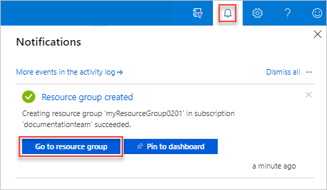
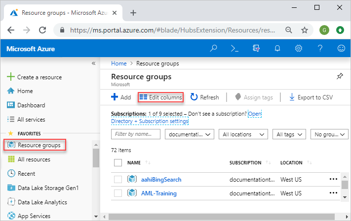
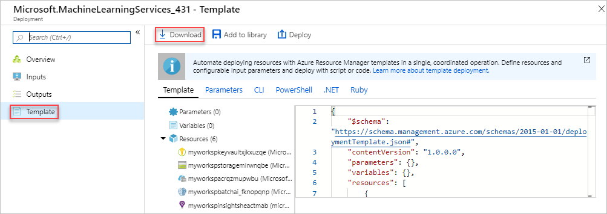

# Manage Azure Resource Manager resource groups by using the Azure portal

Learn how to use the [Azure portal](https://portal.azure.com) with [Azure Resource Manager](resource-group-overview.md) to manage your Azure resource groups. For managing Azure resources, see [Manage Azure resources by using the Azure portal](./manage-resources-portal.md).

Other articles about managing resource groups:

- [Manage Azure resource groups by using Azure CLI](./manage-resources-cli.md)
- [Manage Azure resource groups by using Azure PowerShell](./manage-resources-powershell.md)

[!INCLUDE [Handle personal data](../../includes/gdpr-intro-sentence.md)]

## What is a resource group

A resource group is a container that holds related resources for an Azure solution. The resource group can include all the resources for the solution, or only those resources that you want to manage as a group. You decide how you want to allocate resources to resource groups based on what makes the most sense for your organization. Generally, add resources that share the same lifecycle to the same resource group so you can easily deploy, update, and delete them as a group.

The resource group stores metadata about the resources. Therefore, when you specify a location for the resource group, you are specifying where that metadata is stored. For compliance reasons, you may need to ensure that your data is stored in a particular region.

The resource group stores metadata about the resources. When you specify a location for the resource group, you're specifying where that metadata is stored.

## Create resource groups

1. Sign in to the [Azure portal](https://portal.azure.com).
2. Select **Resource groups**

    
3. Select **Add**.
4. Enter the following values:

   - **Subscription**: Select your Azure subscription. 
   - **Resource group**: Enter a new resource group name. 
   - **Region**: Select an Azure location, such as **Central US**.

     
5. Select **Review + Create**
6. Select **Create**. It takes a few seconds to create a resource group.
7. Select **Refresh** from the top menu to refresh the resource group list, and then select the newly created resource group to open it. Or select **Notification**(the bell icon) from the top, and then select **Go to resource group** to open the newly created resource group

    

## List resource groups

1. Sign in to the [Azure portal](https://portal.azure.com).
2. To list the resource groups, select **Resource groups**

    

3. To customize the information displayed for the resource groups, select **Edit columns**. The following screenshot shows the addition columns you could add to the display:

## Open resource groups

1. Sign in to the [Azure portal](https://portal.azure.com).
2. Select **Resource groups**.
3. Select the resource group you want to open.

## Delete resource groups

1. Open the resource group you want to delete.  See [Open resource groups](#open-resource-groups).
2. Select **Delete resource group**.

    

For more information about how Azure Resource Manager orders the deletion of resources, see [Azure Resource Manager resource group deletion](./resource-group-delete.md).

## Deploy resources to a resource group

After you have created a Resource Manager template, you can use the Azure portal to deploy your Azure resources. For creating a template, see [Quickstart: Create and deploy Azure Resource Manager templates by using the Azure portal](./resource-manager-quickstart-create-templates-use-the-portal.md). For deploying a template using the portal, see [Deploy resources with Resource Manager templates and Azure portal](resource-group-template-deploy-portal.md).

## Move to another resource group or subscription

You can move the resources in the group to another resource group. For more information, see [Move resources to new resource group or subscription](resource-group-move-resources.md).

## Lock resource groups

Locking prevents other users in your organization from accidentally deleting or modifying critical resources, such as Azure subscription, resource group, or resource. 

1. Open the resource group you want to delete.  See [Open resource groups](#open-resource-groups).
2. In the left pane, select **Locks**.
3. To add a lock to the resource group, select **Add**.
4. Enter **Lock name**, **Lock type**, and **Notes**. The lock types include **Read-only**, and **Delete**.

    

For more information, see [Lock resources to prevent unexpected changes](./resource-group-lock-resources.md).

## Tag resource groups

You can apply tags to resource groups and resources to logically organize your assets. For information, see [Using tags to organize your Azure resources](./resource-group-using-tags.md#portal).

## Export resource groups to templates

After setting up your resource group successfully, you may want to view the Resource Manager template for the resource group. Exporting the template offers two benefits:

- Automate future deployments of the solution because the template contains all the complete infrastructure.
- Learn template syntax by looking at the JavaScript Object Notation (JSON) that represents your solution.

There are two ways to export a template:

- You can export the actual template used for deployment. The exported template includes all the parameters and variables exactly as they appeared in the original template. This approach is helpful when you deployed resources through the portal, and want to see the template to create those resources. This template is readily usable. 
- You can export a generated template that represents the current state of the resource group. The exported template isn't based on any template that you used for deployment. Instead, it creates a template that is a "snapshot" or "backup" of the resource group. The exported template has many hard-coded values and probably not as many parameters as you would typically define. Use this option to redeploy resources to the same resource group. To use this template for another resource group, you may have to significantly modify it.

### Export templates from deployment history

This method exports the templates for certain deployments. If you have changed the resources from the portal, or added/removed resource in multiple deployments, see [Export templates from resource groups](#export-templates-from-resource-groups).

1. Open the resource group you want to export.  See [Open resource groups](#open-resource-groups).
2. In the left pane, select **Deployments**, or select the link under **Deployments**.  On the following screenshot, it shows **4 Succeeded** because there were four separated deployments with four different deployment names. You might see **1 Succeeded**.

    

3. Select one of the deployments from the list.
4. In the left pane, select **Template**. Resource Manager retrieves the following six files for you:

   - **Template** - The template that defines the infrastructure for your solution. When you created the storage account through the portal, Resource Manager used a template to deploy it and saved that template for future reference.
   - **Parameters** - A parameter file that you can use to pass in values during deployment. It contains the values that you provided during the first deployment. You can change any of these values when you redeploy the template.
   - **CLI** - An Azure CLI script file that you can use to deploy the template.
   - **PowerShell** - An Azure PowerShell script file that you can use to deploy the template.
   - **.NET** - A .NET class that you can use to deploy the template.
   - **Ruby** - A Ruby class that you can use to deploy the template.

     By default, the portal displays the template.

5. Select **Download** to export a template to your local computer.

    

### Export templates from resource groups

If you've changed your resources from the portal, or added/remove resources in multiple deployments, retrieving a template from the deployment history doesn't reflect the current state of the resource group. This section shows you how to export a template that reflects the current state of the resource group. It is intended as a snapshot of the resource group, which you can use to redeploy to the same resource group. To use the exported template for other solutions, you must significantly modify it.

1. Open the resource group you want to export.  See [Open resource groups](#open-resource-groups).
2. In the left pane, select **Export template**. Resource Manager retrieves the following six files for you:

   - **Template** - The template that defines the infrastructure for your solution. When you created the storage account through the portal, Resource Manager used a template to deploy it and saved that template for future reference.
   - **Parameters** - A parameter file that you can use to pass in values during deployment. It contains the values that you provided during the first deployment. You can change any of these values when you redeploy the template.
   - **CLI** - An Azure CLI script file that you can use to deploy the template.
   - **PowerShell** - An Azure PowerShell script file that you can use to deploy the template.
   - **.NET** - A .NET class that you can use to deploy the template.
   - **Ruby** - A Ruby class that you can use to deploy the template.

     By default, the portal displays the template.
3. Select **Download** to export a template to your local computer.

Some exported templates need some edits before they can be used. To learn how to develop templates, see the [Step-by-step tutorials](/azure/azure-resource-manager/).

### Export template before deploying

You can use the portal to define a resource.  Before deploying the resource, you can view and export a template. For the instructions, see [Quickstart: Create and deploy Azure Resource Manager templates by using the Azure portal](./resource-manager-quickstart-create-templates-use-the-portal.md).

### Fix export issues

Not all resource types support the export template function. You only see export issues when exporting from a resource group rather than from your deployment history. If your last deployment accurately represents the current state of the resource group, you should export the template from the deployment history rather than from the resource group. Only export from a resource group when you have made changes to the resource group that aren't defined in a single template.

To resolve export issues, manually add the missing resources back into your template. The error message includes the resource types that can't be exported. Find that resource type in [Template reference](/azure/templates/). For example, to manually add a virtual network gateway, see [Microsoft.Network/virtualNetworkGateways template reference](/azure/templates/microsoft.network/virtualnetworkgateways). The template reference gives you the JSON to add the resource to your template.

After getting the JSON format for the resource, you need to get the resource values. You can see the values for the resource by using the GET operation in the REST API for the resource type. For example, to get the values for your virtual network gateway, see [Virtual Network Gateways - Get](/rest/api/network-gateway/virtualnetworkgateways/get).

## Manage access to resource groups

[Role-based access control (RBAC)](../role-based-access-control/overview.md) is the way that you manage access to resources in Azure. For more information, see [Manage access using RBAC and the Azure portal](../role-based-access-control/role-assignments-portal.md).

## Next steps

- To learn Azure Resource Manager, see [Azure Resource Manager overview](./resource-group-overview.md).
- To learn the Resource Manager template syntax, see [Understand the structure and syntax of Azure Resource Manager templates](./resource-group-authoring-templates.md).
- To learn how to develop templates, see the [step-by-step tutorials](/azure/azure-resource-manager/).
- To view the Azure Resource Manager template schemas, see [template reference](/azure/templates/).