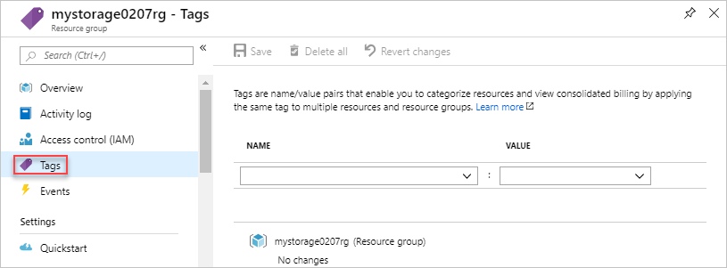

# Manage Azure resources by using Azure PowerShell

Learn how to use Azure PowerShell with [Azure Resource Manager](resource-group-overview.md) to manage your Azure resources.

[!INCLUDE [Handle personal data](../../includes/gdpr-intro-sentence.md)]

For managing resource groups, see [Manage Azure resource groups by using Azure PowerShell](./manage-resource-groups-powershell.md).

## Deploy resources to an existing resource group

You can deploy Azure resources directly use Azure PowerShell or deploy a Resource Manager template to create Azure resources. 

### Deploy a resource

The following PowerShell script creates a storage account.

```azurepowershell-interactive
$resourceGroupName = Read-Host -Prompt "Enter the Resource Group name"
$location = Read-Host -Prompt "Enter the location (i.e. centralus)"
$storageAccountName = Read-Host -Prompt "Enter the storage account name"

# Create the storage account.
$storageAccount = New-AzStorageAccount -ResourceGroupName $resourceGroupName `
  -Name $storageAccountName `
  -Location $location `
  -SkuName "Standard_LRS"

# Retrieve the context.
$ctx = $storageAccount.Context
```

### Deploy a template

The following PowerShell creates deploy a Quickstart template to create a storage account. For more information, see [Quickstart: Create Azure Resource Manager templates by using Visual Studio Code](./resource-manager-quickstart-create-templates-use-visual-studio-code.md?tabs=PowerShell).

```azurepowershell-interactive
$resourceGroupName = Read-Host -Prompt "Enter the Resource Group name"
$location = Read-Host -Prompt "Enter the location (i.e. centralus)"
$templateUri = "https://raw.githubusercontent.com/Azure/azure-quickstart-templates/master/101-storage-account-create/azuredeploy.json"
New-AzResourceGroupDeployment -ResourceGroupName $resourceGroupName -TemplateUri $templateUri -Location $location
```

## Deploy a resource group and resources

You can create a resource group and deploy resources to the group. For more information, see [Create resource group and deploy resources](./deploy-to-subscription.md#create-resource-group-and-deploy-resources).

## Delete resources

The following script shows how to delete a storage account.

```azurepowershell-interactive
$resourceGroupName = Read-Host -Prompt "Enter the Resource Group name"
$storageAccountName = Read-Host -Prompt "Enter the storage account name"

Remove-AzStorageAccount -ResourceGroupName $resourceGroupName -AccountName $storageAccountName
```

## Move resources

The following script shows how to remove a storage account from one resource group to another resource group.

```azurepowershell-interactive
$srcResourceGroupName = Read-Host -Prompt "Enter the source Resource Group name"
$destResourceGroupName = Read-Host -Prompt "Enter the destination Resource Group name"
$storageAccountName = Read-Host -Prompt "Enter the storage account name"

$storageAccount = Get-AzResource -ResourceGroupName $srcResourceGroupName -ResourceName $storageAccountName
Move-AzResource -DestinationResourceGroupName $destResourceGroupName -ResourceId $storageAccount.ResourceId
```

For more information, see [Move resources to new resource group or subscription](resource-group-move-resources.md).

## Lock resources

Locking prevents other users in your organization from accidentally deleting or modifying critical resources, such as Azure subscription, resource group, or resource. 

The following script locks a storage account so the account can't be deleted.

```azurepowershell-interactive
$resourceGroupName = Read-Host -Prompt "Enter the Resource Group name"
$storageAccountName = Read-Host -Prompt "Enter the storage account name"

New-AzResourceLock -LockName LockStorage -LockLevel CanNotDelete -ResourceGroupName $resourceGroupName -ResourceName $storageAccountName -ResourceType Microsoft.Storage/storageAccounts 
```

The following script gets all locks for a storage account:

```azurepowershell-interactive
$resourceGroupName = Read-Host -Prompt "Enter the Resource Group name"
$storageAccountName = Read-Host -Prompt "Enter the storage account name"

Get-AzResourceLock -ResourceGroupName $resourceGroupName -ResourceName $storageAccountName -ResourceType Microsoft.Storage/storageAccounts
```

The following script deletes a lock of a storage account:

```azurepowershell-interactive
$resourceGroupName = Read-Host -Prompt "Enter the Resource Group name"
$storageAccountName = Read-Host -Prompt "Enter the storage account name"

$lockId = (Get-AzResourceLock -ResourceGroupName $resourceGroupName -ResourceName $storageAccountName -ResourceType Microsoft.Storage/storageAccounts).LockId
Remove-AzResourceLock -LockId $lockId
```

For more information, see [Lock resources with Azure Resource Manager](resource-group-lock-resources.md).

## Tag resources

Tagging helps organizing your resource group and resources logically. 

1. Open the resource in the portal. For the steps, see [Open resources](#open-resources).
2. Select **Tags**. The following screenshot shows the management options for a storage account.

    
3. Specify the tag properties, and then select **Save**.

For information, see [Using tags to organize your Azure resources](./resource-group-using-tags.md#portal).

## Monitor resources

When you open a resource, the portal presents default graphs and tables for monitoring that resource type. The following screenshot shows the graphs for a virtual machine:


You can select the pin icon on the upper right corner of the graphs to pin the graph to the dashboard. To learn about working with dashboards, see [Creating and sharing dashboards in Azure PowerShell](../azure-portal/azure-portal-dashboards.md).

## Next steps

* To view activity logs, see [Audit operations with Resource Manager](resource-group-audit.md).
* To view details about a deployment, see [View deployment operations](resource-manager-deployment-operations.md).
* To deploy resources through the portal, see [Deploy resources with Resource Manager templates and Azure portal](resource-group-template-deploy-portal.md).
* To manage access to resources, see [Use role assignments to manage access to your Azure subscription resources](../role-based-access-control/role-assignments-portal.md).
* For guidance on how enterprises can use Resource Manager to effectively manage subscriptions, see [Azure enterprise scaffold - prescriptive subscription governance](/azure/architecture/cloud-adoption-guide/subscription-governance).