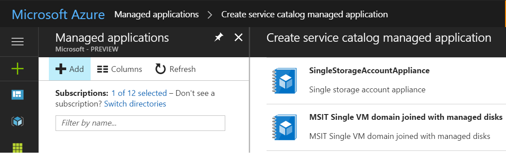
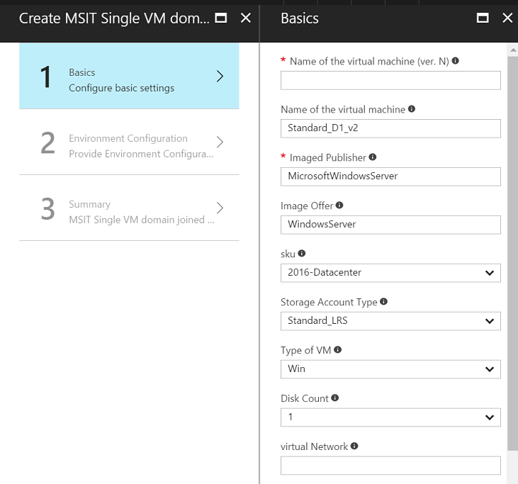

# Consume an Azure Managed Application

As described in the [Managed Application overview](managed-application-overview.md) article, there are two scenarios in the end to end experience. One is the publisher or ISV who wants to create a managed application for use by customers. The second is the end customer or the consumer of the managed application. This article covers the second scenario and explains how an end customer can consume a managed application provided by an ISV.

Currently, you can use either Azure CLI or Azure portal to consume a managed application. 

## Create the managed application using CLI 

You must get the appliance definition ID for the appliance you want to consume.

There are two ways, using Azure CLI, to create a managed application. One is using the regular template deployment command, and the other is using a new command provided just for this purpose.

### Create using template deployment command

You deploy the applianceMainTemplate.json file that the vendor created.

You create two resource groups. The first resource group is where the appliance resource is created (Microsoft.Solutions/appliances). The second resource group contains all the resources defined in the mainTemplate.json. This resource group is managed by the ISV.

```azurecli
az group create --name mainResourceGroup --location westcentralus    
az group create --name managedResourceGroup --location westcentralus
```

> [!NOTE]
> Use `westcentralus` as the location of the resource group.
>


Next, use the following command to deploy the applianceMainTemplate.json in the mainResourceGroup:

```azurecli
az group deployment create --name managedAppDeployment --resourceGroup mainResourceGroup --templateUri  
```

When the preceding template executes, it prompts you for the values of the parameters that are defined in the template. In addition to the parameters needed for provisioning resources in a template, you need two key parameter values:

- managedResourceGroupId - The ID of the resource group where the resources defined in the applianceMainTemplate.json are created. The id is of the form `/subscriptions/{subscriptionId}/resourceGroups/{resoureGroupName}`. In the preceding example, it is the id of `managedResourceGroup`.
- applianceDefinitionId - The ID of the managed application definition resource. This value is provided by the ISV. 

> [!NOTE] 
> The ISV must grant access to the resource group where the appliance definition resource is created. The appliance definition resource is created in the ISV subscription. Therefore, a user, user group, or application in the customer tenant needs read access to this resource. 

After the deployment completes successfully, you see the appliance resource is created in **mainResourceGroup**. the storageAccount resource is created in **managedResourceGroup**.

### Create the managed application using create command

You can use the `az managedapp create` command to create a managed application from the managed application definition. 

```azurecli
az managedapp create --name ravtestappliance401 --location "westcentralus" 
	--kind "Servicecatalog" --resource-group "ravApplianceCustRG401" 
   	--managedapp-definition-id "/subscriptions/{guid}/resourceGroups/ravApplianceDefRG401/providers/Microsoft.Solutions/applianceDefinitions/ravtestAppDef401" 
   	--managed-rg-id "/subscriptions/{guid}/resourceGroups/ravApplianceCustManagedRG401" 
   	--parameters "{\"storageAccountName\": {\"value\": \"ravappliancedemostore1\"}}" 
   	--debug
```

**appliance-definition-Id** -  The resource Id of the appliance definition created in the preceding step. To get this ID, run the following command:

```azurecli
az appliance definition show -n ravtestAppDef1 -g ravApplianceRG2
```

This command returns the appliance definition. You need the value of **Id** property.

**managed-rg-id** - The name of the resource group where all the resources defined in the applianceMainTemplate.json are created. This resource group is the managed resource group, and is managed by the publisher. If it does not exist, it is created for you.

**resource-group** - The resource group where the appliance resource is created. The Microsoft.Solutions/appliance resource lives in this resource group. 

**parameters** - The parameters that are needed for the resources defined in the applianceMainTemplate.json.

## Create the managed application using Portal

The support to consume managed applications published by the ISVs is also present in the portal. You can follow the following steps:

Select the Service Catalog Managed Application from the Create blade in Azure portal -


Next, you see the list of offers from various ISVs/partners. Select the one you would like to create and click "Create"



After clicking create, provide the parameters required to provision the resources in the blade that opens. 



After providing the values, click OK. The template is validated against the inputs you provided. If validation succeeds, the template deployment starts. After the deployment has completed, the appropriate resources defined in the template are provisioned in the managed resource group you provided.

## Known issues

This preview release includes the following issues:

* If you get a 500 Internal Server Error during the creation of the appliance, it's likely an intermittent issue. Retry the operation if you run into this issue.
* A new resource group is needed for the managed resource group. Using an existing resource group causes the deployment to fail.
* The resource group that contains the Microsoft.Solutions/appliances resource should be created in **westcentralus** location.

## Next steps

* For an introduction to managed applications, see [Azure Managed Application overview](managed-application-overview.md).
* To understand the vendor experience, see [Create and publish an Azure Managed Application](managed-application-publishing.md).