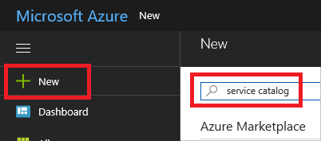
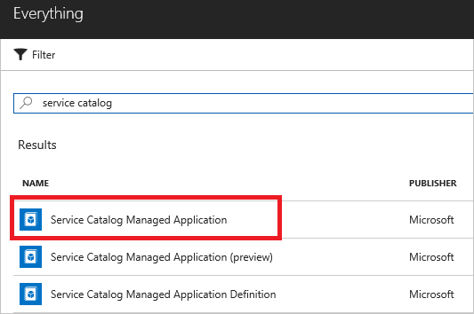
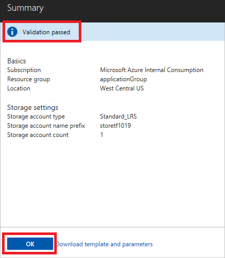

# Consume an internal managed application

You can consume Azure [managed applications](managed-application-overview.md) that are intended for members of your organization. For example, you can select managed applications from your IT department that ensure compliance with organizational standards. These managed applications are available through the Service Catalog, not the Azure Marketplace.

Before proceeding with this article, you must have a managed application available in the service catalog for your subscription. If someone in your organization has not already created a managed application, see [Publish a managed application for internal consumption](managed-application-publishing.md).

Currently, you can use either Azure CLI or the Azure portal to consume a managed application.

## Create the managed application by using the portal

To deploy a managed application through the portal, follow these steps:

1. Go to the Azure portal. Select **+ New** and search for **service catalog**.

   

1. Select **Service Catalog Managed Application**.

   

1. Select **Create**.

   

1. Find the managed application you want to create from the list of available solutions, and select it. Select **Create**.

   

1. Provide basic information that is required for the managed application. Specify the subscription and a new resource group to contain the managed application. Select **West Central US** for location. When done, select **OK**.

   

1. Provide values that are specific to the resources in the managed application. When done, select **OK**.

   

1. The template validates the values you provided. If validation succeeds, select **OK** to start the deployment.

   

After the deployment finishes, the managed application exists in a resource group named applicationGroup. The storage account exists in a resource group named applicationGroup plus a hashed string value.

## Create the managed application by using Azure CLI

You need a resource group for the managed application. Create a resource group with the following command:

```azurecli-interactive
az group create -n applicationGroup -l westcentralus
```

You can use the `az managedapp create` command to create a managed application from the managed application definition.

```azurecli-interactive
appid=$(az managedapp definition show --name ManagedStorage --resource-group appDefinitionGroup --query id --output tsv)
subid=$(az account show --query id --output tsv)
managedGroup=<managed-resource-group-name>
prefix=<storage-account-name-prefix>
managedGroupId=/subscriptions/$subid/resourceGroups/$managedGroup

az managedapp create \
  --name storageApp \
  --location "westcentralus" \
  --kind "Servicecatalog" \
  --resource-group applicationGroup \
  --managedapp-definition-id $appid \
  --managed-rg-id $managedGroupId \
  --parameters "{\"storageAccountNamePrefix\": {\"value\": \"<your-prefix>\"}, \"storageAccountType\": {\"value\": \"Standard_LRS\"}}"
```

> [!NOTE]
> The publisher must grant access to the resource group that contains the managed application definition. The definition resource is created in the publisher subscription. Therefore, a user, user group, or application in the customer tenant needs read access to this resource.

## Known issues

This preview release includes the following issues:

* A 500 internal server error appears during the creation of the managed application. If you run into this issue, it's likely to be intermittent. Retry the operation.
* A new resource group is needed for the managed resource group. If you use an existing resource group, the deployment fails.
* The resource group that contains the Microsoft.Solutions/appliances resource must be created in the **westcentralus** location.

## Next steps

* For an introduction to managed applications, see [Managed application overview](managed-application-overview.md).
* For information about publishing a Service Catalog managed application, see [Create and publish a Service Catalog managed application](managed-application-publishing.md).
* For information about publishing managed applications to the Azure Marketplace, see [Azure managed applications in the Marketplace](managed-application-author-marketplace.md).
* For information about consuming a managed application from the Marketplace, see [Consume Azure managed applications in the Marketplace](managed-application-consume-marketplace.md).
