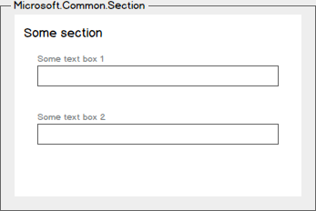

# Microsoft.Common.Section UI element
A control that groups one or more elements under a heading. You use this element when [creating an Azure Managed Application](managed-application-publishing.md).

## UI sample


## Schema
```json
{
  "name": "section1",
  "type": "Microsoft.Common.Section",
  "label": "Some section",
  "elements": [
    {
      "name": "element1",
      "type": "Microsoft.Common.TextBox",
      "label": "Some text box 1"
    },
    {
      "name": "element2",
      "type": "Microsoft.Common.TextBox",
      "label": "Some text box 2"
    }
  ],
  "visible": true
}
```

## Remarks
- `elements` must contain at least one element, and can contain all element
types except `Microsoft.Common.Section`.
- This element doesn't support the `toolTip` property.

## Sample output
To access the output values of elements in `elements`, use the [basics()](managed-application-createuidefinition-functions.md#basics) or
[steps()](managed-application-createuidefinition-functions.md#steps) functions and dot notation:

```json
basics('section1').element1
```

Elements of type `Microsoft.Common.Section` have no output values themselves.

## Next steps
* For an introduction to managed applications, see [Azure Managed Application overview](managed-application-overview.md).
* For an introduction to creating UI definitions, see [Getting started with CreateUiDefinition](managed-application-createuidefinition-overview.md).
* For a description of common properties in UI elements, see [CreateUiDefinition elements](managed-application-createuidefinition-elements.md).
