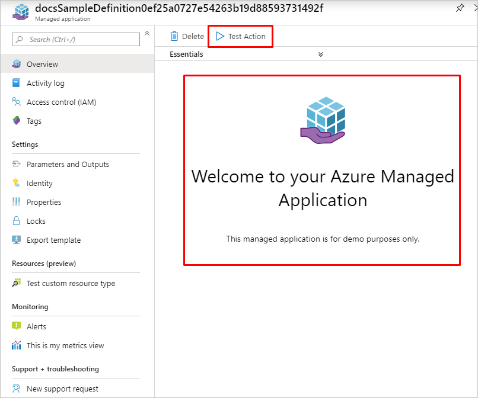
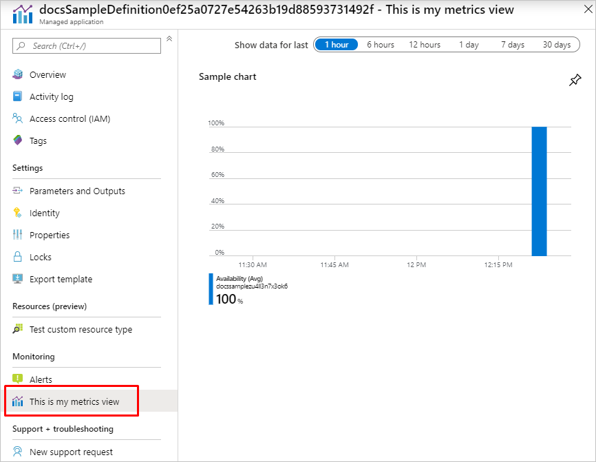
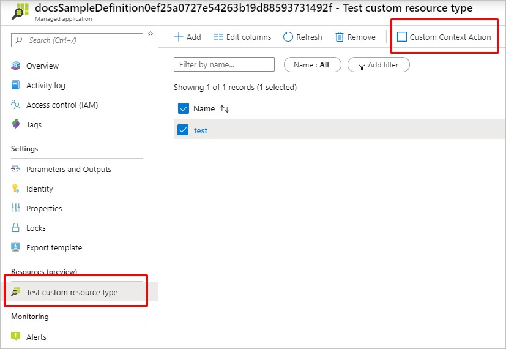

# View definition artifact in Azure Managed Applications

View definition is an optional artifact in Azure Managed Applications. It allows to customize overview page and add more views such as Metrics and Custom resources.

This article provides an overview of view definition artifact and its capabilities.

## View definition artifact

The view definition artifact must be named **viewDefinition.json** and placed at the same level as **createUiDefinition.json** and **mainTemplate.json** in the .zip package that creates a managed application definition. To learn how to create the .zip package and publish a managed application definition, see [Publish an Azure Managed Application definition](publish-service-catalog-app.md)

## View definition schema

The **viewDefinition.json** file has only one top level `views` property, which is an array of views. Each view is shown in the managed application user interface as a separate menu item in the table of contents. Each view has a `kind` property that sets the type of the view. It must be set to one of the following values: [Overview](#overview), [Metrics](#metrics), [CustomResources](#custom-resources), [Associations](#associations). For more information, see current [JSON schema for viewDefinition.json](https://schema.management.azure.com/schemas/viewdefinition/0.0.1-preview/ViewDefinition.json#).

Sample JSON for view definition:

```json
{
    "$schema": "https://schema.management.azure.com/schemas/viewdefinition/0.0.1-preview/ViewDefinition.json#",
    "contentVersion": "0.0.0.1",
    "views": [
        {
            "kind": "Overview",
            "properties": {
                "header": "Welcome to your Azure Managed Application",
                "description": "This managed application is for demo purposes only.",
                "commands": [
                    {
                        "displayName": "Test Action",
                        "path": "testAction"
                    }
                ]
            }
        },
        {
            "kind": "Metrics",
            "properties": {
                "displayName": "This is my metrics view",
                "version": "1.0.0",
                "charts": [
                    {
                        "displayName": "Sample chart",
                        "chartType": "Bar",
                        "metrics": [
                            {
                                "name": "Availability",
                                "aggregationType": "avg",
                                "resourceTagFilter": [ "tag1" ],
                                "resourceType": "Microsoft.Storage/storageAccounts",
                                "namespace": "Microsoft.Storage/storageAccounts"
                            }
                        ]
                    }
                ]
            }
        },
        {
            "kind": "CustomResources",
            "properties": {
                "displayName": "Test custom resource type",
                "version": "1.0.0",
                "resourceType": "testCustomResource",
                "createUIDefinition": { },
                "commands": [
                    {
                        "displayName": "Custom Context Action",
                        "path": "testCustomResource/testContextAction",
                        "icon": "Stop",
                        "createUIDefinition": { }
                    }
                ],
                "columns": [
                    {"key": "name", "displayName": "Name"},
                    {"key": "properties.myProperty1", "displayName": "Property 1"},
                    {"key": "properties.myProperty2", "displayName": "Property 2", "optional": true}
                ]
            }
        },
        {
            "kind": "Associations",
            "properties": {
                "displayName": "Test association resource type",
                "version": "1.0.0",
                "targetResourceType": "Microsoft.Compute/virtualMachines",
                "createUIDefinition": { }
            }
        }
    ]
}
```

## Overview

`"kind": "Overview"`

When you provide this view in **viewDefinition.json**, it overrides the default Overview page in your managed application.

```json
{
    "kind": "Overview",
    "properties": {
        "header": "Welcome to your Azure Managed Application",
        "description": "This managed application is for demo purposes only.",
        "commands": [
            {
                "displayName": "Test Action",
                "path": "testAction"
            }
        ]
    }
}
```

|Property|Required|Description|
|---------|---------|---------|
|header|No|The header of the overview page.|
|description|No|The description of your managed application.|
|commands|No|The array of additional toolbar buttons of the overview page, see [commands](#commands).|



## Metrics

`"kind": "Metrics"`

The metrics view enables you to collect and aggregate data from your managed application resources in [Azure Monitor Metrics](../../azure-monitor/platform/data-platform-metrics.md).

```json
{
    "kind": "Metrics",
    "properties": {
        "displayName": "This is my metrics view",
        "version": "1.0.0",
        "charts": [
            {
                "displayName": "Sample chart",
                "chartType": "Bar",
                "metrics": [
                    {
                        "name": "Availability",
                        "aggregationType": "avg",
                        "resourceTagFilter": [ "tag1" ],
                        "resourceType": "Microsoft.Storage/storageAccounts",
                        "namespace": "Microsoft.Storage/storageAccounts"
                    }
                ]
            }
        ]
    }
}
```

|Property|Required|Description|
|---------|---------|---------|
|displayName|No|The displayed title of the view.|
|version|No|The version of the platform used to render the view.|
|charts|Yes|The array of charts of the metrics page.|

### Chart

|Property|Required|Description|
|---------|---------|---------|
|displayName|Yes|The displayed title of the chart.|
|chartType|No|The visualization to use for this chart. By default, it uses a line chart. Supported chart types: `Bar, Line, Area, Scatter`.|
|metrics|Yes|The array of metrics to plot on this chart. To learn more about metrics supported in Azure portal, see [Supported metrics with Azure Monitor](../../azure-monitor/platform/metrics-supported.md)|

### Metric

|Property|Required|Description|
|---------|---------|---------|
|name|Yes|The name of the metric.|
|aggregationType|Yes|The aggregation type to use for this metric. Supported aggregation types: `none, sum, min, max, avg, unique, percentile, count`|
|namespace|No|Additional information to use when determining the correct metrics provider.|
|resourceTagFilter|No|The resource tags array (will be separated with `or` word) for which metrics would be displayed. Applies on top of resource type filter.|
|resourceType|Yes|The resource type for which metrics would be displayed.|



## Custom resources

`"kind": "CustomResources"`

You can define multiple views of this type. Each view represents a **unique** custom resource type from the custom provider you defined in **mainTemplate.json**. For an introduction to custom providers, see [Azure Custom Providers Preview overview](../custom-providers/overview.md).

In this view you can perform GET, PUT, DELETE and POST operations for your custom resource type. POST operations could be global custom actions or custom actions in a context of your custom resource type.

```json
{
    "kind": "CustomResources",
    "properties": {
        "displayName": "Test custom resource type",
        "version": "1.0.0",
        "resourceType": "testCustomResource",
        "icon": "Polychromatic.ResourceList",
        "createUIDefinition": { },
        "commands": [
            {
                "displayName": "Custom Context Action",
                "path": "testCustomResource/testContextAction",
                "icon": "Stop",
                "createUIDefinition": { },
            }
        ],
        "columns": [
            {"key": "name", "displayName": "Name"},
            {"key": "properties.myProperty1", "displayName": "Property 1"},
            {"key": "properties.myProperty2", "displayName": "Property 2", "optional": true}
        ]
    }
}
```

|Property|Required|Description|
|---------|---------|---------|
|displayName|Yes|The displayed title of the view. The title should be **unique** for each CustomResources view in your **viewDefinition.json**.|
|version|No|The version of the platform used to render the view.|
|resourceType|Yes|The custom resource type. Must be a **unique** custom resource type of your custom provider.|
|icon|No|The icon of the view. List of example icons is defined in [JSON Schema](https://schema.management.azure.com/schemas/viewdefinition/0.0.1-preview/ViewDefinition.json#).|
|createUIDefinition|No|Create UI Definition schema for create custom resource command. For an introduction to creating UI definitions, see [Getting started with CreateUiDefinition](create-uidefinition-overview.md)|
|commands|No|The array of additional toolbar buttons of the CustomResources view, see [commands](#commands).|
|columns|No|The array of columns of the custom resource. If not defined the `name` column will be shown by default. The column must have `"key"` and `"displayName"`. For key, provide the key of the property to display in a view. If nested, use dot as delimiter, for example, `"key": "name"` or `"key": "properties.property1"`. For display name, provide the display name of the property to display in a view. You can also provide an `"optional"` property. When set to true, the column is hidden in a view by default.|



## Commands

Commands is an array of additional toolbar buttons that are displayed on page. Each command represents a POST action from your Azure Custom Provider defined in **mainTemplate.json**. For an introduction to custom providers, see [Azure Custom Providers overview](../custom-providers/overview.md).

```json
{
    "commands": [
        {
            "displayName": "Start Test Action",
            "path": "testAction",
            "icon": "Start",
            "createUIDefinition": { }
        },
    ]
}
```

|Property|Required|Description|
|---------|---------|---------|
|displayName|Yes|The displayed name of the command button.|
|path|Yes|The custom provider action name. The action must be defined in **mainTemplate.json**.|
|icon|No|The icon of the command button. List of example icons is defined in [JSON Schema](https://schema.management.azure.com/schemas/viewdefinition/0.0.1-preview/ViewDefinition.json#).|
|createUIDefinition|No|Create UI Definition schema for command. For an introduction to creating UI definitions, see [Getting started with CreateUiDefinition](create-uidefinition-overview.md).|

## Associations

`"kind": "Associations"`

You can define multiple views of this type. This view allows you to link existing resources to the managed application through the custom provider you defined in **mainTemplate.json**. For an introduction to custom providers, see [Azure Custom Providers Preview overview](../custom-providers/overview.md).

In this view you can extend existing Azure resources based on the `targetResourceType`. When a resource is selected, it will create an onboarding request to the **public** custom provider, which can apply a side effect to the resource. 

```json
{
    "kind": "Associations",
    "properties": {
        "displayName": "Test association resource type",
        "version": "1.0.0",
        "targetResourceType": "Microsoft.Compute/virtualMachines",
        "createUIDefinition": { }
    }
}
```

|Property|Required|Description|
|---------|---------|---------|
|displayName|Yes|The displayed title of the view. The title should be **unique** for each Associations view in your **viewDefinition.json**.|
|version|No|The version of the platform used to render the view.|
|targetResourceType|Yes|The target resource type. This is the resource type that will be displayed for resource onboarding.|
|createUIDefinition|No|Create UI Definition schema for create association resource command. For an introduction to creating UI definitions, see [Getting started with CreateUiDefinition](create-uidefinition-overview.md)|

## Looking for help

If you have questions about Azure Managed Applications, try asking on [Stack Overflow](https://stackoverflow.com/questions/tagged/azure-managedapps). A similar question may have already been asked and answered, so check first before posting. Add the tag `azure-managedapps` to get a fast response!

## Next steps

- For an introduction to managed applications, see [Azure Managed Application overview](overview.md).
- For an introduction to custom providers, see [Azure Custom Providers overview](../custom-providers/overview.md).
- For creating an Azure Managed Application with Azure Custom Providers, see [Tutorial: Create managed application with custom provider actions and resource types](tutorial-create-managed-app-with-custom-provider.md)
