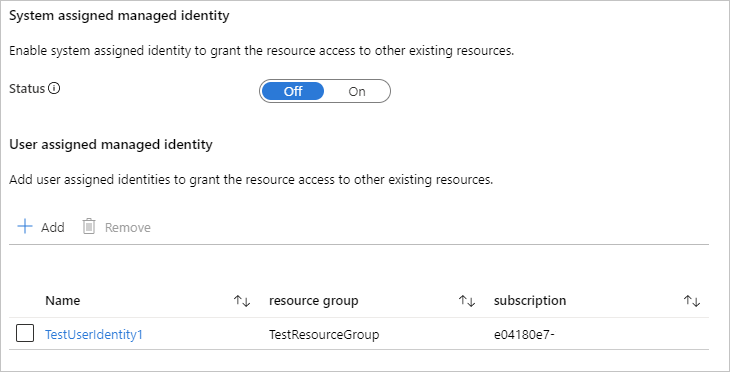

# Microsoft.ManagedIdentity.IdentitySelector UI element

A control for assigning [managed identities](../../active-directory/managed-identities-azure-resources/overview.md) for a resource in a deployment.

## UI sample

The control consists of the following elements:


When the user selects **Add**, the following form opens. The user can select one or more user-assigned identities for the resource.


The selected identities are displayed in the table. The user can add or delete items from this table.



## Schema

```json
{
  "name": "identity",
  "type": "Microsoft.ManagedIdentity.IdentitySelector",
  "label": "Managed Identity Configuration",
  "toolTip": {
    "systemAssignedIdentity": "Enable system assigned identity to grant the resource access to other existing resources.",
    "userAssignedIdentity": "Add user assigned identities to grant the resource access to other existing resources."
  },
  "defaultValue": {
    "systemAssignedIdentity": "Off"
  },
  "options": {
    "hideSystemAssignedIdentity": false,
    "hideUserAssignedIdentity": false
  },
  "visible": true
}
```

## Sample output

```json
{
  "identity": {
    "value": {
      "type": "UserAssigned",
      "userAssignedIdentities": {
        "/subscriptions/xxxx/resourceGroups/TestResourceGroup/providers/Microsoft.ManagedIdentity/userAssignedIdentities/TestUserIdentity1": {}
      }
    }
  }
}
```

## Remarks

- Use **defaultValue.systemAssignedIdentity** to set an initial value for the system assigned identity options control. The default value is **Off**. The following values are allowed:
  - **On** – A system assigned identity is assigned to the resource.
  - **Off** – A system assigned identity isn't assigned to the resource.
  -  **OnOnly** – A system assigned identity is assigned to the resource. Users can't edit this value during deployment.
  - **OffOnly** – A system assigned identity isn't assigned to the resource. Users can't edit this value during deployment.

- If **options.hideSystemAssignedIdentity** is set to **true**, the UI to configure the system assigned identity isn't displayed. The default value for this option is **false**.
- If **options.hideUserAssignedIdentity** is set to **true**, the UI to configure the user assigned identity isn't displayed. The resource isn't assigned a user assigned identity. The default value for this option is **false**.

## Next steps

- For an introduction to creating UI definitions, see [Getting started with CreateUiDefinition](create-uidefinition-overview.md).
- For a description of common properties in UI elements, see [CreateUiDefinition elements](create-uidefinition-elements.md).
