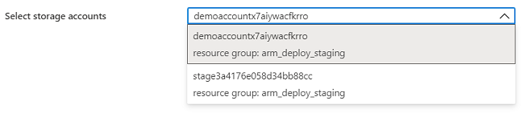

# Microsoft.Solutions.ResourceSelector UI element

ResourceSelector lets users select an existing resource from a subscription.

## UI sample



## Schema

```json
{
    "name": "storageSelector",
    "type": "Microsoft.Solutions.ResourceSelector",
    "label": "Select storage accounts",
    "resourceType": "Microsoft.Storage/storageAccounts",
    "options": {
        "filter": {
            "subscription": "onBasics",
            "location": "onBasics"
        }
    }
}
```

## Sample output

```json
"name": "{resource-name}",
"id": "/subscriptions/{subscription-id}/resourceGroups/{resource-group}/providers/{resource-provider-namespace}/{resource-type}/{resource-name}",
"location": "{deployed-location}"
```

## Remarks

In the `resourceType` property, provide the resource provider namespace and resource type name for the resource you wish to show in the list.

The `filter` property restricts the available options for the resources. You can restrict the results by location or subscription. To show only resources that match the selection in basics, use `onBasics`. To show all resource, use `all`. The default value is `all`.

## Next steps

* For an introduction to creating UI definitions, see [Getting started with CreateUiDefinition](create-uidefinition-overview.md).
* For a description of common properties in UI elements, see [CreateUiDefinition elements](create-uidefinition-elements.md).
