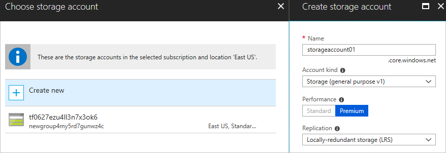

# Microsoft.Storage.StorageAccountSelector UI element

A control for selecting a new or existing storage account.

## UI sample

The control shows the default value.


The control enables the user to create a new storage account or select an existing storage account.



## Schema

```json
{
  "name": "element1",
  "type": "Microsoft.Storage.StorageAccountSelector",
  "label": "Storage account",
  "toolTip": "",
  "defaultValue": {
    "name": "storageaccount01",
    "type": "Premium_LRS"
  },
  "constraints": {
    "allowedTypes": [],
    "excludedTypes": []
  },
  "options": {
    "hideExisting": false
  },
  "visible": true
}
```

## Sample output

```json
{
  "name": "storageaccount01",
  "resourceGroup": "rg01",
  "type": "Premium_LRS",
  "newOrExisting": "new"
}
```

## Remarks

- If specified, `defaultValue.name` is automatically validated for uniqueness. If the storage account name isn't unique, the user must specify a different name or choose an existing storage account.
- The default value for `defaultValue.type` is **Premium_LRS**.
- Any type not specified in `constraints.allowedTypes` is hidden, and any type not specified in `constraints.excludedTypes` is shown. `constraints.allowedTypes` and `constraints.excludedTypes` are both optional, but can't be used simultaneously.
- If `options.hideExisting` is **true**, the user can't choose an existing storage account. The default value is **false**.

## Next steps
* For an introduction to creating UI definitions, see [Getting started with CreateUiDefinition](create-uidefinition-overview.md).
* For a description of common properties in UI elements, see [CreateUiDefinition elements](create-uidefinition-elements.md).
