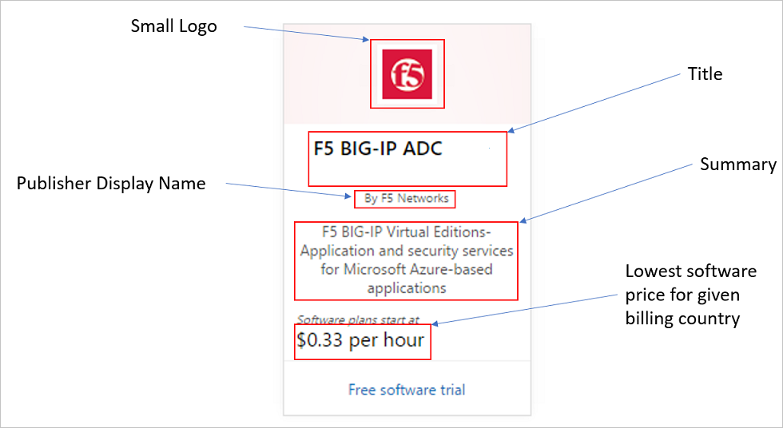
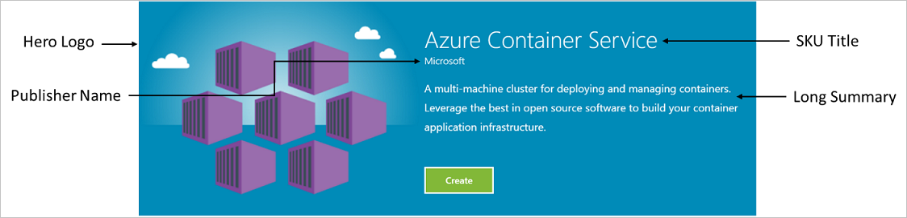

# Tutorial: Publish Azure managed applications in the Marketplace

Vendors can use Azure managed applications to offer their solutions to all Azure Marketplace customers. Those vendors can include managed service providers (MSPs), independent software vendors (ISVs), and system integrators (SIs). Managed applications reduce the maintenance and servicing overhead for customers. Vendors sell infrastructure and software through the marketplace. They can attach services and operational support to managed applications. For more information, see [Managed application overview](overview.md).

This article explains how you can publish an application to the marketplace and make it broadly available to customers.

## Prerequisites for publishing a managed application

To complete this article, you must already have the .zip file for your managed application definition. For more information, see [Create service catalog application](publish-service-catalog-app.md).

There are several business prerequisites. They are:

* Your company or its subsidiary must be located in a country/region where sales are supported by the marketplace.
* Your product must be licensed in a way that is compatible with billing models supported by the marketplace.
* Make technical support available to customers in a commercially reasonable manner. The support can be free, paid, or through community support.
* License your software and any third-party software dependencies.
* Provide content that meets criteria for your offering to be listed in the Marketplace and in the Azure portal.
* Agree to the terms of the Azure Marketplace Participation Policies and Publisher Agreement.
* Agree to comply with the Terms of Use, Microsoft Privacy Statement, and Microsoft Azure Certified Program Agreement.

You must also have a Marketplace account. To create an account, see [How to create a Commercial Marketplace account in Partner Center](../../marketplace/partner-center-portal/create-account.md).

## Create a new Azure application offer

After creating your partner portal account, you're ready to create your managed application offer.

### Set up an offer

The offer for a managed application corresponds to a class of product offering from a publisher. If you have a new type of application that you want to make available in the marketplace, you can set it up as a new offer. An offer is a collection of SKUs. Every offer appears as its own entity in the marketplace.

1. Sign in to the [Cloud Partner portal](https://cloudpartner.azure.com/).

1. In the navigation pane on the left, select **+ New offer** > **Azure Applications**.

1. In the **Editor** view, you see the required forms. Each form is described later in this article.

## Offer Settings form

The fields for the **Offer Settings** form are:

* **Offer ID**: This unique identifier identifies the offer within a publisher profile. This ID is visible in product URLs, Resource Manager templates, and billing reports. It can only be composed of lowercase alphanumeric characters or dashes (-). The ID can't end in a dash. It's limited to a maximum of 50 characters. After an offer goes live, this field is locked.
* **Publisher ID**: Use this drop-down list to choose the publisher profile you want to publish this offer under. After an offer goes live, this field is locked.
* **Name**: This display name for your offer appears in the Marketplace and in the portal. It can have a maximum of 50 characters. Include a recognizable brand name for your product. Don't include your company name here unless that's how it's marketed. If you're marketing this offer on your own website, ensure that the name is exactly how it appears on your website.

When done, select **Save** to save your progress.

## SKUs form

The next step is to add SKUs for your offer.

A SKU is the smallest purchasable unit of an offer. You can use a SKU within the same product class (offer) to differentiate between:

* Different features that are supported
* Whether the offer is managed or unmanaged
* Billing models that are supported

A SKU appears under the parent offer in the marketplace. It appears as its own purchasable entity in the Azure portal.

1. Select **SKUs** > **New SKU**.

1. Enter a **SKU ID**. A SKU ID is a unique identifier for the SKU within an offer. This ID is visible in product URLs, Resource Manager templates, and billing reports. It can only be composed of lowercase alphanumeric characters or dashes (-). The ID can't end in a dash, and it's limited to a maximum of 50 characters. After an offer goes live, this field is locked. You can have multiple SKUs within an offer. You need a SKU for each image you plan to publish.

1. Fill out the **SKU Details** section on the following form:

   Fill out the following fields:

   * **Title**: Enter a title for this SKU. This title appears in the gallery for this item.
   * **Summary**: Enter a short summary for this SKU. This text appears underneath the title.
   * **Description**: Enter a detailed description about the SKU.
   * **SKU Type**: The allowed values are *Managed Application* and *Solution Templates*. For this case, select *Managed Application*.
   * **Country/Region availability**: Select the countries/regions where the managed application is available.
   * **Pricing**: Provide a price for management of the application. Select the available countries/regions before setting the price.

1. Add a new package. Fill out the **Package Details** section on the following form:

   Fill out the following fields:

   * **Version**: Enter a version for the package you upload. It should be in the format `{number}.{number}.{number}{number}`.
   * **Package file (.zip)**: This package contains two required files compressed into a .zip package. One file is a Resource Manager template that defines the resources to deploy for the managed application. The other file defines the [user interface](create-uidefinition-overview.md) for consumers deploying the managed application through the portal. In the user interface, you specify elements that enable consumers to provide parameter values.
   * **Tenant ID**: The tenant ID for the account to get access.
   * **Enable JIT Access**: Select **Yes** to enable [just-in-time access control](request-just-in-time-access.md) for the account. When enabled, you request access to the consumer's account for a specified time period. To require that consumers of your managed application grant your account permanent access, select **No**.
   * **Customize allowed customer actions?**: Select **Yes** to specify which actions consumers can perform on the managed resources.
   * **Allowed customer actions**: If you select **Yes** for the previous setting, you can specify which actions are permitted to consumers by using [deny assignments for Azure resources](../../role-based-access-control/deny-assignments.md).

     For available actions, see [Azure Resource Manager resource provider operations](../../role-based-access-control/resource-provider-operations.md). For example, to permit consumers to restart virtual machines, add `Microsoft.Compute/virtualMachines/restart/action` to the allowed actions. The `*/read` action is automatically allowed so you don't need to include that setting.
   * **PrincipalId**: This property is the Azure Active Directory (Azure AD) identifier of a user, user group, or application that's granted access to the resources in the customer's subscription. The Role Definition describes the permissions.
   * **Role Definition**: This property is a list of all the built-in Role-Based Access Control (RBAC) roles provided by Azure AD. You can select the role that's most appropriate to use to manage the resources on behalf of the customer.
   * **Policy Settings**: Apply an [Azure Policy](../../governance/policy/overview.md) to your managed application to specify compliance requirements for the deployed solutions. From the available options, select the policies to apply. For **Policy Parameters**, provide a JSON string with the parameter values. For policy definitions and the format of the parameter values, see [Azure Policy Samples](../../governance/policy/samples/index.md).

You can add several authorizations. We recommend that you create an AD user group and specify its ID in **PrincipalId**. This way, you can add more users to the user group without the need to update the SKU.

For more information about RBAC, see [Get started with RBAC in the Azure portal](../../role-based-access-control/overview.md).

## Marketplace form

The Marketplace form asks for fields that show up on the [Azure Marketplace](https://azuremarketplace.microsoft.com) and on the [Azure portal](https://portal.azure.com/).

### Preview subscription IDs

Enter a list of Azure subscription IDs that can access the offer after it's published. You can use these white-listed subscriptions to test the previewed offer before you make it live. You can compile an allow list of up to 100 subscriptions in the partner portal.

### Suggested categories

Select up to five categories from the list that your offer can be best associated with. These categories are used to map your offer to the product categories that are available in the [Azure Marketplace](https://azuremarketplace.microsoft.com) and the [Azure portal](https://portal.azure.com/).

#### Azure Marketplace

The summary of your managed application displays the following fields:

The **Overview** tab for your managed application displays the following fields:

The **Plans + Pricing** tab for your managed application displays the following fields:

#### Azure portal

The summary of your managed application displays the following fields:

The overview for your managed application displays the following fields:

#### Logo guidelines

Follow these guidelines for any logo that you upload in the Cloud Partner portal:

*   The Azure design has a simple color palette. Limit the number of primary and secondary colors on your logo.
*   The theme colors of the portal are white and black. Don't use these colors as the background color for your logo. Use a color that makes your logo prominent in the portal. We recommend simple primary colors. *If you use a transparent background, make sure that the logo and text aren't white, black, or blue.*
*   Don't use a gradient background on the logo.
*   Don't place text on the logo, not even your company or brand name. The look and feel of your logo should be flat and avoid gradients.
*   Make sure the logo isn't stretched.

#### Hero logo

The hero logo is optional. The publisher can choose not to upload a hero logo. After the hero icon is uploaded, it can't be deleted. At that time, the partner must follow the Marketplace guidelines for hero icons.

Follow these guidelines for the hero logo icon:

*   The publisher display name, the plan title, and the offer long summary are displayed in white. Therefore, don't use a light color for the background of the hero icon. A black, white, or transparent background isn't allowed for hero icons.
*   After the offer is listed, elements are embedded programmatically inside the hero logo. The embedded elements include the publisher display name, the plan title, the offer long summary, and the **Create** button. Consequently, don't enter any text while you design the hero logo. Leave empty space on the right because the text is included programmatically in that space. The empty space for the text should be 415 x 100 pixels on the right. It's offset by 370 pixels from the left.

	

## Support form

Fill out the **Support** form with support contacts from your company. This information might be engineering contacts and customer support contacts.

## Publish an offer

After you fill out all the sections, select **Publish** to start the process that makes your offer available to customers.

## Next steps

* For information about what happens after you click **Publish**, see [Publish Azure application offer](../../marketplace/cloud-partner-portal/azure-applications/cpp-publish-offer.md)
* For an introduction to managed applications, see [Managed application overview](overview.md).
* For information about publishing a Service Catalog managed application, see [Create and publish a Service Catalog managed application](publish-service-catalog-app.md).
