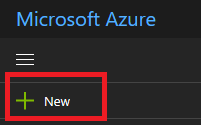
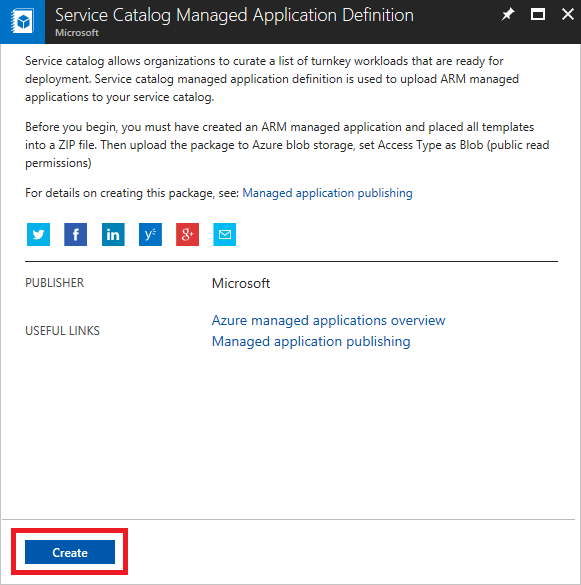

# Publish a service catalog application through Azure portal

You can use the Azure portal to publish [managed applications](overview.md) that are intended for members of your organization. For example, an IT department can publish managed applications that ensure compliance with organizational standards. These managed applications are available through the service catalog, not the Azure marketplace.

## Prerequisites

When publishing a managed application, you specify an identity to manage the resources. We recommend you specify an Azure Active Directory user group. To create an Azure Active Directory user group, see [Create a group and add members in Azure Active Directory](../../active-directory/fundamentals/active-directory-groups-create-azure-portal.md). 

The .zip file that contains the managed application definition must be available through a URI. We recommend that you upload your .zip file to a storage blob. 

## Create managed application with portal

1. In the upper left corner, select **+ New**.

   

1. Search for **service catalog**.

1. In the results, scroll until you find **Service Catalog Managed Application Definition**. Select it.

   

1. Select **Create** to start the process of creating the managed application definition.

   

1. Provide values for name, display name, description, location, subscription, and resource group. For package file URI, provide the path to the zip file you created.

   

1. When you get to the Authentication and Lock Level section, select **Add Authorization**.

   

1. Select an Azure Active Directory group to manage the resources, and select **OK**.

   

1. When you have provided all the values, select **Create**.

   

## Next steps

* For an introduction to managed applications, see [Managed application overview](overview.md).
* For managed application examples, see [Sample projects for Azure managed applications](sample-projects.md).
* To learn how to create a UI definition file for a managed application, see [Get started with CreateUiDefinition](create-uidefinition-overview.md).