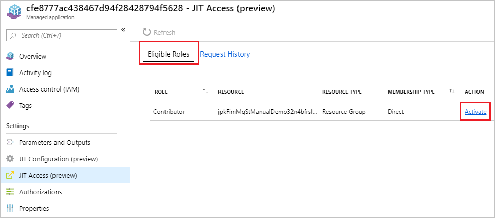
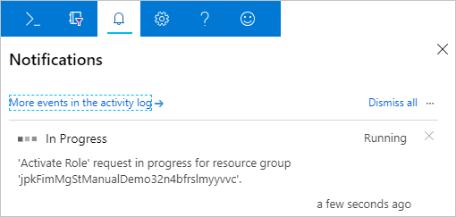

# Enable and request just-in-time access for Azure Managed Applications

Consumers of your managed application may be reluctant to grant you permanent access to the managed resource group. As a publisher of a manager application, you might prefer that consumers know exactly when you need to access the managed resources. To give consumers greater control over granting access to managed resources, Azure Managed Applications provides a feature called just-in-time (JIT) access, which is currently in preview.

JIT access enables you to request elevated access to a managed application's resources for troubleshooting or maintenance. You always have read-only access to the resources, but for a specific time period you can have greater access.

The work flow for granting access is:

1. You add a managed application to the marketplace and specify that JIT access is available.

1. During deployment, the consumer enables JIT access for that instance of the managed application.

1. After deployment, the consumer can change the settings for JIT access.

1. You send a request for access when you need to troubleshoot or update the managed resources.

1. The consumer approves your request.

This article focuses on the actions publishers take to enable JIT access and submit requests. To learn about approving JIT access requests, see [Approve just-in-time access in Azure Managed Applications](approve-just-in-time-access.md).

## Add JIT access step to UI

Your CreateUiDefinition.json file is exactly like the UI file you create for permanent access, except you must include a step that lets consumers enable JIT access. To learn more about publishing your first managed application offering in the Azure Marketplace, see [Azure Managed Applications in the Marketplace](publish-marketplace-app.md).

To support JIT capability for your offer, add the following content to your CreateUiDefinition.json file:

In "steps":

```json
{
    "name": "jitConfiguration",
    "label": "JIT Configuration",
    "subLabel": {
        "preValidation": "Configure JIT settings for your application",
        "postValidation": "Done"
    },
    "bladeTitle": "JIT Configuration",
    "elements": [
        {
          "name": "jitConfigurationControl",
          "type": "Microsoft.Solutions.JitConfigurator",
          "label": "JIT Configuration"
        }
    ]
}
```
 
In "outputs":

```json
"jitAccessPolicy": "[steps('jitConfiguration').jitConfigurationControl]"
```

> [!NOTE]
> JIT access is in preview. The schema for JIT configuration could change in future iterations.

## Enable JIT access

When defining your offering in the marketplace, make sure you enable JIT access.

1. Sign in to the [Cloud Partner publishing portal](https://cloudpartner.azure.com).

1. Provide values to publish your managed application in the marketplace. Select **Yes** for **Enable JIT Access?**

   

You have added a JIT configuration step to your UI, and have enabled JIT access in the marketplace offering. When consumers deploy your managed application, they can [turn on JIT access for their instance](approve-just-in-time-access.md#enable-during-deployment).

## Request access

When you need to access the consumer's managed resources, you send a request for a specific role, time and duration. The consumer must then approve the request.

To send a JIT access request:

1. Select **JIT Access** for the managed application you need to access.

1. Select **Eligible Roles**, and select **Activate** in the ACTION column for the role you want.

   

1. On the **Activate Role** form, select a start time and duration for your role to be active. Select **Activate** to send the request.

    

1. View the notifications to see that the new JIT request is successfully sent to the consumer.

   

   Now, you must wait for the consumer to [approve your request](approve-just-in-time-access.md#approve-requests).

1. To view the status of all JIT requests for a managed application, select **JIT Access** and **Request History**.

   

## Known issues

The principal ID of the account requesting JIT access must be explicitly included in the managed application definition. The account can't only be included through a group that is specified in the package. This limitation will be fixed in a future release.

## Next steps

To learn about approving requests for JIT access, see [Approve just-in-time access in Azure Managed Applications](approve-just-in-time-access.md).
