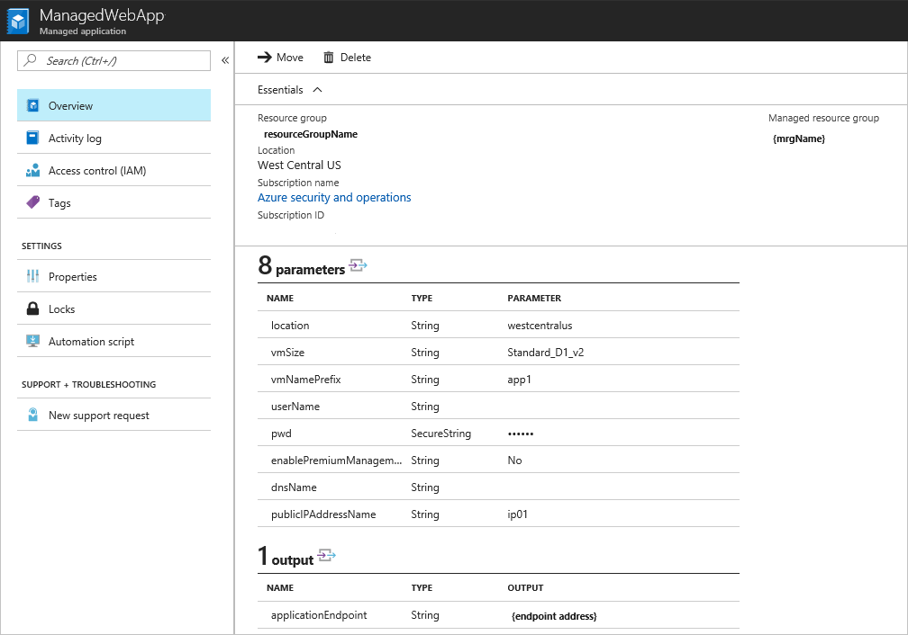
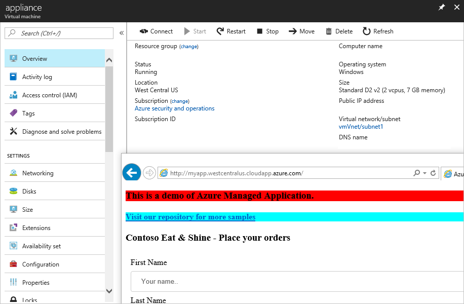
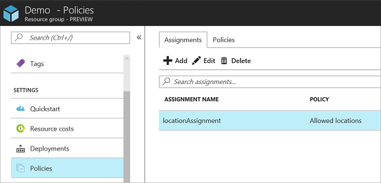

# Work with resources in the managed resource group for Azure managed application

This article describes how to update resources that are deployed as part of a managed application. As the publisher of a managed application, you have access to the resources in the managed resource group. To update these resources, you need to find the managed resource group associated with a managed application, and access the resource in that resource group.

This article assumes you have deployed the managed application in the [Managed Web Application (IaaS) with Azure management services](https://github.com/Azure/azure-managedapp-samples/tree/master/Managed%20Application%20Sample%20Packages/201-managed-web-app) sample project. That managed application includes a **Standard_D1_v2** virtual machine. If you have not deployed that managed application, you can still use this article to become familiar with the steps for updating a managed resource group.

The following image shows the deployed managed application.



In this article, you use Azure CLI to:

* Identify the managed application
* Identify the managed resource group
* Identify the virtual machine resource(s) in the managed resource group
* Change the VM size (either to a smaller size if not utilized, or a larger to support more load)
* Assign a policy to the managed resource group that specifies the allowed locations

## Get managed application and managed resource group

To get the managed applications in a resource group, use:

```azurecli-interactive
az managedapp list --query "[?contains(resourceGroup,'DemoApp')]"
```

To get the ID of the managed resource group, use:

```azurecli-interactive
az managedapp list --query "[?contains(resourceGroup,'DemoApp')].{ managedResourceGroup:managedResourceGroupId }"
```

## Resize VMs in managed resource group

To see the virtual machines in the managed resource group, provide the name of the managed resource group.

```azurecli-interactive
az vm list -g DemoApp6zkevchqk7sfq --query "[].{VMName:name,OSType:storageProfile.osDisk.osType,VMSize:hardwareProfile.vmSize}"
```

To update the size of the VMs, use:

```azurecli-interactive
az vm resize --size Standard_D2_v2 --ids $(az vm list -g DemoApp6zkevchqk7sfq --query "[].id" -o tsv)
```

After the operation completes, verify the application is running on Standard D2 v2.



## Apply policy to managed resource group

Get the managed resource group and assignment a policy at that scope. The policy **e56962a6-4747-49cd-b67b-bf8b01975c4c** is a built-in policy for specifying allowed locations.

```azurecli-interactive
managedGroup=$(az managedapp show --name <app-name> --resource-group DemoApp --query managedResourceGroupId --output tsv)

az policy assignment create --name locationAssignment --policy e56962a6-4747-49cd-b67b-bf8b01975c4c --scope $managedGroup --params '{
                            "listofallowedLocations": {
                                "value": [
                                    "northeurope",
                                    "westeurope"
                                ]
                            }
                        }'
```

To see the allowed locations, use:

```azurecli-interactive
az policy assignment show --name locationAssignment --scope $managedGroup --query parameters.listofallowedLocations.value
```

The policy assignment appears in the portal.



## Next steps

* For an introduction to managed applications, see [Managed application overview](overview.md).
* For sample projects, see [Sample projects for Azure managed applications](sample-projects.md).
