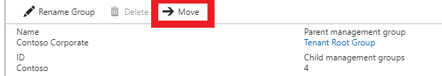

# 

## Change the name of a management group 
A user with the role of "Owner" or "Contributor" can change the display name of the management group. This name is shown within the Azure portal.  


# [PowerShell](#tab/powershell)

PowerShell gives you the ability to change the name or the ParentID within the same command. The ParentId is not editable on the Root management group. 

```powershell
Update-AzureRmManagementGroup
    [-GroupName]<string>
    [-DisplayName]<string>
    [-ParentId]<string>
    [-Defaultprofile]<IAzureContextContainer>
    [<CommonParameters>]
```
- [-GroupName]: The identifier of the management group to be updated. 
- [-DisplayName]: The name that is displayed within the UI. This property can be updated. 
- [-ParentId]: This parameter can be updated to link this group to a new parent group. The group listed here is the new parent of the updated management group.   
 
# [Portal](#tab/portal)
The ability to update the display name on a management group is available on the detail screen.   


---

### Example 3: Update a management group with a new display name
This example shows how to update an existing management group with the "GroupName" of "Contoso" to have a display name of "Contoso Group." After this update, the group shows the new display name in the Azure portal.  

# [PowerShell](#tab/powershell)

```powershell
C:\> Update-AzureRmManagementGroup -GroupName Contoso -DisplayName "Contoso Group" 
```    
 
# [Portal](#tab/portal)
To rename a management group: 
Select the Management Groups Service on the left navigation. 
- Select the management group you would like to rename. 
- Select the "Rename" option at the top of the page


- When the menu opens, enter the new name you would like to have displayed.

 
- Select save. 

The hierarchy list updates to show the new display name. 

--- 

## Delete a management group
Any management group can be deleted from a hierarchy that meets these requirements:
- There are no child management groups or subscriptions under the management group.
- You have write permissions on the management group ("Owner" or "Contributor" roles). These permissions can be directly assigned or inherited.  

# [PowerShell](#tab/powershell)
Delete can only be used if the particular group has no children. If the group does have child items, use "Update-AzureRmManagementGroup" or "Remove-AzureRMManagementGroupSubscription" to remove all children. 

```powershell
Remove-AzureRmManagementGroup
    [-GroupName]<string>
    [-Defaultprofile]<IAzureContextContainer>
    [<CommonParameters>]
```
- [-GroupName]: Parameter required to identify what group to remove from the hierarchy. 

# [Portal](#tab/portal)
The ability to delete a management group is available on the detail page of a management group. The delete icon shows disabled if you do not have the correct permissions or there are children of the management group. 


---
 
### Example 5: Delete a management group
This example shows how to remove the management group "ContosoMarketing" from the hierarchy. This management group does not have any children in the hierarchy so it can be deleted. 

# [Powershell](#tab/powershell)

```powershell
Remove-AzureRmManagementGroup -GroupName ContosoMarketing
```
# [Portal](#tab/portal)
To delete a management group: 
Select the Management Groups Service on the left navigation. 
- Select the management group you would like to delete. 

- Select the "delete" option at the top of the page. 
    - If the icon is disabled, hovering your mouse selector over the icon shows you the reason. 
 
- There is a window that opens confirming you want to delete the management group. 
 
- Select "Yes." 

The hierarchy list updates showing the group has been deleted.

---

## View management groups
There are multiple ways to view management groups within Azure. The following are the PowerShell and Portal methods of viewing. 

# [Powershell](#tab/powershell)
Within PowerShell, you can use the Get command to retrieve all groups or details on an individual management group. 

```powershell
Get-AzureRmManagementGroup
    [-GroupName]<string>
    [-DefaultProfile]<IAzureContextContainer>
    [-Expand]
    [-Recurse]
    [<CommonParameters>]
```
- [-GroupName]: Use to select a particular management group.
- [-Expand]: Expand parameter is used when at a management group scope to view all children.
- [-Recurse]: Recurse is used when at a management group scope to return the entire hierarchy under that node.   

# [Portal](#tab/portal)
Within the Azure portal, there are two ways to view management groups. There is the main page that shows the hierarchy in a tree form and then there is a detail page for each management group.  

Hierarchy tree view: 


Detail view:


---

### Example 6: Show all management groups 
This example shows how to see all the groups that are under the tenant. 

# [Powershell](#tab/powershell)

```powershell
Get-AzureRmManagementGroup
```

# [Portal](#tab/portal)

Select the Management Groups Service on the left navigation. 
- The Management Group hierarchy page loads where all groups are displayed.


---

### Example 7: View one management group
Use the following processes to view a management group with the name of Contoso.  

# [Powershell](#tab/powershell)

```powershell
Get-AzureRmManagementGroup -GroupName Contoso
```

# [Portal](#tab/portal)
Select the Management Groups Service on the left navigation. 
- The Management Group hierarchy page loads showing all groups.
- Select the management group "Contoso." 


---

### Example 8: View a group and its children 
This example shows how to view the one management group, Contoso, and its children.   

# [Powershell](#tab/powershell)
This command only returns the immediate children.
```powershell
Get-AzureRmManagementGroup -GroupName Contoso -Expand
```

# [Portal](#tab/portal)
Select the Management Groups Service on the left navigation. 
- The Management Group hierarchy page loads where all groups are displayed.
- Select the management group "Contoso"
- On the detail page, you see all the children listed


---

### Example 9: View all groups under a management group
To see all groups in PowerShell, use the following command

```powershell
Get-AzureRmManagementGroup -GroupName ContosoMarketing -Recurse

``` 

## Moving subscriptions with management groups
One of the main goal of creating management groups is to bundle subscriptions together. The following features are used to associate a subscription to a management group. Only management groups and subscriptions can be made children of another management group.  

A subscription that moves to a management group inherits all user authorizations and policies from any parent management group in the hierarchy. To move the subscription, there are a couple permissions that you must have: 
- "Owner" role on the child subscription.
- "Owner" or "Contributor" role on the new parent management group. 
- "Owner" or "Contributor" role on the old parent management group.

### Moving a subscription to a management group   
There are a couple easy ways to connect a subscription to a management group.    

# [Powershell](#tab/powershell)

```powershell
Add-AzureRmManagementGroupSubscription
    [-GroupName]<string>
    [-SubscriptionId]<guid>
    [-Defaultprofile]<IAzureContextContainer>
    [<CommonParameters>]
```  
- [-GroupName]: This required field identifies the management group that becomes the parent of the subscription 
- [-SubscriptionId]: The required field that identifies the subscription that becomes the child of the management group

# [Portal](#tab/portal)
To move a subscription in the portal, go to the management group's detail page. Here you are able to add an existing subscription to the management group


---


### Example 10: Connecting a subscription and a management group
Do the following to group "Contoso" and a Subscription with a GUID of 12345678-1234-1234-1234-123456789012.

# [Powershell](#tab/powershell)

There are two pieces of information needed to link a subscription and a management group. Here the group Contoso is linked with a Subscription with a GUID of 12345678-1234-1234-1234-123456789012.

```powershell
Add-AzureRmManagementGroupSubscription -GroupName Contoso -SubscriptionId 12345678-1234-1234-1234-123456789012
```

# [Portal](#tab/portal)

 Select the Management Groups Service on the left navigation. 
- Select the management group "Contoso." 
- On the detail page, select "Children" on the left menu.  

- At the top of the page, you select "Add existing."
- In the menu that opened, select the Type of the item moving which in this example is "Subscription"  
- Select the subscription in the list with the ID 12345678-1234-1234-1234-123456789012

- Select "Save"

You see the list now show with the subscription

---

### Moving a subscription from a management group
Just as it is easy to move a subscription to a management group, you can move a subscription out from a management group.

A subscription that moves to a management group inherits all user accesses and policies from any parent management group in the hierarchy. To move the subscription, there are a couple permissions that you must have: 
- "Owner" role on the child subscription.
- "Owner" or "Contributor" role on the new parent management group. 
- "Owner" or "Contributor" role on the old parent management group.

#[Powershell](#tab/powershell)
Use the following command to remove the link between the management group and a subscription. 

```powershell
Remove-AzureRmManagementGroupSubscription
    [-GroupName]<string>
    [-SubscriptionId]<guid>
    [-Defaultprofile]<IAzureContextContainer>
    [<CommonParameters>]
```
- [-GroupName]: This required field identifies the management group that is the current parent. 
- [-SubscriptionId]: The required field that identifies the subscription that is currently linked to a management group to be unlinked.

#[Portal](#tab/portal)
On the management group's detail page, you are able to add an existing subscription to the management group


---

### Example 11: Removing a link between a subscription and a management group
Following is how to remove the grouping of Contoso and a Subscription with a GUID of 12345678-1234-1234-1234-123456789012.

#[Powershell](#tab/powershell)
Almost the same command syntax as the Add-, to remove the link between and subscription and the management group use the following command: 

```powershell
Remove-AzureRmManagementGroupSubscription -GroupName Contoso -SubscriptionId 12345678-1234-1234-1234-123456789012
```

#[Portal](#tab/portal)

 Select the Management Groups Service on the left navigation. 
- Select the management group "Contoso." 
- On the detail page, select "Children" on the left menu.  

- Select the ellipse at the end of the row for the subscription in the list with the ID 12345678-1234-1234-1234-123456789012


- On the menu that opens, select the parent management group. 
 

- Select "Save"

You see the list update now with the subscription

---

### Moving a management group to a different management group   
There is plenty of flexibility to move management groups and subscriptions within the hierarchy.       

# [Powershell](#tab/powershell)

```powershell
Update-AzureRmManagementGroup
    [-GroupName]<string>
    [-DisplayName]<string>
    [-ParentId]<string>
    [-Defaultprofile]<IAzureContextContainer>
    [<CommonParameters>]
```
- [-GroupName]: The identifier of the management group to be updated. 
- [-DisplayName]: The name that is displayed within the UI. This property can be updated. 
- [-ParentId]: This parameter can be updated to link this group to a new parent group. The group listed here is the new parent of the updated management group.   

# [Portal](#tab/portal)
There are a couple different ways to move a management group to a different management group within the Azure portal. 

The first way is the management group's detail page. Here you are able to add an existing management group.


The second way is on the management group detail page. You select the "Move" action to move this management group to a new parent management group.



The third option is to select "Move" on any of the lists.  


---

### Example 12: Connecting a management group to another management group
In this example, it shows how to update an existing management group with the name of "ContosoMarketing" to have a parent of "Contoso."

# [Powershell](#tab/powershell)

```powershell
C:\> Update-AzureRmManagementGroup -GroupName ContosoMarketing -ParentName Contoso 
```  

# [Portal](#tab/portal)

 Select the management groups service on the left navigation. 
- Select the management group "Contoso." 
- On the detail page, select "Children" on the left menu. 


- At the top of the page, you select "Add existing."
- In the menu that opened, select the Type of the item moving which in this example is "Management Group."  
- Select the management group with the name "Contoso Marketing."


- Select "Save"

You see the list update now with the management group

The alternative way is to navigate to the management group and change the parent
- Select the management group service menu on the left 
[image]
- Choose the management group you would like to move 
- On the detail page, select "Move" 
- In the menu that opened, the first two fields are already populated for you. 
- Select the new parent of the management group. For this example, select "Contoso"
- Select "Save" 

After you select save the Parent listed updated to Contoso

---

### Moving a management group from a management group
Moving a management group to be the child of a different management group is a simple action.   

The first option is to go to the other management group and add the new management group. 
the second option is where you go to the management group detail page and change the parent.  

A management group that moves to a different management group inherits all user accesses and policies from any parent management group in the hierarchy. To move a management group, there are a couple permissions that you must have: 
- "Owner" role of the child management group.
- "Owner" or "Contributor" role on the new parent management group. 
- "Owner" or "Contributor" role on the old parent management group.

# [Powershell](#tab/powershell)
Use the following command to remove the link between two management groups. 

```powershell
Update-AzureRmManagementGroup
    [-GroupName]<string>
    [-DisplayName]<string>
    [-ParentId]<string>
    [-Defaultprofile]<IAzureContextContainer>
    [<CommonParameters>]
```
- [-GroupName]: The identifier of the management group to be updated. 
- [-DisplayName]: The name that is displayed within the UI. This property can be updated. 
- [-ParentId]: This parameter can be updated to link this group to a new parent group. The group listed here is the new parent of the updated management group.   

# [Portal](#tab/portal)

There are a couple different ways to move a management group to a different management group within the Azure portal. 

The first way is on the management group's detail page. Here you are able to add an existing management group.


The second way is on the management group detail page. You select the "Move" action to move this management group to a new parent management group.


The third option is to select "Move" on any of the lists.  


---

### Example 13: Removing a link between a two management groups 
Following is how to remove the link between two management groups. Parent group is "Contoso" and the child is "Contoso Marketing" in this example.  

# [Powershell](#tab/powershell)
Here the update moves the Contoso Marketing group to the root group

```powershell
C:\> Update-AzureRmManagementGroup -GroupName ContosoMarketing -ParentName Root 
```  

# [Portal](#tab/portal)

You select the "Move" action to move this management group to a new parent management group.


Another option is to select "Move" on any of the lists.  


---