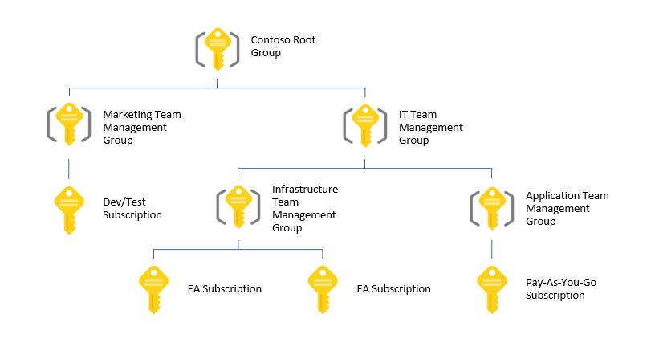

# Organize your resources with Azure Management Groups 

If your organization has many subscriptions, you may need a way to efficiently manage access, policies, and compliance for those subscriptions. Azure Management Groups provides a level of scope above subscriptions. You organize subscriptions into containers called "management groups" and apply your governance conditions to the management groups. All subscriptions within a management group automatically inherit the conditions applied to the management group. Management groups give you enterprise-grade management at a large scale no matter what type of subscriptions you might have.

The management group feature is available in a public preview. To start using management groups, login to the [Azure portal](https://portal.azure.com) and search for **Management Groups** in the **All Services** section. 

As an example, you can apply policies to a management group that limits the regions available for virtual machine (VM) creation. This policy would be applied to all management groups, subscriptions, and resources under that management group by only allowing VMs to be created in that region.

## Hierarchy of management groups and subscriptions 

You can build a flexible structure of management groups and subscriptions to organize your resources into a hierarchy for unified policy and access management. 
The following diagram shows an example hierarchy that consists of management groups and subscriptions organized by departments.    

By creating a hierarchy that is grouped by departments, you are able to assign [Azure Role-Based Access Control (RBAC)](../role-based-access-control/overview.md) roles that *inherit* to the departments under that management group. By using management groups, you can reduce your workload and reduces the risk of error by only having to assign the role once. 

### Important facts about management groups
- 10,000 management groups can be supported in a single directory. 
- A management group tree can support up to six levels of depth.
    - This limit does not include the Root level or the subscription level.
- Each management group can only support one parent.
- Each management group can have multiple children. 

### Preview subscription visibility limitation 
There's currently a limitation within the preview where you aren't able to view subscriptions that you have inherited access to. The access is inherited to the subscription, but the Azure Resource Manager isn't able to honor the inheritance access yet.  

Using the REST API to get information on the subscription returns details as you do have access, but within the Azure portal and Azure Powershell the subscriptions don't show. 

This item is being worked on and will be resolved before Management Groups are announced as "General Availability."  

### Cloud Solution Provider(CSP) limitation during Preview 
There's a current limitation for Cloud Solution Provider(CSP) Partners where they aren't able to create or manage their customer's management groups within their customer's directory.  
This item is being worked on and will be resolved before Management Groups are announced as "General Availability."

## Root management group for each directory

Each directory is given a single top-level management group called the "Root" management group. This root management group is built into the hierarchy to have all management groups and subscriptions fold up to it. This Root management group allows for global policies and RBAC assignments to be applied at the directory level. The [Directory Administrator needs to elevate themselves](../role-based-access-control/elevate-access-global-admin.md) to be the owner of this root group initially. Once the administrator is the owner of the group, they can assign any RBAC role to other directory users or groups to manage the hierarchy.  

### Important facts about the Root management group
- The root management group's name and ID are given the Azure Active Directory ID by default. The display name can be updated at any time to show different within the Azure portal. 
- All subscriptions and management groups can fold up to the one root management group within the directory.  
    - It is recommended to have all items in the directory fold up to the Root management group for global management.  
    - During the Public Preview, all subscriptions within the directory are not automatically made children of the root.   
    - During the Public Preview, new subscriptions are not automatically defaulted to the Root management group. 
- The root management group cannot be moved or deleted, unlike other management groups. 
  
## Management Group Access

Azure Management Groups supports [Azure Role-Based Access Control (RBAC)](../role-based-access-control/overview.md) for all resource accesses and role definitions. These permissions are inherited to child resources that exist in the hierarchy.   

While any [built-in RBAC role](../role-based-access-control/overview.md#built-in-roles) can be assigned to a management group, there are four roles that are commonly used: 
- **Owner** has full access to all resources including the right to delegate access to others. 
- **Contributor** can create and manage all types of Azure resources but can't grant access to others.
- **Resource Policy Contributor** can create and manage policies in the directory on the resources.     
- **Reader** can view existing Azure resources. 

## Next steps 
To learn more about management groups, see: 
- [Create management groups to organize Azure resources](management-groups-create.md)
- [How to change, delete, or manage your management groups](management-groups-manage.md)
- [Install the Azure PowerShell module](https://www.powershellgallery.com/packages/AzureRM.ManagementGroups/0.0.1-preview)
- [Review the REST API Spec](https://github.com/Azure/azure-rest-api-specs/tree/master/specification/managementgroups/resource-manager/Microsoft.Management/preview/2018-01-01-preview)
- [Install the Azure CLI extension](https://docs.microsoft.com/en-us/cli/azure/extension?view=azure-cli-latest#az_extension_list_available)

