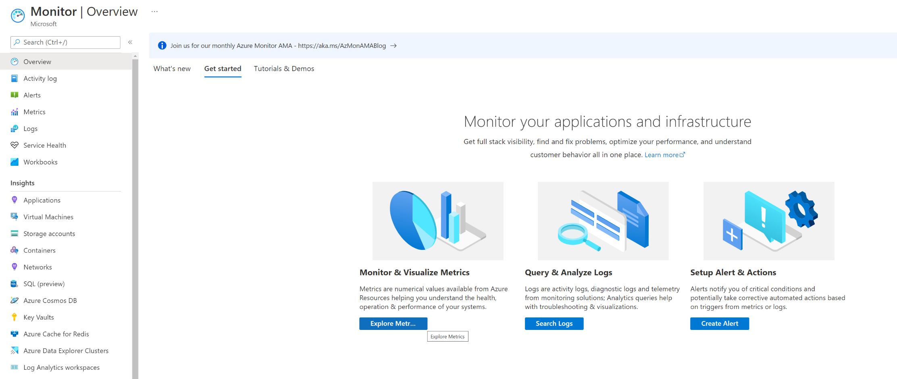
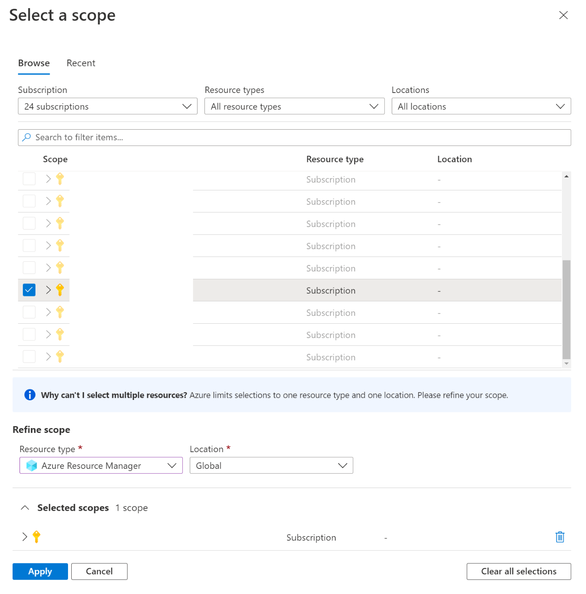
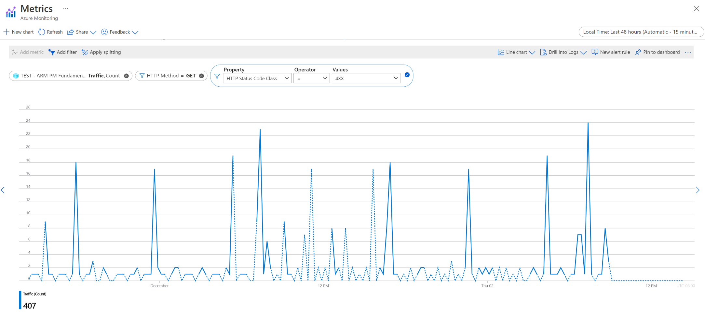

# Azure Resource Manager metrics in Azure Monitor
Requests to create and manage resources in Azure are orchestrated through Azure's control plane, Azure Resource Manager. This article describes how to monitor the volume and latency of control plane requests made to Azure.   

With these metrics, you have observability,  throughout your subscriptions, into your requests' traffic and latency up to the last 3 months (93 days).

## Accessing ARM metrics

You can access control plane metrics via the Azure Monitor REST APIs, SDKs, and the Azure Portal (by selecting the "Azure Resource Manager" metric). For an overview on Azure Monitor, see [Azure Monitor Metrics](../../monitoring-and-diagnostics/monitoring-overview-metrics.md). Portal integration is coming soon.

There is no opt-in or sign up process to access control plane metrics.

## Metric definition

The definition for ARM metrics in Azure Monitor is only accessible through the 2017-12-01-preview API version. To retrieve the definition, you can run the following snippet:

```c
> curl --location --request GET 'https://management.azure.com/subscriptions/00000000-0000-0000-0000-000000000000/providers/microsoft.insights/metricDefinitions?api-version=2017-12-01-preview&metricnamespace=microsoft.resources/subscriptions' \
--header 'Authorization: bearer {{bearerToken}}'
```

This will return the a definition for the metrics schema. Notably, this schema includes the dimensions you can filter on with the Monitor API:

| Dimension Name | Description |
| ------------------- | ----------------- |
| **ResourceUri** | The full ARM Resource ID for a particular resource. |
| **RequestRegion** | ARM region where control plane requests originate, like "EastUS2" |
| **StatusCode** | Response type from ARM for your control plane request. Possible values are (but not limited to): <br/><li>**0**</li><li>**200**</li><li>**201**</li><li>**400**</li><li>**404**</li><li>**429**</li><li>**500**</li><li>**502**</li>||
| **StatusCodeClass** | The class for the status code returned from ARM. Possible values are: <br/><li>**2xx**</li><li>**4xx**</li><li>**5xx**</li>|
| **Namespace** | The namespace for the Resource Provider, in all caps, like "MICROSOFT.COMPUTE"|
| **ResourceType** | Any resource type in Azure that you have created or sent a request to, in all caps, like "VIRTUALMACHINES" |
| **Method** | The HTTP method used in the request made to ARM. Possible values are:<br/><li>GET</li><li>HEAD</li><li>PUT</li><li>POST</li><li>PATCH</li><li>DELETE</li> |


### Example: Query traffic and latency control plane metrics via Azure portal

First, navigate to the Azure Monitor blade within the [portal](https://portal.azure.com):

  

After selecting "Explore Metrics", select a single subscription and the "Azure Resource Manager" metric:

  

Then, after selecting "Apply", you can visualize your Traffic or Latency control plane metrics with custom filtering and splitting:

  

### Example: Query traffic and latency control plane metrics via REST API

After you are authenticated with Azure, you can make a request to retrieve control plane metrics for your subscription. In the script shared below, it's assumed you're using a bearer token in AAD authentication:

```c
> curl --location --request GET "https://management.azure.com/subscriptions/00000000-0000-0000-0000-000000000000/providers/microsoft.insights/metrics?api-version=2021-05-01&interval=P1D&metricnames=Latency,Traffic&metricnamespace=microsoft.resources/subscriptions&region=global&aggregation=average,count&timespan=2021-11-01T00:00:00Z/2021-11-01T02:00:00Z" \
--header "Authorization: bearer {{bearerToken}}"
```

The response for this would be populated with your metrics in a JSON responsw:

```Json
{
    "cost": 476,
    "timespan": "2021-11-01T00:00:00Z/2021-11-01T02:00:00Z",
    "interval": "P1D",
    "value": [
        {
            "id": "subscriptions/00000000-0000-0000-0000-000000000000/providers/Microsoft.Insights/metrics/Latency",
            "type": "Microsoft.Insights/metrics",
            "name": {
                "value": "Latency",
                "localizedValue": "Latency"
            },
            "displayDescription": "Latency data for all requests to Azure Resource Manager",
            "unit": "Seconds",
            "timeseries": [
                {
                    "metadatavalues": [],
                    "data": [
                        {
                            "timeStamp": "2021-11-01T00:00:00Z",
                            "count": 1406.0,
                            "average": 0.19345163584637265
                        }
                    ]
                }
            ],
            "errorCode": "Success"
        },
        {
            "id": "subscriptions/00000000-0000-0000-0000-000000000000/providers/Microsoft.Insights/metrics/Traffic",
            "type": "Microsoft.Insights/metrics",
            "name": {
                "value": "Traffic",
                "localizedValue": "Traffic"
            },
            "displayDescription": "Traffic data for all requests to Azure Resource Manager",
            "unit": "Count",
            "timeseries": [
                {
                    "metadatavalues": [],
                    "data": [
                        {
                            "timeStamp": "2021-11-01T00:00:00Z",
                            "count": 1406.0,
                            "average": 0.19345163584637276
                        }
                    ]
                }
            ],
            "errorCode": "Success"
        }
    ],
    "namespace": "microsoft.resources/subscriptions",
    "resourceregion": "global"
}
```

For the metrics supporting dimensions, you need to specify the dimension value to see the corresponding metrics values. For example, if you want to use **Latency** value for successful requests to ARM, you need to filter the **StatusCodeClass** dimension with **2xx**.<br/></br> Similarly with **Traffic**, you would need to filter the **Namespace** dimension with **Microsoft.Network** if you want to look at the number of requests made in your subscription for Networking resources.

## FAQ

**Does this account for long running operation reliability and latency metrics?**

No, this is only tracking synchronous requests to ARM. This means that for a scenario like a VM creation, our metrics do not represent the performance or reliability of the= long running asynchronous operation.

## Helpful links

* [Azure Monitor Overview](../../monitoring-and-diagnostics/monitoring-overview.md)
