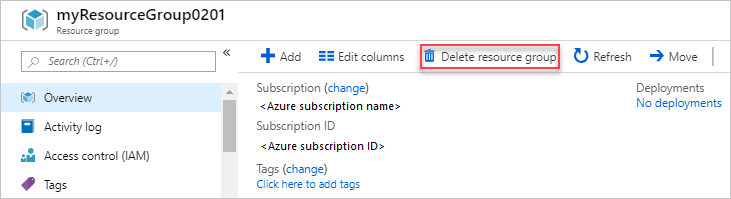

# Azure Resource Manager resource group and resource deletion

This article shows how to delete resource groups and resources. It describes how Azure Resource Manager orders the deletion of resources when you delete a resource group.

## How order of deletion is determined

When you delete a resource group, Resource Manager determines the order to delete resources. It uses the following order:

1. All the child (nested) resources are deleted.

2. Resources that manage other resources are deleted next. A resource can have the `managedBy` property set to indicate that a different resource manages it. When this property is set, the resource that manages the other resource is deleted before the other resources.

3. The remaining resources are deleted after the previous two categories.

After the order is determined, Resource Manager issues a DELETE operation for each resource. It waits for any dependencies to finish before proceeding.

For synchronous operations, the expected successful response codes are:

* 200
* 204
* 404

For asynchronous operations, the expected successful response is 202. Resource Manager tracks the location header or the azure-async operation header to determine the status of the asynchronous delete operation.
  
### Deletion errors

When a delete operation returns an error, Resource Manager retries the DELETE call. Retries happen for the 5xx, 429 and 408 status codes. By default, the time period for retry is 15 minutes.

## After deletion

Resource Manager issues a GET call on each resource that it tried to delete. The response of this GET call is expected to be 404. When Resource Manager gets a 404, it considers the deletion to have completed successfully. Resource Manager removes the resource from its cache.

However, if the GET call on the resource returns a 200 or 201, Resource Manager recreates the resource.

If the GET operation returns an error, Resource Manager retries the GET for the following error code:

* Less than 100
* 408
* 429
* Greater than 500

For other error codes, Resource Manager fails the deletion of the resource.

> [!IMPORTANT]
> Resource Group deletion is irreversible.

## Delete resource group

Use one of the following methods to delete the resource group.

# [PowerShell](#tab/azure-powershell)

```azurepowershell-interactive
Remove-AzResourceGroup -Name ExampleResourceGroup
```

# [Azure CLI](#tab/azure-cli)

```azurecli-interactive
az group delete --name ExampleResourceGroup
```

# [Portal](#tab/azure-portal)

1. In the [portal](https://portal.azure.com), select the resource group you want to delete.

1. Select **Delete resource group**.

   

1. To confirm the deletion, type the name of the resource group

---

## Delete resource

Use one of the following methods to delete a resource.

# [PowerShell](#tab/azure-powershell)

```azurepowershell-interactive
Remove-AzResource `
  -ResourceGroupName ExampleResourceGroup `
  -ResourceName ExampleVM `
  -ResourceType Microsoft.Compute/virtualMachines
```

# [Azure CLI](#tab/azure-cli)

```azurecli-interactive
az resource delete \
  --resource-group ExampleResourceGroup \
  --name ExampleVM \
  --resource-type "Microsoft.Compute/virtualMachines"
```

# [Portal](#tab/azure-portal)

1. In the [portal](https://portal.azure.com), select the resource you want to delete.

1. Select **Delete**. The following screenshot shows the management options for a virtual machine.

   

1. When prompted, confirm the deletion.

---


## Next steps

* To understand Resource Manager concepts, see [Azure Resource Manager overview](overview.md).
* For deletion commands, see [PowerShell](/powershell/module/az.resources/Remove-AzResourceGroup), [Azure CLI](/cli/azure/group?view=azure-cli-latest#az-group-delete), and [REST API](/rest/api/resources/resourcegroups/delete).
