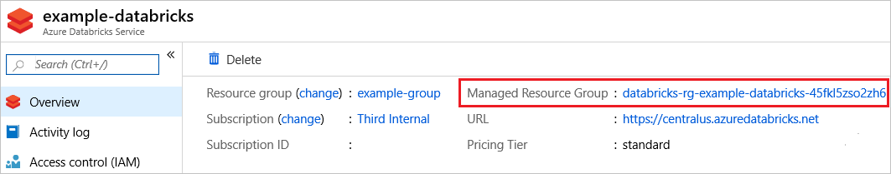
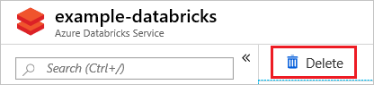

# Lock resources to prevent unexpected changes

As an administrator, you may need to lock a subscription, resource group, or resource to prevent other users in your organization from accidentally deleting or modifying critical resources. You can set the lock level to **CanNotDelete** or **ReadOnly**. In the portal, the locks are called **Delete** and **Read-only** respectively.

* **CanNotDelete** means authorized users can still read and modify a resource, but they can't delete the resource. 
* **ReadOnly** means authorized users can read a resource, but they can't delete or update the resource. Applying this lock is similar to restricting all authorized users to the permissions granted by the **Reader** role.

## How locks are applied

When you apply a lock at a parent scope, all resources within that scope inherit the same lock. Even resources you add later inherit the lock from the parent. The most restrictive lock in the inheritance takes precedence.

Unlike role-based access control, you use management locks to apply a restriction across all users and roles. To learn about setting permissions for users and roles, see [Azure Role-based Access Control](../../role-based-access-control/role-assignments-portal.md).

Resource Manager locks apply only to operations that happen in the management plane, which consists of operations sent to `https://management.azure.com`. The locks don't restrict how resources perform their own functions. Resource changes are restricted, but resource operations aren't restricted. For example, a ReadOnly lock on a SQL Database prevents you from deleting or modifying the database. It doesn't prevent you from creating, updating, or deleting data in the database. Data transactions are permitted because those operations aren't sent to `https://management.azure.com`.

## Considerations before applying locks

Applying locks can lead to unexpected results because some operations that don't seem to modify the resource actually require actions that are blocked by the lock. Some common examples of the operations that are blocked by locks are:

* A read-only lock on a **storage account** prevents all users from listing the keys. The list keys operation is handled through a POST request because the returned keys are available for write operations.

* A read-only lock on an **App Service** resource prevents Visual Studio Server Explorer from displaying files for the resource because that interaction requires write access.

* A read-only lock on a **resource group** that contains a **virtual machine** prevents all users from starting or restarting the virtual machine. These operations require a POST request.

* A cannot-delete lock on a **resource group** prevents Azure Resource Manager from [automatically deleting deployments](../templates/deployment-history-deletions.md) in the history. If you reach 800 deployments in the history, your deployments will fail.

* A cannot-delete lock on the **resource group** created by **Azure Backup Service** causes backups to fail. The service supports a maximum of 18 restore points. When locked, the backup service can't clean up restore points. For more information, see [Frequently asked questions-Back up Azure VMs](../../backup/backup-azure-vm-backup-faq.md).

* A read-only lock on a **subscription** prevents **Azure Advisor** from working correctly. Advisor is unable to store the results of its queries.

## Who can create or delete locks

To create or delete management locks, you must have access to `Microsoft.Authorization/*` or `Microsoft.Authorization/locks/*` actions. Of the built-in roles, only **Owner** and **User Access Administrator** are granted those actions.

## Managed Applications and locks

Some Azure services, such as Azure Databricks, use [managed applications](../managed-applications/overview.md) to implement the service. In that case, the service creates two resource groups. One resource group contains an overview of the service and isn't locked. The other resource group contains the infrastructure for the service and is locked.

If you try to delete the infrastructure resource group, you get an error stating that the resource group is locked. If you try to delete the lock for the infrastructure resource group, you get an error stating that the lock can't be deleted because it's owned by a system application.

Instead, delete the service, which also deletes the infrastructure resource group.

For managed applications, select the service you deployed.


Notice the service includes a link for a **Managed Resource Group**. That resource group holds the infrastructure and is locked. It can't be directly deleted.



To delete everything for the service, including the locked infrastructure resource group, select **Delete** for the service.



## Portal

[!INCLUDE [resource-manager-lock-resources](../../../includes/resource-manager-lock-resources.md)]

## Template

When using a Resource Manager template to deploy a lock, you use different values for the name and type depending on the scope of the lock.

When applying a lock to a **resource**, use the following formats:

* name - `{resourceName}/Microsoft.Authorization/{lockName}`
* type - `{resourceProviderNamespace}/{resourceType}/providers/locks`

When applying a lock to a **resource group** or **subscription**, use the following formats:

* name - `{lockName}`
* type - `Microsoft.Authorization/locks`

The following example shows a template that creates an app service plan, a web site, and a lock on the web site. The resource type of the lock is the resource type of the resource to lock and **/providers/locks**. The name of the lock is created by concatenating the resource name with **/Microsoft.Authorization/** and the name of the lock.

```json
{
    "$schema": "https://schema.management.azure.com/schemas/2015-01-01/deploymentTemplate.json#",
    "contentVersion": "1.0.0.0",
    "parameters": {
        "hostingPlanName": {
            "type": "string"
        }
    },
    "variables": {
        "siteName": "[concat('ExampleSite', uniqueString(resourceGroup().id))]"
    },
    "resources": [
        {
            "apiVersion": "2016-09-01",
            "type": "Microsoft.Web/serverfarms",
            "name": "[parameters('hostingPlanName')]",
            "location": "[resourceGroup().location]",
            "sku": {
                "tier": "Free",
                "name": "f1",
                "capacity": 0
            },
            "properties": {
                "targetWorkerCount": 1
            }
        },
        {
            "apiVersion": "2016-08-01",
            "name": "[variables('siteName')]",
            "type": "Microsoft.Web/sites",
            "location": "[resourceGroup().location]",
            "dependsOn": [
                "[resourceId('Microsoft.Web/serverfarms', parameters('hostingPlanName'))]"
            ],
            "properties": {
                "serverFarmId": "[parameters('hostingPlanName')]"
            }
        },
        {
            "type": "Microsoft.Web/sites/providers/locks",
            "apiVersion": "2016-09-01",
            "name": "[concat(variables('siteName'), '/Microsoft.Authorization/siteLock')]",
            "dependsOn": [
                "[resourceId('Microsoft.Web/sites', variables('siteName'))]"
            ],
            "properties": {
                "level": "CanNotDelete",
                "notes": "Site should not be deleted."
            }
        }
    ]
}
```

For an example of setting a lock on a resource group, see [Create a resource group and lock it](https://github.com/Azure/azure-quickstart-templates/tree/master/subscription-deployments/create-rg-lock-role-assignment).

## PowerShell
You lock deployed resources with Azure PowerShell by using the [New-AzResourceLock](/powershell/module/az.resources/new-azresourcelock) command.

To lock a resource, provide the name of the resource, its resource type, and its resource group name.

```azurepowershell-interactive
New-AzResourceLock -LockLevel CanNotDelete -LockName LockSite -ResourceName examplesite -ResourceType Microsoft.Web/sites -ResourceGroupName exampleresourcegroup
```

To lock a resource group, provide the name of the resource group.

```azurepowershell-interactive
New-AzResourceLock -LockName LockGroup -LockLevel CanNotDelete -ResourceGroupName exampleresourcegroup
```

To get information about a lock, use [Get-AzResourceLock](/powershell/module/az.resources/get-azresourcelock). To get all the locks in your subscription, use:

```azurepowershell-interactive
Get-AzResourceLock
```

To get all locks for a resource, use:

```azurepowershell-interactive
Get-AzResourceLock -ResourceName examplesite -ResourceType Microsoft.Web/sites -ResourceGroupName exampleresourcegroup
```

To get all locks for a resource group, use:

```azurepowershell-interactive
Get-AzResourceLock -ResourceGroupName exampleresourcegroup
```

To delete a lock, use:

```azurepowershell-interactive
$lockId = (Get-AzResourceLock -ResourceGroupName exampleresourcegroup -ResourceName examplesite -ResourceType Microsoft.Web/sites).LockId
Remove-AzResourceLock -LockId $lockId
```

## Azure CLI

You lock deployed resources with Azure CLI by using the [az lock create](/cli/azure/lock#az-lock-create) command.

To lock a resource, provide the name of the resource, its resource type, and its resource group name.

```azurecli
az lock create --name LockSite --lock-type CanNotDelete --resource-group exampleresourcegroup --resource-name examplesite --resource-type Microsoft.Web/sites
```

To lock a resource group, provide the name of the resource group.

```azurecli
az lock create --name LockGroup --lock-type CanNotDelete --resource-group exampleresourcegroup
```

To get information about a lock, use [az lock list](/cli/azure/lock#az-lock-list). To get all the locks in your subscription, use:

```azurecli
az lock list
```

To get all locks for a resource, use:

```azurecli
az lock list --resource-group exampleresourcegroup --resource-name examplesite --namespace Microsoft.Web --resource-type sites --parent ""
```

To get all locks for a resource group, use:

```azurecli
az lock list --resource-group exampleresourcegroup
```

To delete a lock, use:

```azurecli
lockid=$(az lock show --name LockSite --resource-group exampleresourcegroup --resource-type Microsoft.Web/sites --resource-name examplesite --output tsv --query id)
az lock delete --ids $lockid
```

## REST API
You can lock deployed resources with the [REST API for management locks](https://docs.microsoft.com/rest/api/resources/managementlocks). The REST API enables you to create and delete locks, and retrieve information about existing locks.

To create a lock, run:

    PUT https://management.azure.com/{scope}/providers/Microsoft.Authorization/locks/{lock-name}?api-version={api-version}

The scope could be a subscription, resource group, or resource. The lock-name is whatever you want to call the lock. For api-version, use **2016-09-01**.

In the request, include a JSON object that specifies the properties for the lock.

    {
      "properties": {
        "level": "CanNotDelete",
        "notes": "Optional text notes."
      }
    } 

## Next steps
* To learn about logically organizing your resources, see [Using tags to organize your resources](tag-resources.md).
* You can apply restrictions and conventions across your subscription with customized policies. For more information, see [What is Azure Policy?](../../governance/policy/overview.md).
* For guidance on how enterprises can use Resource Manager to effectively manage subscriptions, see [Azure enterprise scaffold - prescriptive subscription governance](/azure/architecture/cloud-adoption-guide/subscription-governance).

