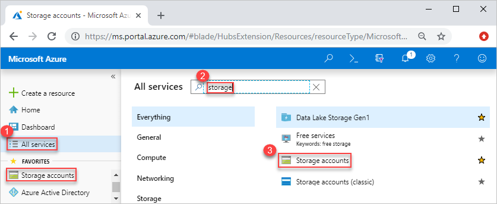
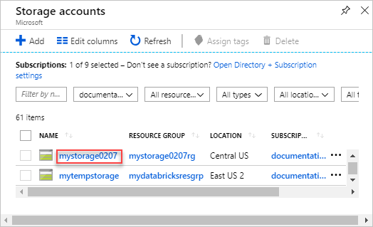
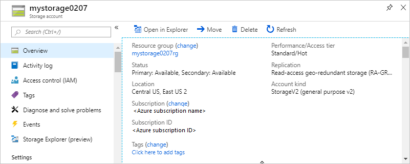
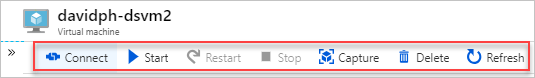
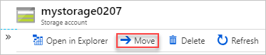
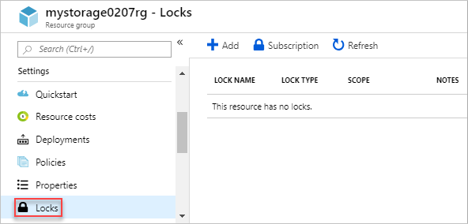
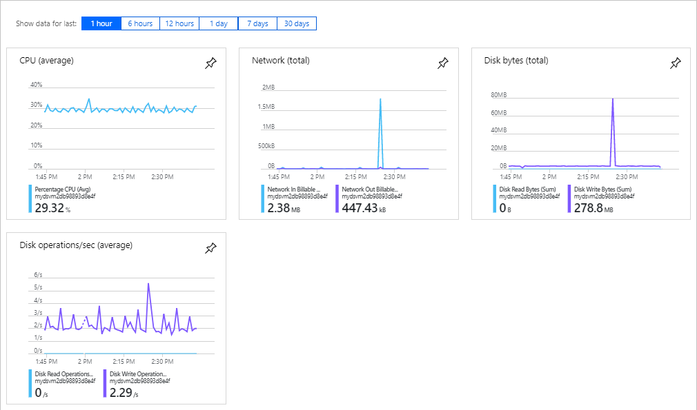

# Manage Azure resources by using the Azure portal

Learn how to use the [Azure portal](https://portal.azure.com) with [Azure Resource Manager](overview.md) to manage your Azure resources. For managing resource groups, see [Manage Azure resource groups by using the Azure portal](manage-resource-groups-portal.md).

Other articles about managing resources:

- [Manage Azure resources by using Azure CLI](manage-resources-cli.md)
- [Manage Azure resources by using Azure PowerShell](manage-resources-powershell.md)

[!INCLUDE [Handle personal data](../../../includes/gdpr-intro-sentence.md)]

## Deploy resources to a resource group

After you have created a Resource Manager template, you can use the Azure portal to deploy your Azure resources. For creating a template, see [Quickstart: Create and deploy Azure Resource Manager templates by using the Azure portal](../templates/quickstart-create-templates-use-the-portal.md). For deploying a template using the portal, see [Deploy resources with Resource Manager templates and Azure portal](../templates/deploy-portal.md).

## Open resources

Azure resources are organized by Azure services and by resource groups. The following procedures shows how to open a storage account called **mystorage0207**. The virtual machine resides in a resource group called **mystorage0207rg**.

To open a resource by the service type:

1. Sign in to the [Azure portal](https://portal.azure.com).
2. In the left pane, select the Azure service. In this case, **Storage accounts**.  If you don't see the service listed, select **All services**, and then select the service type.

    

3. Select the resource you want to open.

    

    A storage account looks like:

    

To open a resource by resource group:

1. Sign in to the [Azure portal](https://portal.azure.com).
2. In the left pane, select **Resource groups** to list the resource within the group.
3. Select the resource you want to open. 

## Manage resources

When viewing a resource in the portal, you see the options for managing that particular resource.

The screenshot shows the management options for an Azure virtual machine. You can perform operations such as starting, restarting, and stopping a virtual machine.

## Delete resources

1. Open the resource in the portal. For the steps, see [Open resources](#open-resources).
2. Select **Delete**. The following screenshot shows the management options for a virtual machine.

    
3. Type the name of the resource to confirm the deletion, and then select **Delete**.

For more information about how Azure Resource Manager orders the deletion of resources, see [Azure Resource Manager resource group deletion](delete-resource-group.md).

## Move resources

1. Open the resource in the portal. For the steps, see [Open resources](#open-resources).
2. Select **Move**. The following screenshot shows the management options for a storage account.

    
3. Select **Move to another resource group** or **Move to another subscription** depending on your needs.

For more information, see [Move resources to new resource group or subscription](move-resource-group-and-subscription.md).

## Lock resources

Locking prevents other users in your organization from accidentally deleting or modifying critical resources, such as Azure subscription, resource group, or resource. 

1. Open the resource in the portal. For the steps, see [Open resources](#open-resources).
2. Select **Locks**. The following screenshot shows the management options for a storage account.

    
3. Select **Add**, and then specify the lock properties.

For more information, see [Lock resources with Azure Resource Manager](lock-resources.md).

## Tag resources

Tagging helps organizing your resource group and resources logically. 

1. Open the resource in the portal. For the steps, see [Open resources](#open-resources).
2. Select **Tags**. The following screenshot shows the management options for a storage account.

    
3. Specify the tag properties, and then select **Save**.

For information, see [Using tags to organize your Azure resources](tag-resources.md#portal).

## Monitor resources

When you open a resource, the portal presents default graphs and tables for monitoring that resource type. The following screenshot shows the graphs for a virtual machine:

You can select the pin icon on the upper right corner of the graphs to pin the graph to the dashboard. To learn about working with dashboards, see [Creating and sharing dashboards in the Azure portal](../../azure-portal/azure-portal-dashboards.md).

## Manage access to resources

[Role-based access control (RBAC)](../../role-based-access-control/overview.md) is the way that you manage access to resources in Azure. For more information, see [Manage access using RBAC and the Azure portal](../../role-based-access-control/role-assignments-portal.md).

## Next steps

- To learn Azure Resource Manager, see [Azure Resource Manager overview](overview.md).
- To learn the Resource Manager template syntax, see [Understand the structure and syntax of Azure Resource Manager templates](../templates/template-syntax.md).
- To learn how to develop templates, see the [step-by-step tutorials](/azure/azure-resource-manager/).
- To view the Azure Resource Manager template schemas, see [template reference](/azure/templates/).
