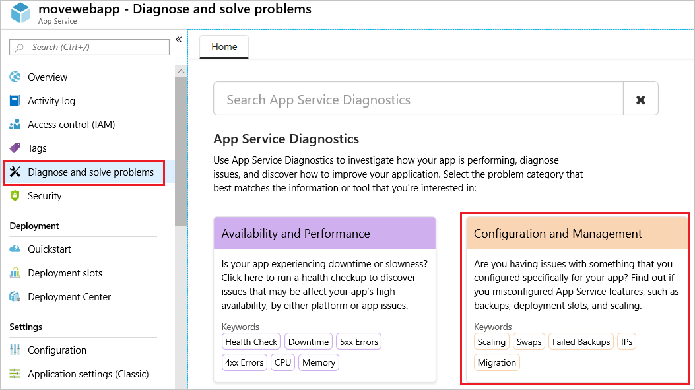
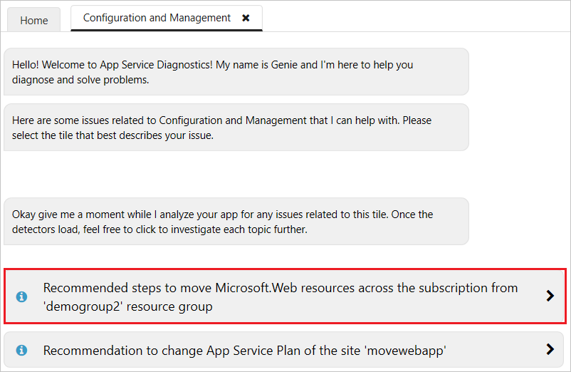
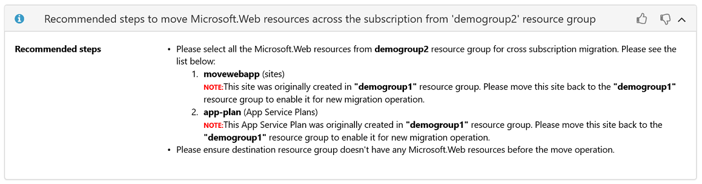

# Move guidance for App Service resources

This article describes the steps to move App Service resources. There are specific requirements for moving App Service resources to a new subscription.

## Move across subscriptions

When moving a Web App across subscriptions, the following guidance applies:

- The destination resource group must not have any existing App Service resources. App Service resources include:
    - Web Apps
    - App Service plans
    - Uploaded or imported TLS/SSL certificates
    - App Service Environments
- All App Service resources in the resource group must be moved together. Note that App Service Environments cannot be moved to a new Resource Group nor to a new Subscription.
- You can move a certificate bound to a web without deleting the TLS bindings, as long as the certificate is moved with all other resources in the resource group.
- App Service resources can only be moved from the resource group in which they were originally created. If an App Service resource is no longer in its original resource group, move it back to its original resource group. Then, move the resource across subscriptions.

If you don't remember the original resource group, you can find it through diagnostics. For your web app, select **Diagnose and solve problems**. Then, select **Configuration and Management**.

Select **Migration Options**.

Select the option for recommended steps to move the web app.

You see the recommended actions to take before moving the resources. The information includes the original resource group for the web app.

## Move support

To determine which App Service resources can be moved, see move support status for:

- [Microsoft.AppService](../move-support-resources.md#microsoftappservice)
- [Microsoft.CertificateRegistration](../move-support-resources.md#microsoftcertificateregistration)
- [Microsoft.DomainRegistration](../move-support-resources.md#microsoftdomainregistration)
- [Microsoft.Web](../move-support-resources.md#microsoftweb)

## Next steps

For commands to move resources, see [Move resources to new resource group or subscription](../move-resource-group-and-subscription.md).
