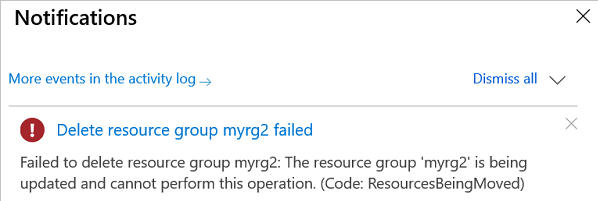

# Move resources to a new resource group or subscription

This article shows you how to move Azure resources to either another Azure subscription or another resource group under the same subscription. You can use the Azure portal, Azure PowerShell, Azure CLI, or the REST API to move resources.

Both the source group and the target group are locked during the move operation. Write and delete operations are blocked on the resource groups until the move completes. This lock means you can't add, update, or delete resources in the resource groups. It doesn't mean the resources are frozen. For example, if you move an Azure SQL logical server and its databases to a new resource group or subscription, applications that use the databases experience no downtime. They can still read and write to the databases. The lock can last for a maximum of four hours, but most moves complete in much less time.

Moving a resource only moves it to a new resource group or subscription. It doesn't change the location of the resource.

## Changed resource ID

When you move a resource, you change its resource ID. The standard format for a resource ID is `/subscriptions/{subscriptionId}/resourceGroups/{resourceGroupName}/providers/{resourceProviderNamespace}/{resourceType}/{resourceName}`. When you move a resource to a new resource group or subscription, you change one or more values in that path.

If you use the resource ID anywhere, you'll need to change that value. For example, if you have a [custom dashboard](../../azure-portal/quickstart-portal-dashboard-azure-cli.md) in the portal that references a resource ID, you'll need to update that value. Look for any scripts or templates that need to be updated for the new resource ID.

## Checklist before moving resources

There are some important steps to do before moving a resource. By verifying these conditions, you can avoid errors.

1. The resources you want to move must support the move operation. For a list of which resources support move, see [Move operation support for resources](move-support-resources.md).

1. Some services have specific limitations or requirements when moving resources. If you're moving any of the following services, check that guidance before moving.

   * If you're using Azure Stack Hub, you can't move resources between groups.
   * [App Services move guidance](./move-limitations/app-service-move-limitations.md)
   * [Azure DevOps Services move guidance](/azure/devops/organizations/billing/change-azure-subscription?toc=/azure/azure-resource-manager/toc.json)
   * [Classic deployment model move guidance](./move-limitations/classic-model-move-limitations.md) - Classic Compute, Classic Storage, Classic Virtual Networks, and Cloud Services
   * [Networking move guidance](./move-limitations/networking-move-limitations.md)
   * [Recovery Services move guidance](../../backup/backup-azure-move-recovery-services-vault.md?toc=/azure/azure-resource-manager/toc.json)
   * [Virtual Machines move guidance](./move-limitations/virtual-machines-move-limitations.md)
   * To move an Azure subscription to a new management group, see [Move subscriptions](../../governance/management-groups/manage.md#move-subscriptions).

1. If you move a resource that has an Azure role assigned directly to the resource (or a child resource), the role assignment isn't moved and becomes orphaned. After the move, you must re-create the role assignment. Eventually, the orphaned role assignment is automatically removed, but we recommend removing the role assignment before the move.

    For information about how to manage role assignments, see [List Azure role assignments](../../role-based-access-control/role-assignments-list-portal.md#list-role-assignments-at-a-scope) and [Assign Azure roles](../../role-based-access-control/role-assignments-portal.md).

1. The source and destination subscriptions must be active. If you have trouble enabling an account that has been disabled, [create an Azure support request](../../azure-portal/supportability/how-to-create-azure-support-request.md). Select **Subscription Management** for the issue type.

1. The source and destination subscriptions must exist within the same [Azure Active Directory tenant](../../active-directory/develop/quickstart-create-new-tenant.md). To check that both subscriptions have the same tenant ID, use Azure PowerShell or Azure CLI.

   For Azure PowerShell, use:

   ```azurepowershell-interactive
   (Get-AzSubscription -SubscriptionName <your-source-subscription>).TenantId
   (Get-AzSubscription -SubscriptionName <your-destination-subscription>).TenantId
   ```

   For Azure CLI, use:

   ```azurecli-interactive
   az account show --subscription <your-source-subscription> --query tenantId
   az account show --subscription <your-destination-subscription> --query tenantId
   ```

   If the tenant IDs for the source and destination subscriptions aren't the same, use the following methods to reconcile the tenant IDs:

   * [Transfer ownership of an Azure subscription to another account](../../cost-management-billing/manage/billing-subscription-transfer.md)
   * [How to associate or add an Azure subscription to Azure Active Directory](../../active-directory/fundamentals/active-directory-how-subscriptions-associated-directory.md)

1. The destination subscription must be registered for the resource provider of the resource being moved. If not, you receive an error stating that the **subscription is not registered for a resource type**. You might see this error when moving a resource to a new subscription, but that subscription has never been used with that resource type.

   For PowerShell, use the following commands to get the registration status:

   ```azurepowershell-interactive
   Set-AzContext -Subscription <destination-subscription-name-or-id>
   Get-AzResourceProvider -ListAvailable | Select-Object ProviderNamespace, RegistrationState
   ```

   To register a resource provider, use:

   ```azurepowershell-interactive
   Register-AzResourceProvider -ProviderNamespace Microsoft.Batch
   ```

   For Azure CLI, use the following commands to get the registration status:

   ```azurecli-interactive
   az account set -s <destination-subscription-name-or-id>
   az provider list --query "[].{Provider:namespace, Status:registrationState}" --out table
   ```

   To register a resource provider, use:

   ```azurecli-interactive
   az provider register --namespace Microsoft.Batch
   ```

1. The account moving the resources must have at least the following permissions:

   * **Microsoft.Resources/subscriptions/resourceGroups/moveResources/action** on the source resource group.
   * **Microsoft.Resources/subscriptions/resourceGroups/write** on the destination resource group.

1. Before moving the resources, check the subscription quotas for the subscription you're moving the resources to. If moving the resources means the subscription will exceed its limits, you need to review whether you can request an increase in the quota. For a list of limits and how to request an increase, see [Azure subscription and service limits, quotas, and constraints](../../azure-resource-manager/management/azure-subscription-service-limits.md).

1. **For a move across subscriptions, the resource and its dependent resources must be located in the same resource group and they must be moved together.** For example, a VM with managed disks would require the VM and the managed disks to be moved together, along with other dependent resources.

   If you're moving a resource to a new subscription, check to see whether the resource has any dependent resources, and whether they're located in the same resource group. If the resources aren't in the same resource group, check to see whether the resources can be combined into the same resource group. If so, bring all these resources into the same resource group by using a move operation across resource groups.

   For more information, see [Scenario for move across subscriptions](#scenario-for-move-across-subscriptions).

## Scenario for move across subscriptions

Moving resources from one subscription to another is a three-step process:


For illustration purposes, we have only one dependent resource.

* Step 1: If dependent resources are distributed across different resource groups, first move them into one resource group.
* Step 2: Move the resource and dependent resources together from the source subscription to the target subscription.
* Step 3: Optionally, redistribute the dependent resources to different resource groups within the target subscription.

## Validate move

The [validate move operation](/rest/api/resources/resources/moveresources) lets you test your move scenario without actually moving the resources. Use this operation to check if the move will succeed. Validation is automatically called when you send a move request. Use this operation only when you need to predetermine the results. To run this operation, you need the:

* name of the source resource group
* resource ID of the target resource group
* resource ID of each resource to move
* the [access token](/rest/api/azure/#acquire-an-access-token) for your account

Send the following request:

```HTTP
POST https://management.azure.com/subscriptions/<subscription-id>/resourceGroups/<source-group>/validateMoveResources?api-version=2019-05-10
Authorization: Bearer <access-token>
Content-type: application/json
```

With a request body:

```json
{
 "resources": ["<resource-id-1>", "<resource-id-2>"],
 "targetResourceGroup": "/subscriptions/<subscription-id>/resourceGroups/<target-group>"
}
```

If the request is formatted correctly, the operation returns:

```HTTP
Response Code: 202
cache-control: no-cache
pragma: no-cache
expires: -1
location: https://management.azure.com/subscriptions/<subscription-id>/operationresults/<operation-id>?api-version=2018-02-01
retry-after: 15
...
```

The 202 status code indicates the validation request was accepted, but it hasn't yet determined if the move operation will succeed. The `location` value contains a URL that you use to check the status of the long-running operation.

To check the status, send the following request:

```HTTP
GET <location-url>
Authorization: Bearer <access-token>
```

While the operation is still running, you continue to receive the 202 status code. Wait the number of seconds indicated in the `retry-after` value before trying again. If the move operation validates successfully, you receive the 204 status code. If the move validation fails, you receive an error message, such as:

```json
{"error":{"code":"ResourceMoveProviderValidationFailed","message":"<message>"...}}
```

## Use the portal

To move resources, select the resource group that contains those resources.

When you view the resource group, the move option is disabled.

:::image type="content" source="./media/move-resource-group-and-subscription/move-first-view.png" alt-text="move option disabled":::

To enable the move option, select the resources you want to move. To select all of the resources, select the checkbox at the top of list. Or, select resources individually. After selecting resources, the move option is enabled.

:::image type="content" source="./media/move-resource-group-and-subscription/select-resources.png" alt-text="select resources":::

Select the **Move** button.

:::image type="content" source="./media/move-resource-group-and-subscription/move-options.png" alt-text="move options":::

This button gives you three options:

* Move to a new resource group.
* Move to a new subscription.
* Move to a new region. To change regions, see [Move resources across regions (from resource group)](../../resource-mover/move-region-within-resource-group.md?toc=/azure/azure-resource-manager/management/toc.json).

Select whether you're moving the resources to a new resource group or a new subscription.

Select the destination resource group. Acknowledge that you need to update scripts for these resources and select **OK**. If you selected to move to a new subscription, you must also select the destination subscription.

:::image type="content" source="./media/move-resource-group-and-subscription/move-destination.png" alt-text="select destination":::

After validating that the resources can be moved, you see a notification that the move operation is running.

:::image type="content" source="./media/move-resource-group-and-subscription/move-notification.png" alt-text="notification":::

When it has completed, you're notified of the result.

## Use Azure PowerShell

To move existing resources to another resource group or subscription, use the [Move-AzResource](/powershell/module/az.resources/move-azresource) command. The following example shows how to move several resources to a new resource group.

```azurepowershell-interactive
$webapp = Get-AzResource -ResourceGroupName OldRG -ResourceName ExampleSite
$plan = Get-AzResource -ResourceGroupName OldRG -ResourceName ExamplePlan
Move-AzResource -DestinationResourceGroupName NewRG -ResourceId $webapp.ResourceId, $plan.ResourceId
```

To move to a new subscription, include a value for the `DestinationSubscriptionId` parameter.

## Use Azure CLI

To move existing resources to another resource group or subscription, use the [az resource move](/cli/azure/resource#az-resource-move) command. Provide the resource IDs of the resources to move. The following example shows how to move several resources to a new resource group. In the `--ids` parameter, provide a space-separated list of the resource IDs to move.

```azurecli
webapp=$(az resource show -g OldRG -n ExampleSite --resource-type "Microsoft.Web/sites" --query id --output tsv)
plan=$(az resource show -g OldRG -n ExamplePlan --resource-type "Microsoft.Web/serverfarms" --query id --output tsv)
az resource move --destination-group newgroup --ids $webapp $plan
```

To move to a new subscription, provide the `--destination-subscription-id` parameter.

## Use REST API

To move existing resources to another resource group or subscription, use the [Move resources](/rest/api/resources/resources/moveresources) operation.

```HTTP
POST https://management.azure.com/subscriptions/{source-subscription-id}/resourcegroups/{source-resource-group-name}/moveResources?api-version={api-version}
```

In the request body, you specify the target resource group and the resources to move.

```json
{
 "resources": ["<resource-id-1>", "<resource-id-2>"],
 "targetResourceGroup": "/subscriptions/<subscription-id>/resourceGroups/<target-group>"
}
```

## Frequently asked questions

**Question: My resource move operation, which usually takes a few minutes, has been running for almost an hour. Is there something wrong?**

Moving a resource is a complex operation that has different phases. It can involve more than just the resource provider of the resource you're trying to move. Because of the dependencies between resource providers, Azure Resource Manager allows 4 hours for the operation to complete. This time period gives resource providers a chance to recover from transient issues. If your move request is within the four-hour period, the operation keeps trying to complete and may still succeed. The source and destination resource groups are locked during this time to avoid consistency issues.

**Question: Why is my resource group locked for four hours during resource move?**

A move request is allowed a maximum of four hours to complete. To prevent modifications on the resources being moved, both the source and destination resource groups are locked during the resource move.

There are two phases in a move request. In the first phase, the resource is moved. In the second phase, notifications are sent to other resource providers that are dependent on the resource being moved. A resource group can be locked for the entire four hours when a resource provider fails either phase. During the allowed time, Resource Manager retries the failed step.

If a resource can't be moved within four hours, Resource Manager unlocks both resource groups. Resources that were successfully moved are in the destination resource group. Resources that failed to move are left the source resource group.

**Question: What are the implications of the source and destination resource groups being locked during the resource move?**

The lock prevents you from deleting either resource group, creating a new resource in either resource group, or deleting any of the resources involved in the move.

The following image shows an error message from the Azure portal when a user tries to delete a resource group that is part of an ongoing move.



**Question: What does the error code "MissingMoveDependentResources" mean?**

When moving a resource, its dependent resources must either exist in the destination resource group or subscription, or be included in the move request. You get the MissingMoveDependentResources error code when a dependent resource doesn't meet this requirement. The error message has details about the dependent resource that needs to be included in the move request.

For example, moving a virtual machine could require moving seven resource types with three different resource providers. Those resource providers and types are:

* Microsoft.Compute

  * virtualMachines
  * disks
* Microsoft.Network
  * networkInterfaces
  * publicIPAddresses
  * networkSecurityGroups
  * virtualNetworks
* Microsoft.Storage
  * storageAccounts

Another common example involves moving a virtual network. You may have to move several other resources associated with that virtual network. The move request could require moving public IP addresses, route tables, virtual network gateways, network security groups, and others.

**Question: Why can't I move some resources in Azure?**

Currently, not all resources in Azure support move. For a list of resources that support move, see [Move operation support for resources](move-support-resources.md).

**Question: How many resources can I move in a single operation?**

When possible, break large moves into separate move operations. Resource Manager immediately returns an error when there are more than 800 resources in a single operation. However, moving less than 800 resources may also fail by timing out.

**Question: What is the meaning of the error that a resource isn't in succeeded state?**

When you get an error message that indicates a resource can't be moved because it isn't in a succeeded state, it may actually be a dependent resource that is blocking the move. Typically, the error code is **MoveCannotProceedWithResourcesNotInSucceededState**.

If the source or target resource group contains a virtual network, the states of all dependent resources for the virtual network are checked during the move. The check includes those resources directly and indirectly dependent on the virtual network. If any of those resources are in a failed state, the move is blocked. For example, if a virtual machine that uses the virtual network has failed, the move is blocked. The move is blocked even when the virtual machine isn't one of the resources being moved and isn't in one of the resource groups for the move.

When you receive this error, you have two options. Either move your resources to a resource group that doesn't have a virtual network, or [contact support](../../azure-portal/supportability/how-to-create-azure-support-request.md).

## Next steps

For a list of which resources support move, see [Move operation support for resources](move-support-resources.md).
