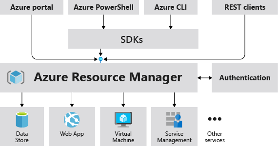
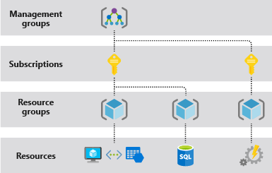

# What is Azure Resource Manager?

Azure Resource Manager is the deployment and management service for Azure. It provides a management layer that enables you to create, update, and delete resources in your Azure account. You use management features, like access control, locks, and tags, to secure and organize your resources after deployment.

To learn about Azure Resource Manager templates (ARM templates), see the [template deployment overview](../templates/overview.md).

## Consistent management layer

When a user sends a request from any of the Azure tools, APIs, or SDKs, Resource Manager receives the request. It authenticates and authorizes the request. Resource Manager sends the request to the Azure service, which takes the requested action. Because all requests are handled through the same API, you see consistent results and capabilities in all the different tools.

The following image shows the role Azure Resource Manager plays in handling Azure requests.

All capabilities that are available in the portal are also available through PowerShell, Azure CLI, REST APIs, and client SDKs. Functionality initially released through APIs will be represented in the portal within 180 days of initial release.

## Terminology

If you're new to Azure Resource Manager, there are some terms you might not be familiar with.

* **resource** - A manageable item that is available through Azure. Virtual machines, storage accounts, web apps, databases, and virtual networks are examples of resources. Resource groups, subscriptions, management groups, and tags are also examples of resources.
* **resource group** - A container that holds related resources for an Azure solution. The resource group includes those resources that you want to manage as a group. You decide which resources belong in a resource group based on what makes the most sense for your organization. See [Resource groups](#resource-groups).
* **resource provider** - A service that supplies Azure resources. For example, a common resource provider is `Microsoft.Compute`, which supplies the virtual machine resource. `Microsoft.Storage` is another common resource provider. See [Resource providers and types](resource-providers-and-types.md).
* **Resource Manager template** - A JavaScript Object Notation (JSON) file that defines one or more resources to deploy to a resource group, subscription, management group, or tenant. The template can be used to deploy the resources consistently and repeatedly. See [Template deployment overview](../templates/overview.md).
* **declarative syntax** - Syntax that lets you state "Here is what I intend to create" without having to write the sequence of programming commands to create it. The Resource Manager template is an example of declarative syntax. In the file, you define the properties for the infrastructure to deploy to Azure.  See [Template deployment overview](../templates/overview.md).

## The benefits of using Resource Manager

With Resource Manager, you can:

* Manage your infrastructure through declarative templates rather than scripts.

* Deploy, manage, and monitor all the resources for your solution as a group, rather than handling these resources individually.

* Redeploy your solution throughout the development lifecycle and have confidence your resources are deployed in a consistent state.

* Define the dependencies between resources so they're deployed in the correct order.

* Apply access control to all services because Azure role-based access control (Azure RBAC) is natively integrated into the management platform.

* Apply tags to resources to logically organize all the resources in your subscription.

* Clarify your organization's billing by viewing costs for a group of resources sharing the same tag.

## Understand scope

Azure provides four levels of scope: [management groups](../../governance/management-groups/overview.md), subscriptions, [resource groups](#resource-groups), and resources. The following image shows an example of these layers.

You apply management settings at any of these levels of scope. The level you select determines how widely the setting is applied. Lower levels inherit settings from higher levels. For example, when you apply a [policy](../../governance/policy/overview.md) to the subscription, the policy is applied to all resource groups and resources in your subscription. When you apply a policy on the resource group, that policy is applied to the resource group and all its resources. However, another resource group doesn't have that policy assignment.

You can deploy templates to tenants, management groups, subscriptions, or resource groups.

## Resource groups

There are some important factors to consider when defining your resource group:

* All the resources in your resource group should share the same lifecycle. You deploy, update, and delete them together. If one resource, such as a server, needs to exist on a different deployment cycle it should be in another resource group.

* Each resource can exist in only one resource group.

* You can add or remove a resource to a resource group at any time.

* You can move a resource from one resource group to another group. For more information, see [Move resources to new resource group or subscription](move-resource-group-and-subscription.md).

* The resources in a resource group can be located in different regions than the resource group.

* When creating a resource group, you need to provide a location for that resource group. You may be wondering, "Why does a resource group need a location? And, if the resources can have different locations than the resource group, why does the resource group location matter at all?" The resource group stores metadata about the resources. When you specify a location for the resource group, you're specifying where that metadata is stored. For compliance reasons, you may need to ensure that your data is stored in a particular region.

   If the resource group's region is temporarily unavailable, you can't update resources in the resource group because the metadata is unavailable. The resources in other regions will still function as expected, but you can't update them. For more information about building reliable applications, see [Designing reliable Azure applications](/azure/architecture/checklist/resiliency-per-service).

* A resource group can be used to scope access control for administrative actions. To manage a resource group, you can assign [Azure Policies](../../governance/policy/overview.md), [Azure roles](../../role-based-access-control/role-assignments-portal.md), or [resource locks](lock-resources.md).

* You can [apply tags](tag-resources.md) to a resource group. The resources in the resource group don't inherit those tags.

* A resource can connect to resources in other resource groups. This scenario is common when the two resources are related but don't share the same lifecycle. For example, you can have a web app that connects to a database in a different resource group.

* When you delete a resource group, all resources in the resource group are also deleted. For information about how Azure Resource Manager orchestrates those deletions, see [Azure Resource Manager resource group and resource deletion](delete-resource-group.md).

* You can deploy up to 800 instances of a resource type in each resource group. Some resource types are [exempt from the 800 instance limit](resources-without-resource-group-limit.md).

* Some resources can exist outside of a resource group. These resources are deployed to the [subscription](../templates/deploy-to-subscription.md), [management group](../templates/deploy-to-management-group.md), or [tenant](../templates/deploy-to-tenant.md). Only specific resource types are supported at these scopes.

* To create a resource group, you can use the [portal](manage-resource-groups-portal.md#create-resource-groups), [PowerShell](manage-resource-groups-powershell.md#create-resource-groups), [Azure CLI](manage-resource-groups-cli.md#create-resource-groups), or an [ARM template](../templates/deploy-to-subscription.md#resource-groups).

## Resiliency of Azure Resource Manager

The Azure Resource Manager service is designed for resiliency and continuous availability. Resource Manager and control plane operations (requests sent to `management.azure.com`) in the REST API are:

* Distributed across regions. Some services are regional.

* Distributed across Availability Zones (as well as regions) in locations that have multiple Availability Zones.

* Not dependent on a single logical data center.

* Never taken down for maintenance activities.

This resiliency applies to services that receive requests through Resource Manager. For example, Key Vault benefits from this resiliency.

## Next steps

* To learn about moving resources, see [Move resources to new resource group or subscription](move-resource-group-and-subscription.md).

* To learn about tagging resources, see [Use tags to organize your Azure resources](tag-resources.md).

* To learn about locking resources, see [Lock resources to prevent unexpected changes](lock-resources.md).
