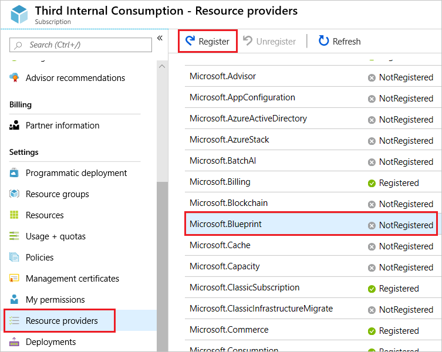
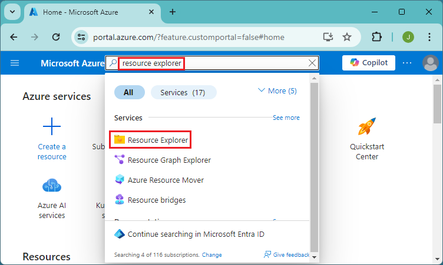
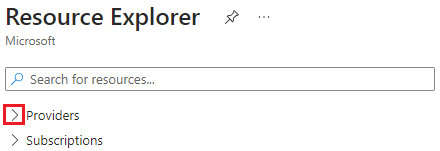
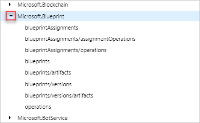
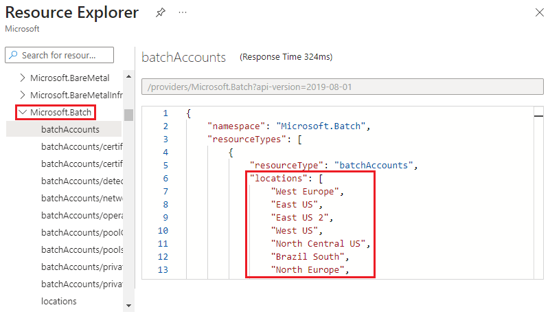
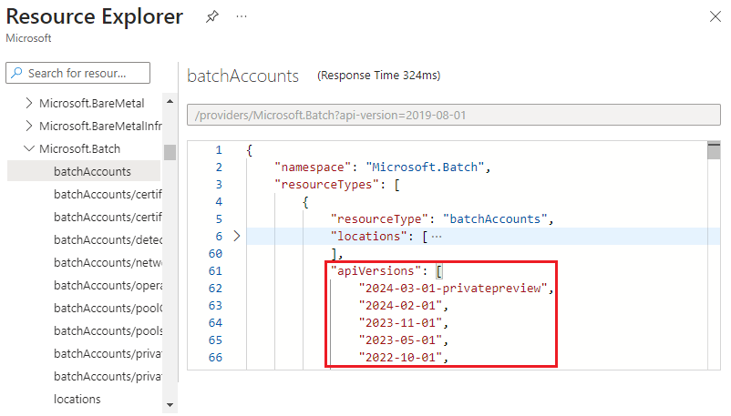

# Azure resource providers and types

When deploying resources, you frequently need to retrieve information about the resource providers and types. For example, if you want to store keys and secrets, you work with the Microsoft.KeyVault resource provider. This resource provider offers a resource type called vaults for creating the key vault.

The name of a resource type is in the format: **{resource-provider}/{resource-type}**. The resource type for a key vault is **Microsoft.KeyVault/vaults**.

In this article, you learn how to:

* View all resource providers in Azure
* Check registration status of a resource provider
* Register a resource provider
* View resource types for a resource provider
* View valid locations for a resource type
* View valid API versions for a resource type

You can do these steps through the Azure portal, Azure PowerShell, or Azure CLI.

For a list that maps resource providers to Azure services, see [Resource providers for Azure services](azure-services-resource-providers.md).

## Azure portal

To see all resource providers, and the registration status for your subscription:

1. Sign in to the [Azure portal](https://portal.azure.com).
2. On the Azure portal menu, select **All services**.

    

3. In the **All services** box, enter **subscription**, and then select **Subscriptions**.
4. Select the subscription from the subscription list to view.
5. Select **Resource providers** and view the list of available resource providers.

    

6. Registering a resource provider configures your subscription to work with the resource provider. The scope for registration is always the subscription. By default, many resource providers are automatically registered. However, you may need to manually register some resource providers. To register a resource provider, you must have permission to do the `/register/action` operation for the resource provider. This operation is included in the Contributor and Owner roles. To register a resource provider, select **Register**. In the previous screenshot, the **Register** link is highlighted for **Microsoft.Blueprint**.

    You can't unregister a resource provider when you still have resource types from that resource provider in your subscription.

To see information for a particular resource provider:

1. Sign in to the [Azure portal](https://portal.azure.com).
2. On the Azure portal menu, select **All services**.
3. In the **All services** box, enter **resource explorer**, and then select **Resource Explorer**.

    

4. Expand **Providers** by selecting the right arrow.

    

5. Expand a resource provider and resource type that you want to view.

    

6. Resource Manager is supported in all regions, but the resources you deploy might not be supported in all regions. In addition, there may be limitations on your subscription that prevent you from using some regions that support the resource. The resource explorer displays valid locations for the resource type.

    

7. The API version corresponds to a version of REST API operations that are released by the resource provider. As a resource provider enables new features, it releases a new version of the REST API. The resource explorer displays valid API versions for the resource type.

    

## Azure PowerShell

[!INCLUDE [updated-for-az](../../../includes/updated-for-az.md)]

To see all resource providers in Azure, and the registration status for your subscription, use:

```azurepowershell-interactive
Get-AzResourceProvider -ListAvailable | Select-Object ProviderNamespace, RegistrationState
```

Which returns results similar to:

```output
ProviderNamespace                RegistrationState
-------------------------------- ------------------
Microsoft.ClassicCompute         Registered
Microsoft.ClassicNetwork         Registered
Microsoft.ClassicStorage         Registered
Microsoft.CognitiveServices      Registered
...
```

Registering a resource provider configures your subscription to work with the resource provider. The scope for registration is always the subscription. By default, many resource providers are automatically registered. However, you may need to manually register some resource providers. To register a resource provider, you must have permission to do the `/register/action` operation for the resource provider. This operation is included in the Contributor and Owner roles.

```azurepowershell-interactive
Register-AzResourceProvider -ProviderNamespace Microsoft.Batch
```

Which returns results similar to:

```output
ProviderNamespace : Microsoft.Batch
RegistrationState : Registering
ResourceTypes     : {batchAccounts, operations, locations, locations/quotas}
Locations         : {West Europe, East US, East US 2, West US...}
```

You can't unregister a resource provider when you still have resource types from that resource provider in your subscription.

To see information for a particular resource provider, use:

```azurepowershell-interactive
Get-AzResourceProvider -ProviderNamespace Microsoft.Batch
```

Which returns results similar to:

```output
{ProviderNamespace : Microsoft.Batch
RegistrationState : Registered
ResourceTypes     : {batchAccounts}
Locations         : {West Europe, East US, East US 2, West US...}

...
```

To see the resource types for a resource provider, use:

```azurepowershell-interactive
(Get-AzResourceProvider -ProviderNamespace Microsoft.Batch).ResourceTypes.ResourceTypeName
```

Which returns:

```output
batchAccounts
operations
locations
locations/quotas
```

The API version corresponds to a version of REST API operations that are released by the resource provider. As a resource provider enables new features, it releases a new version of the REST API.

To get the available API versions for a resource type, use:

```azurepowershell-interactive
((Get-AzResourceProvider -ProviderNamespace Microsoft.Batch).ResourceTypes | Where-Object ResourceTypeName -eq batchAccounts).ApiVersions
```

Which returns:

```output
2017-05-01
2017-01-01
2015-12-01
2015-09-01
2015-07-01
```

Resource Manager is supported in all regions, but the resources you deploy might not be supported in all regions. In addition, there may be limitations on your subscription that prevent you from using some regions that support the resource.

To get the supported locations for a resource type, use.

```azurepowershell-interactive
((Get-AzResourceProvider -ProviderNamespace Microsoft.Batch).ResourceTypes | Where-Object ResourceTypeName -eq batchAccounts).Locations
```

Which returns:

```output
West Europe
East US
East US 2
West US
...
```

## Azure CLI

To see all resource providers in Azure, and the registration status for your subscription, use:

```azurecli
az provider list --query "[].{Provider:namespace, Status:registrationState}" --out table
```

Which returns results similar to:

```output
Provider                         Status
-------------------------------- ----------------
Microsoft.ClassicCompute         Registered
Microsoft.ClassicNetwork         Registered
Microsoft.ClassicStorage         Registered
Microsoft.CognitiveServices      Registered
...
```

Registering a resource provider configures your subscription to work with the resource provider. The scope for registration is always the subscription. By default, many resource providers are automatically registered. However, you may need to manually register some resource providers. To register a resource provider, you must have permission to do the `/register/action` operation for the resource provider. This operation is included in the Contributor and Owner roles.

```azurecli
az provider register --namespace Microsoft.Batch
```

Which returns a message that registration is on-going.

You can't unregister a resource provider when you still have resource types from that resource provider in your subscription.

To see information for a particular resource provider, use:

```azurecli
az provider show --namespace Microsoft.Batch
```

Which returns results similar to:

```output
{
    "id": "/subscriptions/####-####/providers/Microsoft.Batch",
    "namespace": "Microsoft.Batch",
    "registrationsState": "Registering",
    "resourceTypes:" [
        ...
    ]
}
```

To see the resource types for a resource provider, use:

```azurecli
az provider show --namespace Microsoft.Batch --query "resourceTypes[*].resourceType" --out table
```

Which returns:

```output
Result
---------------
batchAccounts
operations
locations
locations/quotas
```

The API version corresponds to a version of REST API operations that are released by the resource provider. As a resource provider enables new features, it releases a new version of the REST API.

To get the available API versions for a resource type, use:

```azurecli
az provider show --namespace Microsoft.Batch --query "resourceTypes[?resourceType=='batchAccounts'].apiVersions | [0]" --out table
```

Which returns:

```output
Result
---------------
2017-05-01
2017-01-01
2015-12-01
2015-09-01
2015-07-01
```

Resource Manager is supported in all regions, but the resources you deploy might not be supported in all regions. In addition, there may be limitations on your subscription that prevent you from using some regions that support the resource.

To get the supported locations for a resource type, use.

```azurecli
az provider show --namespace Microsoft.Batch --query "resourceTypes[?resourceType=='batchAccounts'].locations | [0]" --out table
```

Which returns:

```output
Result
---------------
West Europe
East US
East US 2
West US
...
```

## Next steps

* To learn about creating Resource Manager templates, see [Authoring Azure Resource Manager templates](../templates/template-syntax.md). 
* To view the resource provider template schemas, see [Template reference](/azure/templates/).
* For a list that maps resource providers to Azure services, see [Resource providers for Azure services](azure-services-resource-providers.md).
* To view the operations for a resource provider, see [Azure REST API](/rest/api/).
