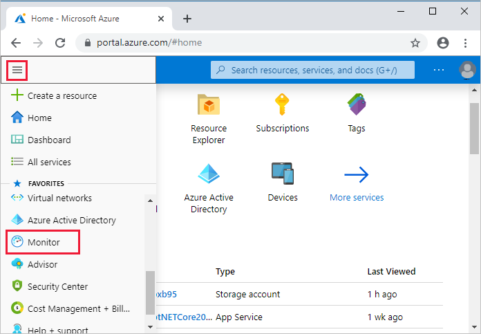
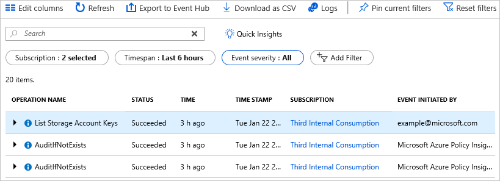
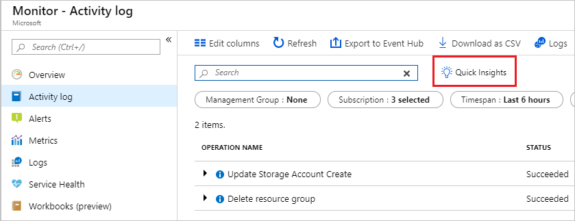
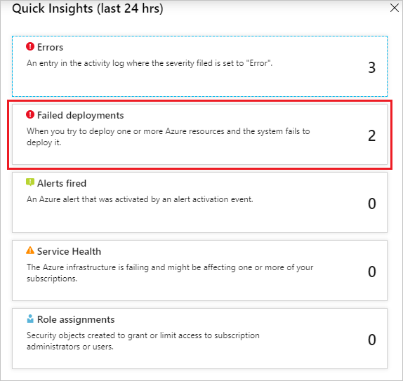
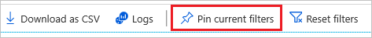
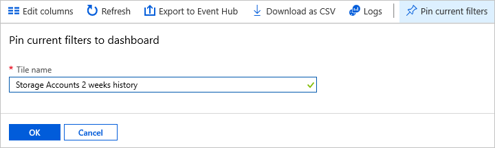
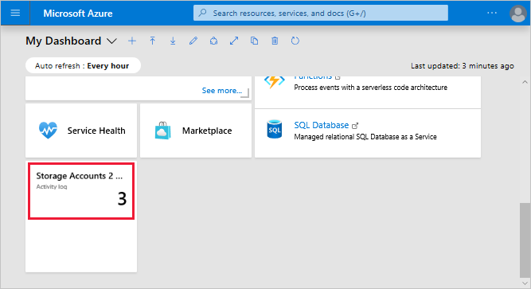
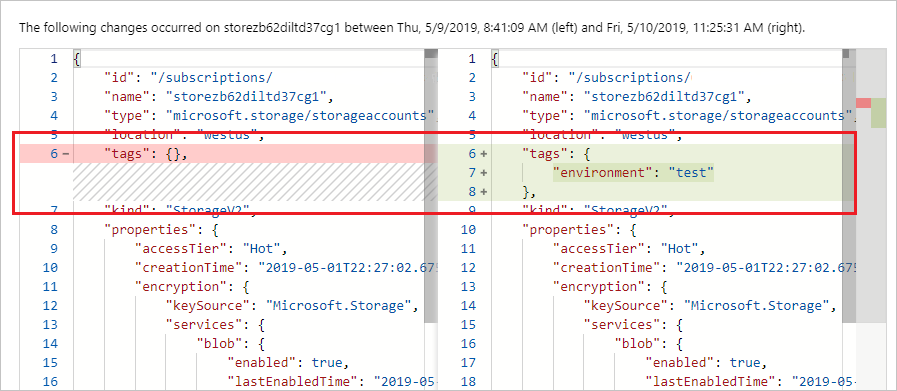

# View activity logs to monitor actions on resources

Through activity logs, you can determine:

* what operations were taken on the resources in your subscription
* who started the operation
* when the operation occurred
* the status of the operation
* the values of other properties that might help you research the operation

The activity log contains all write operations (PUT, POST, DELETE) for your resources. It doesn't include read operations (GET). For a list of resource actions, see [Azure resource provider operations](../../role-based-access-control/resource-provider-operations.md). You can use the activity logs to find an error when troubleshooting or to monitor how a user in your organization modified a resource.

Activity logs are kept for 90 days. You can query for any range of dates, as long as the starting date isn't more than 90 days in the past.

You can retrieve information from the activity logs through the portal, PowerShell, Azure CLI, Insights REST API, or [Insights .NET Library](https://www.nuget.org/packages/Microsoft.Azure.Insights/).

## Azure portal

To view the activity logs through the portal, follow these steps:

1. On the Azure portal menu, select **Monitor**, or search for and select **Monitor** from any page.

    

1. Select **Activity Log**.

    

1. You see a summary of recent operations. A default set of filters is applied to the operations. Notice the information on the summary includes who started the action and when it happened.

    

1. To quickly run a pre-defined set of filters, select **Quick Insights**.

    

1. Select one of the options. For example, select **Failed deployments** to see errors from deployments.

    

1. Notice the filters have been changed to focus on deployment errors in the last 24 hours. Only operations that match the filters are displayed.

    

1. To focus on specific operations, change the filters or apply new ones. For example, the following image shows a new value for the **Timespan** and **Resource type** is set to storage accounts.

    

1. If you need to run the query again later, select **Pin current filters**.

    

1. Give the filter a name.

    

1. The filter is available in the dashboard. On the Azure portal menu, select **Dashboard**.

    

1. From the portal, you can view changes to a resource. Go back to the default view in Monitor, and select an operation that involved changing a resource.

    

1. Select **Change history (Preview)** and pick one of the available operations.

    

1. The changes in the resource are displayed.

    

To learn more about change history, see [Get resource changes](../../governance/resource-graph/how-to/get-resource-changes.md).

## PowerShell

[!INCLUDE [updated-for-az](../../../includes/updated-for-az.md)]

To retrieve log entries, run the **Get-AzLog** command. You provide additional parameters to filter the list of entries. If you don't specify a start and end time, entries for the last seven days are returned.

```azurepowershell-interactive
Get-AzLog -ResourceGroup ExampleGroup
```

The following example shows how to use the activity log to research operations taken during a specified time. The start and end dates are specified in a date format.

```azurepowershell-interactive
Get-AzLog -ResourceGroup ExampleGroup -StartTime 2019-05-05T06:00 -EndTime 2019-05-09T06:00
```

Or, you can use date functions to specify the date range, such as the last 14 days.

```azurepowershell-interactive
Get-AzLog -ResourceGroup ExampleGroup -StartTime (Get-Date).AddDays(-14)
```

You can look up the actions taken by a particular user.

```azurepowershell-interactive
Get-AzLog -ResourceGroup ExampleGroup -StartTime (Get-Date).AddDays(-14) -Caller someone@contoso.com
```

You can filter for failed operations.

```azurepowershell-interactive
Get-AzLog -ResourceGroup ExampleGroup -Status Failed
```

You can focus on one error by looking at the status message for that entry.

```azurepowershell-interactive
(Get-AzLog -ResourceGroup ExampleGroup -Status Failed).Properties.Content.statusMessage | ConvertFrom-Json
```

You can select specific values to limit the data that is returned.

```azurepowershell-interactive
Get-AzLog -ResourceGroupName ExampleGroup | Format-table EventTimeStamp, Caller, @{n='Operation'; e={$_.OperationName.value}}, @{n='Status'; e={$_.Status.value}}, @{n='SubStatus'; e={$_.SubStatus.LocalizedValue}}
```

Depending on the start time you specify, the previous commands can return a long list of operations for the resource group. You can filter the results for what you are looking for by providing search criteria. For example, you can filter by the type of operation.

```azurepowershell-interactive
Get-AzLog -ResourceGroup ExampleGroup | Where-Object {$_.OperationName.value -eq "Microsoft.Resources/deployments/write"}
```

You can use Resource Graph to see the change history for a resource. For more information, see [Get resource changes](../../governance/resource-graph/how-to/get-resource-changes.md).

## Azure CLI

To retrieve log entries, run the [az monitor activity-log list](/cli/azure/monitor/activity-log#az_monitor_activity_log_list) command with an offset to indicate the time span.

```azurecli-interactive
az monitor activity-log list --resource-group ExampleGroup --offset 7d
```

The following example shows how to use the activity log to research operations taken during a specified time. The start and end dates are specified in a date format.

```azurecli-interactive
az monitor activity-log list -g ExampleGroup --start-time 2019-05-01 --end-time 2019-05-15
```

You can look up the actions taken by a particular user, even for a resource group that no longer exists.

```azurecli-interactive
az monitor activity-log list -g ExampleGroup --caller someone@contoso.com --offset 5d
```

You can filter for failed operations.

```azurecli-interactive
az monitor activity-log list -g ExampleGroup --status Failed --offset 1d
```

You can focus on one error by looking at the status message for that entry.

```azurecli-interactive
az monitor activity-log list -g ExampleGroup --status Failed --offset 1d --query [].properties.statusMessage
```

You can select specific values to limit the data that is returned.

```azurecli-interactive
az monitor activity-log list -g ExampleGroup --offset 1d --query '[].{Operation: operationName.value, Status: status.value, SubStatus: subStatus.localizedValue}'
```

Depending on the start time you specify, the previous commands can return a long list of operations for the resource group. You can filter the results for what you are looking for by providing search criteria. For example, you can filter by the type of operation.

```azurecli-interactive
az monitor activity-log list -g ExampleGroup --offset 1d --query "[?operationName.value=='Microsoft.Storage/storageAccounts/write']"
```

You can use Resource Graph to see the change history for a resource. For more information, see [Get resource changes](../../governance/resource-graph/how-to/get-resource-changes.md).

## REST API

The REST operations for working with the activity log are part of the [Insights REST API](/rest/api/monitor/). To retrieve activity log events, see [List the management events in a subscription](/rest/api/monitor/activitylogs).

## Next steps

* Azure Activity logs can be used with Power BI to gain greater insights about the actions in your subscription. See [View and analyze Azure Activity Logs in Power BI and more](https://azure.microsoft.com/blog/analyze-azure-audit-logs-in-powerbi-more/).
* To learn about setting security policies, see [Azure role-based access control (Azure RBAC)](../../role-based-access-control/role-assignments-portal.md).
* To view more details about the changes to your applications from the infrastructure layer all the way to application deployment, see [Use Application Change Analysis in Azure Monitor](../../azure-monitor/app/change-analysis.md).
* To learn about the commands for viewing deployment operations, see [View deployment operations](../templates/deployment-history.md).
* To learn how to prevent deletions on a resource for all users, see [Lock resources with Azure Resource Manager](lock-resources.md).
* To see the list of operations available for each Microsoft Azure Resource Manager provider, see [Azure resource provider operations](../../role-based-access-control/resource-provider-operations.md)
