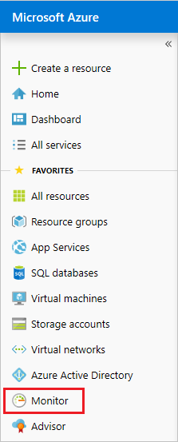
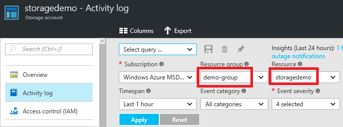
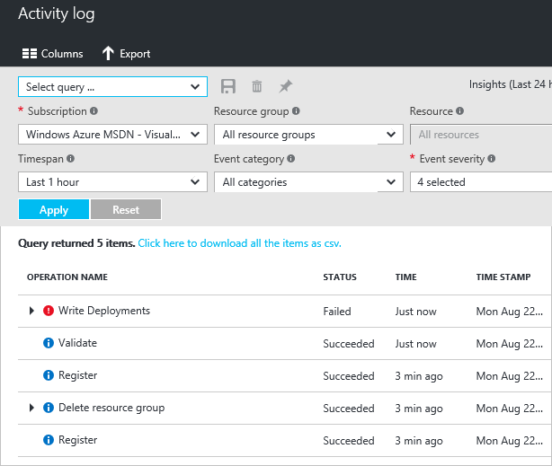
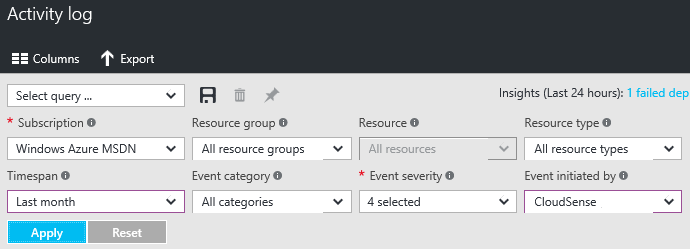
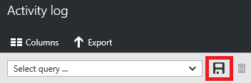
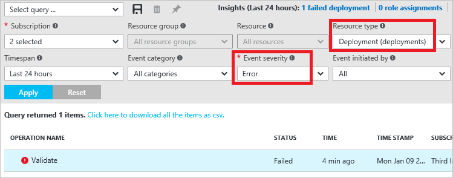
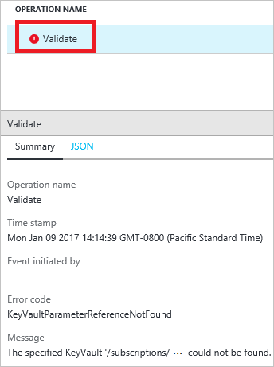

# View activity logs to audit actions on resources
Through activity logs, you can determine:

* what operations were taken on the resources in your subscription
* who initiated the operation (although operations initiated by a backend service do not return a user as the caller)
* when the operation occurred
* the status of the operation
* the values of other properties that might help you research the operation

[!INCLUDE [resource-manager-audit-limitations](../../includes/resource-manager-audit-limitations.md)]

You can retrieve information from the activity logs through the portal, PowerShell, Azure CLI, Insights REST API, or [Insights .NET Library](https://www.nuget.org/packages/Microsoft.Azure.Insights/).

## Portal
1. To view the activity logs through the portal, select **Monitor**.
   
    

   Or, to automatically filter the activity log for a particular resource or resource group, select **Activity log** from that resource blade. Notice that the activity log is automatically filtered by the selected resource.
   
    
2. In the **Activity Log** blade, you see a summary of recent operations.
   
    
3. To restrict the number of operations displayed, select different conditions. For example, the following image shows the **Timespan** and **Event initiated by** fields changed to view the actions taken by a particular user or application for the past month. Select **Apply** to view the results of your query.
   
    

4. If you need to run the query again later, select **Save** and give the query a name.
   
    
5. To quickly run a query, you can select one of the built-in queries, such as failed deployments.

    

   The selected query automatically sets the required filter values.

       

6. Select one of the operations to see a summary of the event.

      

## PowerShell
1. To retrieve log entries, run the **Get-AzureRmLog** command. You provide additional parameters to filter the list of entries. If you do not specify a start and end time, entries for the last hour are returned. For example, to retrieve the operations for a resource group during the past hour run:

  ```powershell
  Get-AzureRmLog -ResourceGroup ExampleGroup
  ```
   
    The following example shows how to use the activity log to research operations taken during a specified time. The start and end dates are specified in a date format.

  ```powershell
  Get-AzureRmLog -ResourceGroup ExampleGroup -StartTime 2015-08-28T06:00 -EndTime 2015-09-10T06:00
  ```

    Or, you can use date functions to specify the date range, such as the last 14 days.
   
  ```powershell 
  Get-AzureRmLog -ResourceGroup ExampleGroup -StartTime (Get-Date).AddDays(-14)
  ```

2. Depending on the start time you specify, the previous commands can return a long list of operations for the resource group. You can filter the results for what you are looking for by providing search criteria. For example, if you are trying to research how a web app was stopped, you could run the following command:

  ```powershell
  Get-AzureRmLog -ResourceGroup ExampleGroup -StartTime (Get-Date).AddDays(-14) | Where-Object OperationName -eq Microsoft.Web/sites/stop/action
  ```

    Which for this example shows that a stop action was performed by someone@contoso.com. 

  ```powershell 
  Authorization     :
  Scope     : /subscriptions/xxxxx/resourcegroups/ExampleGroup/providers/Microsoft.Web/sites/ExampleSite
  Action    : Microsoft.Web/sites/stop/action
  Role      : Subscription Admin
  Condition :
  Caller            : someone@contoso.com
  CorrelationId     : 84beae59-92aa-4662-a6fc-b6fecc0ff8da
  EventSource       : Administrative
  EventTimestamp    : 8/28/2015 4:08:18 PM
  OperationName     : Microsoft.Web/sites/stop/action
  ResourceGroupName : ExampleGroup
  ResourceId        : /subscriptions/xxxxx/resourcegroups/ExampleGroup/providers/Microsoft.Web/sites/ExampleSite
  Status            : Succeeded
  SubscriptionId    : xxxxx
  SubStatus         : OK
  ```

3. You can look up the actions taken by a particular user, even for a resource group that no longer exists.

  ```powershell 
  Get-AzureRmLog -ResourceGroup deletedgroup -StartTime (Get-Date).AddDays(-14) -Caller someone@contoso.com
  ```

4. You can filter for failed operations.

  ```powershell
  Get-AzureRmLog -ResourceGroup ExampleGroup -Status Failed
  ```

5. You can focus on one error by looking at the status message for that entry.
   
        ((Get-AzureRmLog -Status Failed -ResourceGroup ExampleGroup -DetailedOutput).Properties[1].Content["statusMessage"] | ConvertFrom-Json).error
   
    Which returns:
   
        code           message                                                                        
        ----           -------                                                                        
        DnsRecordInUse DNS record dns.westus.cloudapp.azure.com is already used by another public IP. 


## Azure CLI
* To retrieve log entries, you run the **azure group log show** command.

  ```azurecli
  azure group log show ExampleGroup --json
  ```


## REST API
The REST operations for working with the activity log are part of the [Insights REST API](https://msdn.microsoft.com/library/azure/dn931943.aspx). To retrieve activity log events, see [List the management events in a subscription](https://msdn.microsoft.com/library/azure/dn931934.aspx).

## Next steps
* Azure Activity logs can be used with Power BI to gain greater insights about the actions in your subscription. See [View and analyze Azure Activity Logs in Power BI and more](https://azure.microsoft.com/blog/analyze-azure-audit-logs-in-powerbi-more/).
* To learn about setting security policies, see [Azure Role-based Access Control](../active-directory/role-based-access-control-configure.md).
* To learn about the commands for viewing deployment operations, see [View deployment operations](resource-manager-deployment-operations.md).
* To learn how to prevent deletions on a resource for all users, see [Lock resources with Azure Resource Manager](resource-group-lock-resources.md).

